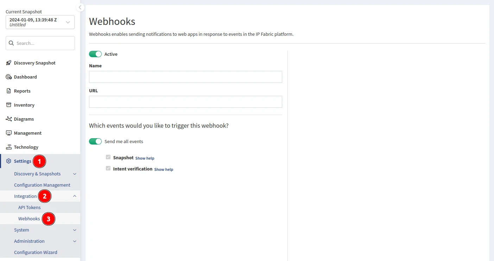

# Webhooks

Webhooks allow you to build or set up integrations that subscribe to
certain events in IP Fabric. When one of those events is
triggered, IP Fabric will send an HTTP POST payload to the webhook's configured
URL. Webhooks can be used to send notifications to the messaging tools of
your choice or update an external issue tracker. You're only limited by
your imagination.

## Add Webhook

To set up a webhook, navigate to **Settings --> Integration --> Webhooks**.



## Events

Whenever IP Fabric generates an event, it checks the list of active
webhooks and determines which of them (if any) are subscribed to the
event that has just occurred. Then, IP Fabric sends the webhook payload to
the corresponding URLs. The receiving party should confirm the payload with
an HTTP status `2xx` response and can process the payload as needed. If the
receiving party doesn't confirm the payload (because it is not
reachable, it returns a bad status code, or the delivery times out), IP Fabric
tries to deliver the webhook payload again 1, 2, 5, and 10 minutes
after the initial delivery. If IP Fabric cannot deliver the webhook in
these five attempts, it gives up. All delivery attempts are recorded in
the webhook's delivery history (in the webhook's **Edit** view).

## Payload Hash

Since the webhook payload might be delivered over untrusted networks,
each webhook message is accompanied by an SHA256 HMAC payload hash
signature. You configure the HMAC secret when configuring the webhook in
the UI. To validate the webhook payload (i.e., to make sure the webhook
payload is sent from IP Fabric and was not altered in
transit), calculate the hash signature of the raw webhook payload on the
receiving end (with the same password) and compare it with the hash
calculated by the server (sent in the `X-IPF-Signature` HTTP header of the
webhook message).

```js
// JavaScript validation code

const hmac = createHmac("sha256", secret);
hmac.update(bodyString);
const verified = hmac.digest("hex") === request.headers["x-ipf-signature"];
```

## Test Webhook

To test your webhook (even an inactive one), use the **Test** button in the UI.
Pick the webhook type and action and confirm the popup dialog. IP Fabric will
send a dummy payload corresponding to the selected webhook. To
distinguish the testing payloads from the real ones, IP Fabric adds the `test: true`
property to the testing messages.

## Webhook Types

Currently, the following webhook types are triggered by IP Fabric:

### `snapshot`

The event is triggered upon network discovery and when manipulating
snapshots.

```json
{
  "type": "snapshot",
  "action": "discover" | "clone" | "delete" | "download" | "load" | "unload",
  "status": "started" | "completed" | "failed" | "resumed" | "resumed (stopping)" | "stopped",
  "reason"?: string,
  "requester": "cron" | "user:<id>",
  "snapshot"?: {
    "id": string,
    "name"?: string,
    "cloneId"?: string,
    "file"?: string,
  }
  "timestamp": number,
  "test"?: boolean
}
```

If the action has `failed`, the payload includes a top-level `reason`
field with a string describing why the action has failed.

The `snapshot` object is missing completely when the snapshot is not known
yet, e.g., when network discovery has just `started`.

When the `clone` action is `completed`, the `snapshot` object also contains
a `cloneId` field with the ID of the newly created (cloned) snapshot.

When the `download` action is `completed`, the `snapshot` object also includes
a `file` field with the filename of the created snapshot archive.

If you are testing the webhook, the `test` field is set to `true`.

### `intent-verification`

The event is triggered when an intent verification is calculated.

```json
{
  "type": "intent-verification",
  "action": "calculate",
  "status": "started" | "completed" | "failed" | "resumed" | "resumed (stopping)" | "stopped",
  "reason"?: string,
  "requester": "cron" | "user" | "snapshot:<action>",
  "reportId"?: string,
  "snapshotId"?: string,
  "timestamp": number,
  "test"?: boolean
}
```

If the action has `failed`, the payload includes a top-level `reason`
field with a string describing why the action has failed.

When the intent verification is related to:

- a report, its ID is available as `reportId`,

- a snapshot, its ID is available as `snapshotId`.

If you are testing the webhook, the `test` field is set to `true`.
