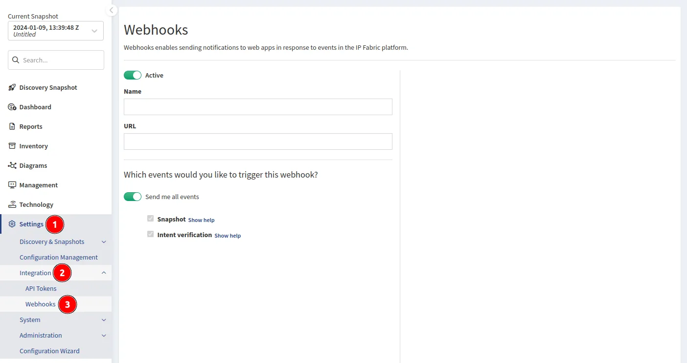
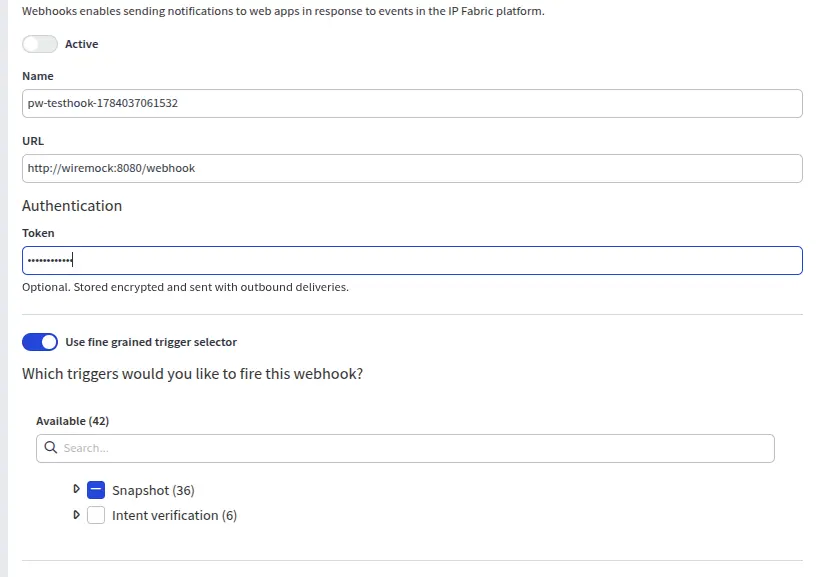
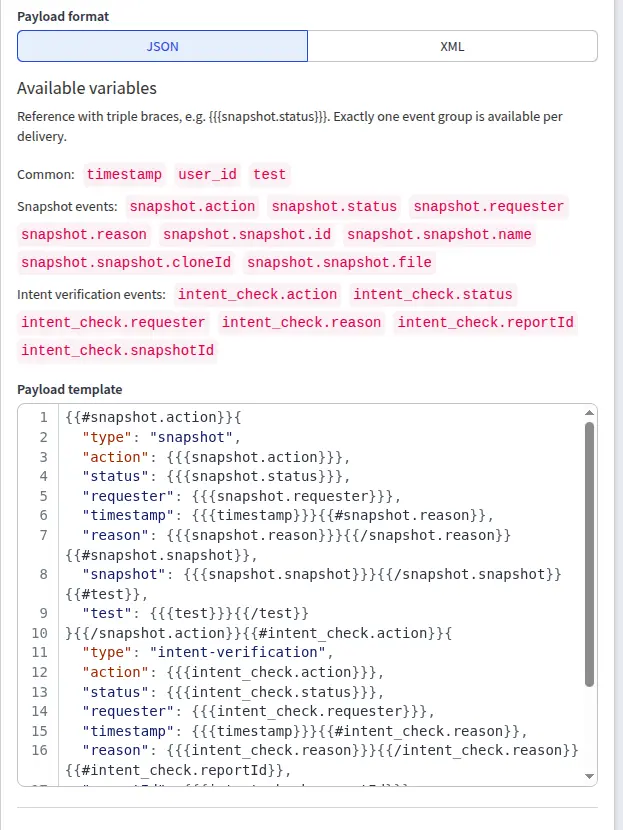
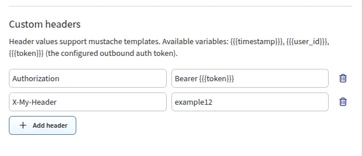

# Webhooks

Webhooks allow you to build or set up integrations that subscribe to
certain events in IP Fabric. When one of those events is
triggered, IP Fabric will send an HTTP POST payload to the webhook configured
URL. Webhooks can be used to send notifications to the messaging tools of
your choice or update an external issue tracker. You're only limited by
your imagination.

## Add Webhook

To set up a webhook, navigate to **Settings --> Integration --> Webhooks**.



## Events

Whenever IP Fabric generates an event, it checks the list of active
webhooks and determines which of them (if any) are subscribed to the
event that has just occurred. Then, IP Fabric sends the webhook payload to
the corresponding URLs. The receiving party should confirm the payload with
an HTTP status `2xx` response and can process the payload as needed. If the
receiving party doesn't confirm the payload (because it is not
reachable, it returns a bad status code, or the delivery times out), IP Fabric
tries to deliver the webhook payload again 1, 2, 5, and 10 minutes
after the initial delivery. If IP Fabric cannot deliver the webhook in
these five attempts, it gives up. All delivery attempts are recorded in
the webhook delivery history (in the webhook **Edit** view).

## Triggers

By default, a webhook triggers on every event of the types it subscribes
to. For finer control, switch the webhook to advanced trigger selection.
Then select exactly which events should trigger it.



IP Fabric currently exposes two groups of triggers:

- **Snapshot events** -- `discover`, `clone`, `delete`, `download`, `load`, and `unload`,

- **Intent verification events** -- `started`, `completed`, `failed`, `resumed`, `resumed (stopping)`, and `stopped`.

You can subscribe broadly (for example, all snapshot events) or narrowly (for
example, only a snapshot `discover` that has `completed`). A trigger with no
action or status set matches every value of that field.

!!! note

    Custom payloads, custom headers, outbound authentication tokens, and custom
    certificate authorities are available only for webhooks that use advanced
    trigger selection. Legacy webhooks (subscribed by type) keep their original
    behavior.

## Payload Hash

Since the webhook payload might be delivered over untrusted networks,
each webhook message is accompanied by an SHA256 HMAC payload hash
signature. You configure the HMAC secret when configuring the webhook in
the UI. To validate the webhook payload (i.e., to make sure the webhook
payload is sent from IP Fabric and was not altered in
transit), calculate the hash signature of the raw webhook payload on the
receiving end (with the same password) and compare it with the hash
calculated by the server (sent in the `X-IPF-Signature` HTTP header of the
webhook message).

```js
// JavaScript validation code

const hmac = createHmac("sha256", secret);
hmac.update(bodyString);
const verified = hmac.digest("hex") === request.headers["x-ipf-signature"];
```

## Authentication

When your endpoint requires an outbound credential, you can store a static
authentication token with the webhook. IP Fabric encrypts the token at rest
and treats it as **write-only**: the API never returns it, and the webhook
form only shows whether a token is currently stored.

To send the token, reference it as the `{{{token}}}` variable in a custom header
(see [Custom Headers](#custom-headers) below) -- for example, an `Authorization`
IP Fabric decrypts the token and substitutes it only at delivery time.
The plaintext value never leaves the appliance until then.

When editing a webhook:

- Leave the token field empty to keep the stored token unchanged.

- Enter a new value to replace it.

- Use the clear-token option to remove it.

!!! note

    The token is sent only if a custom header references `{{{token}}}`. Without
    such a header, the stored token is never transmitted.

## Test Webhook

To test your webhook (even an inactive one), use the **Test** button in the UI.
Pick the webhook type and action and confirm the popup dialog. IP Fabric will
send a dummy payload corresponding to the selected webhook. To
distinguish the testing payloads from the real ones, IP Fabric adds the `test: true`
property to the testing messages.

## Webhook Types

Currently, the following webhook types are triggered by IP Fabric:

### `snapshot`

The event is triggered upon network discovery and when manipulating
snapshots.

```json
{
  "type": "snapshot",
  "action": "discover" | "clone" | "delete" | "download" | "load" | "unload",
  "status": "started" | "completed" | "failed" | "resumed" | "resumed (stopping)" | "stopped",
  "reason"?: string,
  "requester": "cron" | "user:<id>",
  "snapshot"?: {
    "id": string,
    "name"?: string,
    "cloneId"?: string,
    "file"?: string,
  }
  "timestamp": number,
  "test"?: boolean
}
```

If the action has `failed`, the payload includes a top-level `reason`
field with a string describing why the action has failed.

The `snapshot` object is missing completely when the snapshot is not known
yet, e.g., when network discovery has just `started`.

When the `clone` action is `completed`, the `snapshot` object also contains
a `cloneId` field with the ID of the newly created (cloned) snapshot.

When the `download` action is `completed`, the `snapshot` object also includes
a `file` field with the filename of the created snapshot archive.

If you are testing the webhook, the `test` field is set to `true`.

### `intent-verification`

The event is triggered when an intent verification is calculated.

```json
{
  "type": "intent-verification",
  "action": "calculate",
  "status": "started" | "completed" | "failed" | "resumed" | "resumed (stopping)" | "stopped",
  "reason"?: string,
  "requester": "cron" | "user" | "snapshot:<action>" | "recalculateSites",
  "reportId"?: string,
  "snapshotId"?: string,
  "timestamp": number,
  "test"?: boolean
}
```

If the action has `failed`, the payload includes a top-level `reason`
field with a string describing why the action has failed.

When the intent verification is related to:

- a report, its ID is available as `reportId`,

- a snapshot, its ID is available as `snapshotId`.

If you are testing the webhook, the `test` field is set to `true`.

## Custom Payload

For webhooks that use advanced trigger selection, you can replace the default
payload with your own template. Select the `json` or `xml` format and write the
body as a Mustache template. IP Fabric renders the template for each delivery.
The editor starts from a default template that reproduces the standard
payload, so you can adjust it from there.



Reference event values with the triple-brace syntax `{{{variable}}}`. IP Fabric
encodes each value for the chosen format and inserts it as-is, so the rendered
payload stays valid `json` or `xml`. The following variables are available:

- `{{{timestamp}}}`, `{{{user_id}}}`, and `{{{test}}}` at the root,

- for snapshot events, the fields of the `snapshot` payload under `snapshot`, e.g. `{{{snapshot.action}}}`, `{{{snapshot.status}}}`, `{{{snapshot.snapshot.id}}}`, `{{{snapshot.snapshot.cloneId}}}`, and `{{{snapshot.snapshot.file}}}`,

- for intent verification events, the fields of the `intent-verification` payload under `intent_check`, e.g. `{{{intent_check.action}}}`, `{{{intent_check.status}}}`, `{{{intent_check.reportId}}}`, and `{{{intent_check.snapshotId}}}`.

The fields available for each event correspond to the payloads described in
[Webhook Types](#webhook-types) above.

```json
{
  "event": {{{snapshot.action}}},
  "status": {{{snapshot.status}}},
  "snapshotId": {{{snapshot.snapshot.id}}},
  "at": {{{timestamp}}}
}
```

!!! note

    Always use the triple-brace `{{{variable}}}` syntax, not `{{variable}}`. If
    the rendered payload is not valid for the selected format, or the template
    references an unknown variable, the delivery is recorded as failed and
    nothing is sent.

## Custom Headers

Webhooks that use advanced trigger selection can send additional outbound HTTP
headers. Each header has a name and a value. IP Fabric renders the value as
a Mustache template for each delivery.



Header values support the `{{{timestamp}}}`, `{{{user_id}}}`, and `{{{token}}}`
(stored authentication token) variables. For example, an `Authorization` header
with the value `Bearer {{{token}}}` attaches the token to every call.

- Header names must be valid HTTP header names and must be unique.

- IP Fabric reserves `X-IPF-Signature` and you cannot override it.

- IP Fabric always sets `Content-Type`, `User-Agent`, and `X-IPF-Signature`.
  You cannot override these headers. `Content-Type` follows the selected payload format.
