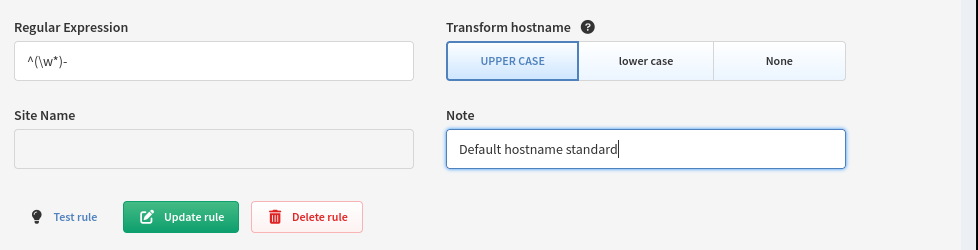
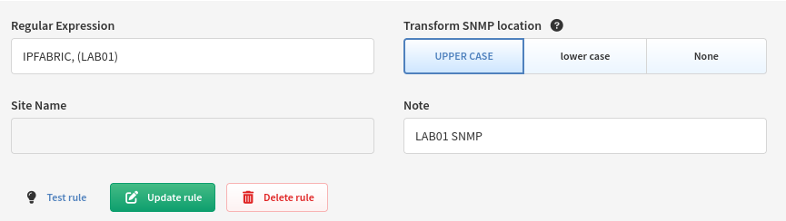
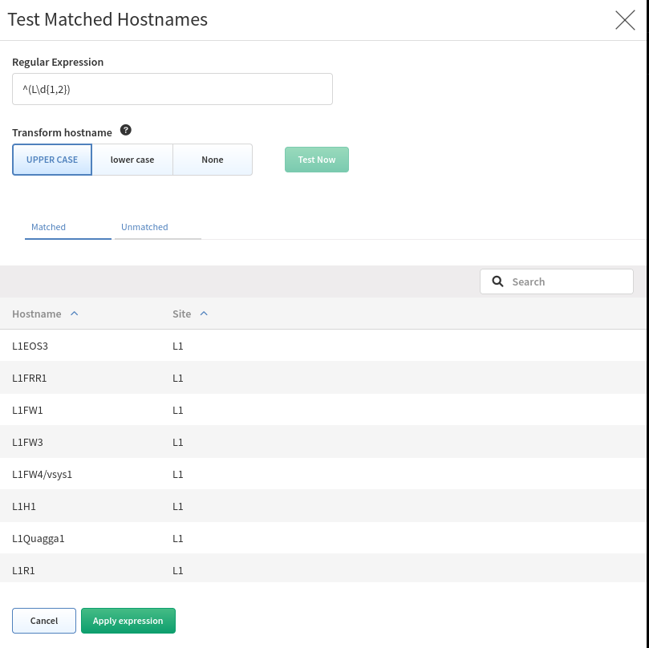
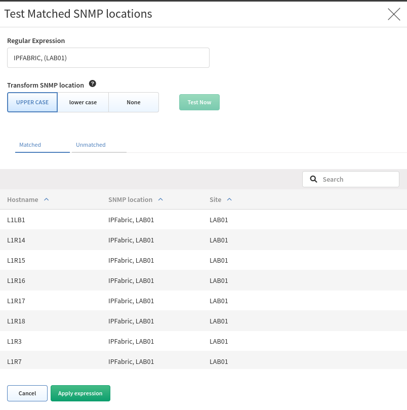
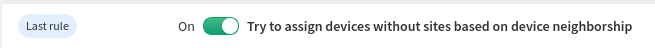
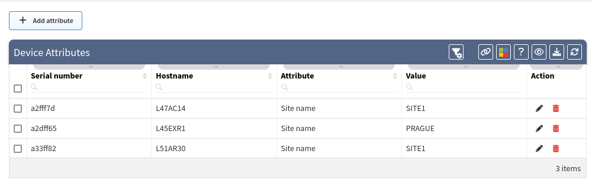
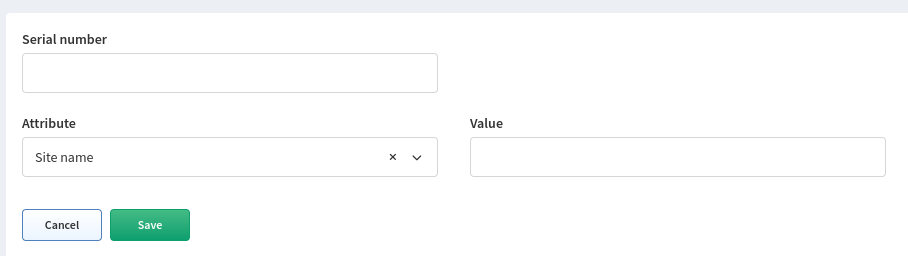
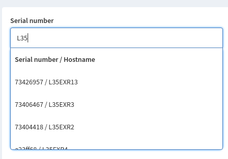
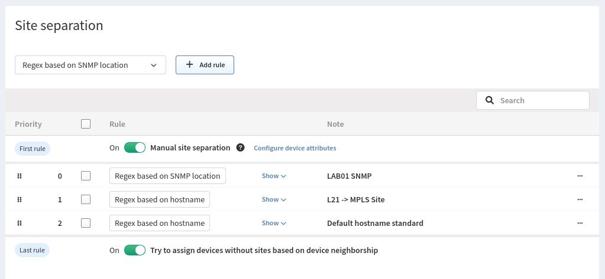

# Site Separation

## Regular Expression Site Separation

!!! info

    Site distribution cannot be changed manually when regex rules are used. Sites cannot be renamed.

    Alternatively, site separation can follow a specific Regular Expression (RegEx) where separation will be performed based on portion of a device hostname or SNMP location.

!!! check

    If you cannot cover the names of the sites with one regex, you can use logical **or**. Use `|` (pipe) operator between RegEx rules or use the Device Attributes method shown below.

### Hostname Regex

Go to **Settings → Site separation** and change **Routing & Switching Domain** to **RegEx based on hostname** or create a new rule by **Add rule** button.

**Transform hostname** is used to normalize site names based on hostname:

- Upper case (default) - first hostname `PRAGUE-RTR1`, second hostname `prague-rtr2` => result is that both devices in one site named `PRAGUE`
- Lower case - first hostname `PRAGUE-RTR1`, second hostname `prague-rtr2` => result is that both devices in one site named `prague`
- No transformation - first hostname `PRAGUE-RTR1`, second hostname `prague-rtr2` => result is that each device has its own site named `PRAGUE` and `prague`



In this example the regular expression matches items such as `PRAGUE-`, `LONDON-`, etc.

### SNMP Location Regex

Go to **Settings → Site separation** and change **Routing & Switching Domain** to **RegEx based on SNMP location** or create a new rule by **Add rule** button.



### Testing

The UI now allows you to edit and test your rules directly in the browser when selecting the **Test rule** option. Here you can see a live preview of devices that will match the regex you created.



You can also test SNMP location rules:



!!! example "RegEx example"

    We have several locations whose name is logically designed as one letter with one to three numbers. From the point of view of a regex, such a site can generally be expressed as `^([a-zA-Z]\\d{1,3})`. Unfortunately, we have two other sites that do not fit into this schema. These sites can be defined with their own regex and this can be added to the original one using the logical operator **or**. Following example will match one of 3 options:

    ```
    ^([a-zA-Z]\\d{1,3}\|HWLAB\|static\\d{1})
    ```

## Device Neighborship



This option will try to define a device based on its neighbor relationship if a device does not match any previous rule. Perhaps you have devices in your environment that do not follow the normal standard like in a DMZ zone or Day 0 devices that have not been fully configured. If that device is connected to a device that did match a rule, IP Fabric will intelligently group it to the correct site.

## Manual Site Separation (Device Attributes)

The Manual Site Separation enables the **Device Attributes** feature to create manual separation if a device does not follow a standard hostname rule or perhaps the hostname is duplicated in multiple locations.

To configure **Device Attributes** first enable the toggle in the Site Separation Menu and select Configure or the Device Attributes menu under settings.


### Device Attributes



- Serial Number is IP Fabric’s "Unique Serial Number" (API column `sn`); this is not the column "Serial Number" which represents the Hardware SN (API column `snHw`). Devices discovered via API can also be assigned using Device Attributes.
- **Hostname** is populated by IP Fabric when a device matching the **Serial Number** is found
- **Attribute** is the Device Attribute to assign, since we want to set the Site based on the serial number set it to **Site name**
- **Value** is the attribute’s value to assign, in this case we want to split site `L35` into separate sites named `35COLO`, `35PRODUCTION`, `35HEADOFFICE`

### Creating Rules In The UI

You are able to create rules in the UI by selecting the **Add attribute** button. This will provide you a form to fill out.



The dropdown is intuitive and will let you search based on SN or hostname. Currently there is an issue where IP Fabric will not search for devices discovered via an API in the UI. Even though it appears no devices match the SN it will still perform the site separation correctly on the next snapshot.



### Creating Rules Via The API

This is the preferred method of creating rules as it allows for bulk importing. Via `PUT` verb on `https://<IPF_URL>/api/v1/attributes/global`. Data looks like

``` json
{"attributes": [
  {"sn": "<IPF SERIAL NUMBER>", "value": "<SITE NAME>", "name": "siteName"}
]
```

### Creating Rules With `python-ipfabric` Package

Please see example at [GitHub](https://github.com/community-fabric/python-ipfabric/blob/main/examples/settings/attributes.py).

## Rule Priority



Rule precedence is defined by the order from top to bottom. So in show example that is

1. **Manual site separation** (if enabled) will look at the **Device Attributes** and try to first assign a device based on serial number if a match is found.
2. Rules you define. In the example above it will check the following
     1. If SNMP Location matches `IPFABRIC, (LAB01)` → Site `LAB01`
     2. If Hostname matches `^L21` → Site `MPLS`
     3. If Hostname matches `^(L\d{1,2})` → Site `L2-99`
4. **Try to assign devices without sites based on device neighborship** (if enabled)
