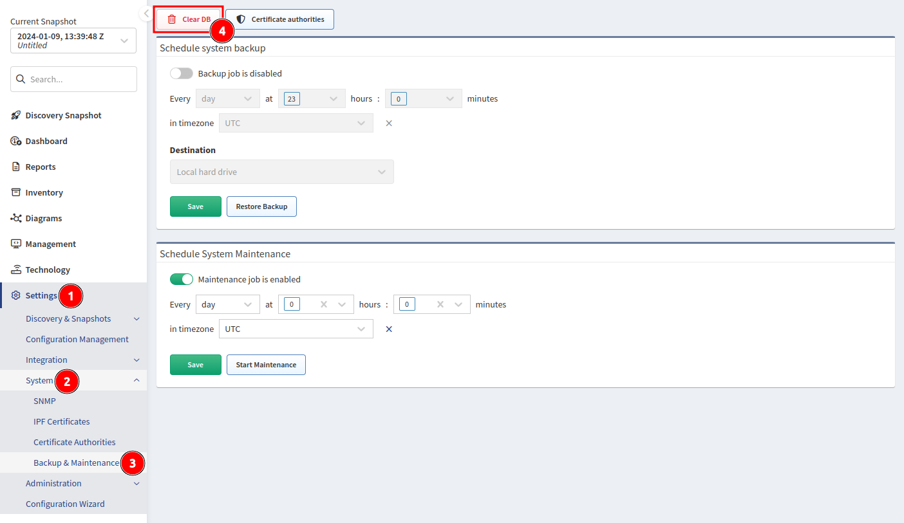
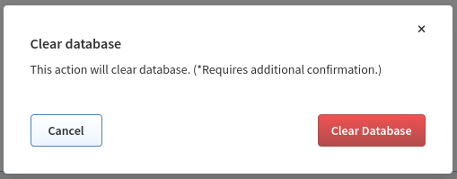
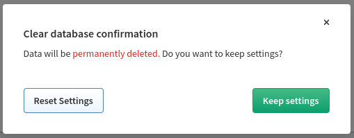

# Clear DB

!!! warning

    Before erasing databases, make sure that you have access to a recent backup!

!!! important

    After clearing the DB, we highly recommend rebooting the IP Fabric
    appliance. It is especially important when you had issues with low amount of
    available RAM and a lot of memory data were moved to the disk swap.

In rare cases, it may be necessary to delete and recreate the IP Fabric
database. Go to **Settings --> System --> Backup & Maintenance** and click **Clear DB**.

When running Clear DB, all loaded snapshots are automatically unloaded and the
database recreated.

There is two-way confirmation.

In the second screen, you can choose between **Reset Settings** or **Keep Settings**:

We recommend selecting **Keep Settings**. If you choose to **Reset Settings**,
all system and discovery settings will be lost, including login credentials,
site separation rules, saved views, shared URLs, filters and API tokens. The
system settings will be reset to defaults **except**:

- Certification authorities
- User settings
- LDAP settings
- Reports settings
- Dashboard settings
