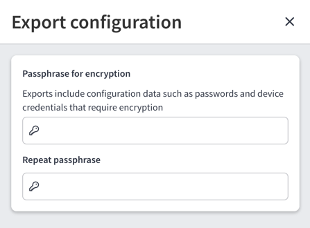

# Configuration Import/Export

To import or export the configuration, navigate to **Settings --> System --> Backup & Maintenance --> Configuration Import/Export**

Easily share your current configuration across multiple IP Fabric instances or create a backup using the import/export feature.
This feature enables you to export the current configuration to a file and import it into the same or another IP Fabric instance,
replacing the existing configuration.

## Configuration Export

To export the current configuration, click the **Export Configuration** button.

A side panel will appear, allowing you to export the full configuration or select specific parts to export.
You will need to enter a passphrase to encrypt the data in the exported file.

!!! info "Password Requirements"

    The password must be at least 8 characters long.
    We recommend using a strong passphrase that includes a mix of uppercase and lowercase letters, numbers, and special characters.

After submitting the export, a `Configuration Export` job will be queued. Once the job is complete, you will receive a notification,
and the exported configuration file will be available for download from the job's notification.

## Configuration Import

To import the configuration, follow these steps and click the **Import Configuration** button.

A side panel will appear, prompting you to enter the correct passphrase and select a file containing the exported configuration.

!!! warning "Configuration import overrides current configuration"

    Importing the configuration will overwrite the entire current configuration file with the imported data.
    We recommend creating a backup before proceeding with the import.

After submitting the import, a `Configuration Import` job will be queued. Once the job is complete, you will receive a notification.
After the import, we recommend logging out and logging back in to ensure all imported data is correctly loaded.
