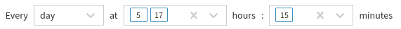

# Schedule System Backup
!!! warning

    If you're about to perform a backup, there needs to be > 50 % of the drive space free on the `root` filesystem.
    
    You can check in the IP Fabric's VM shell with command `df -h`.

## Backup

Use IP Fabric backup to protect your important data.

There are two types of backup:

- Local backup
- Remote backup (FTP, sFTP)

!!! tip

    Backups are encrypted with `osadmin` user password configured during the **first boot wizard**. When you lose `osadmin` user password, backups are also lost!

## Local Backup

Local backup saves database, user and system files locally on a dedicated backup volume. It's highly recommended placing backup volume on different datastore ideally on different physical storage.

!!! info "Backup Disk"

    The backup disk is not present by default! Please add a new virtual disk to enable local backups. (See below)

To add a new backup drive and `mount` it as desired, follow instructions in [Increase Disk Space - Local Backup Disk](../../../System_Administration/increase_disk_space.md#local-backup-disk).

## Automatic Local Backups

To schedule automatic local backups do the following steps:

1. Add dedicated backup volume if not available -- see steps above.
1. Login to the main user interface.
1. Go to **Settings → Advanced → System → Schedule system backup**.
1. Change **Destination** to **Local hard drive**.
1. Set a backup schedule. See example for "Every day at 3:00".
1. Enable backup.

## Automatic Remote Backups

Remote backup saves database, user and system files remotely using `FTP` or `SFTP` protocol.

!!! note

    This is a recommended type of backup.

!!! warning

    A directory **has to be specified** for FTP and SFTP backups.

    Directory path for **SFTP** has to be defined as an **absolute path** and for **FTP** as a **relative path**. Directory **has to exist** on the remote side. If it does not exist, you will get an error.

To set up remote backup do the following steps:

1. Login to the user interface.
1. Go to **Settings → Advanced → System → Schedule system backup**.
1. Enable backup.
1. Set a backup schedule. See example for "Every day at 5:15 and 17:15 (for setting more options, please, hold SHIFT during selection)".
   
1. Change **Destination** to `FTP` or `SFTP`.
1. Enter remote FTP/SFTP **Server** FQDN or IP address. Make sure that your DNS client is configured and working properly in case of FQDN.
1. Enter **Username** to access FTP/SFTP server.
1. Enter **Password** to access FTP/SFTP server
1. Specify a **Directory** where FTP/SFTP backup should be uploaded.
1. Click **Save**.
1. IP Fabric tries to reach FTP/SFTP server with configured parameters.

--8<-- "snippets/username_password_regex.md"

!!! warning

    FTP/SFTP user needs read, write, list and delete permissions.

!!! note

    From version 4.1.1 onward we do not check validity of SSL certificates during FTP backups.
