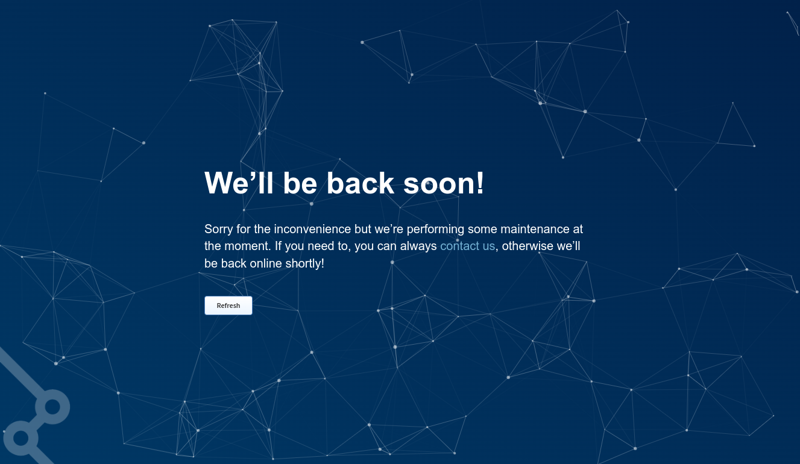
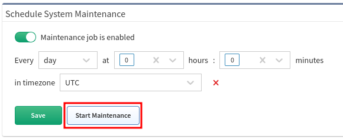

# Schedule System Maintenance

Settings location: **Settings --> System --> Backup & Maintenance --> Schedule
System Maintenance**

To ensure the platform's good health, it's highly recommended to regularly run
System Maintenance. The recommended frequency for System Maintenance is once a
day.

Even though the process is very quick, we recommend performing it when no one is
working with IP Fabric, as the platform is not available during maintenance.

If the IP Fabric GUI is accessed during maintenance, the following message is
shown:

Sometimes, it is necessary to run maintenance manually; this can be done with
the **Start Maintenance** button:

