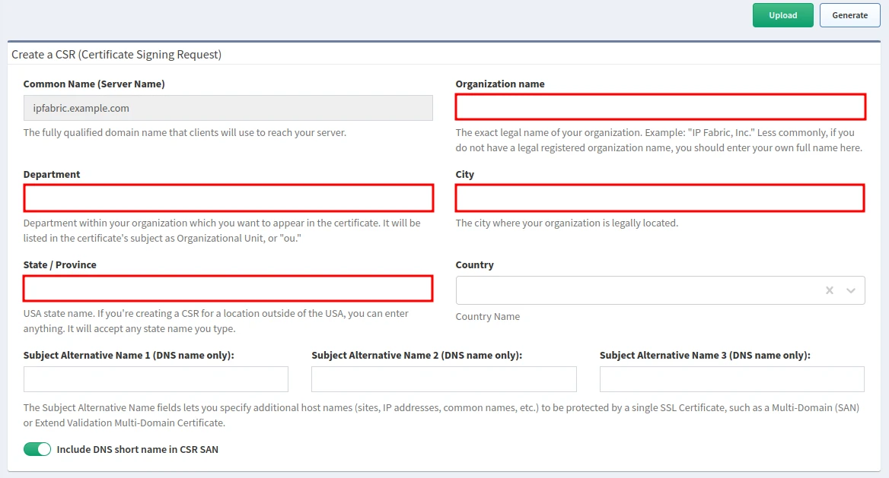
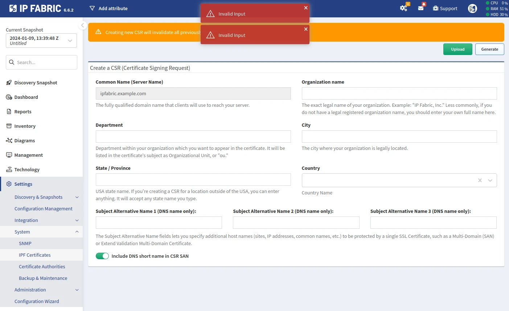
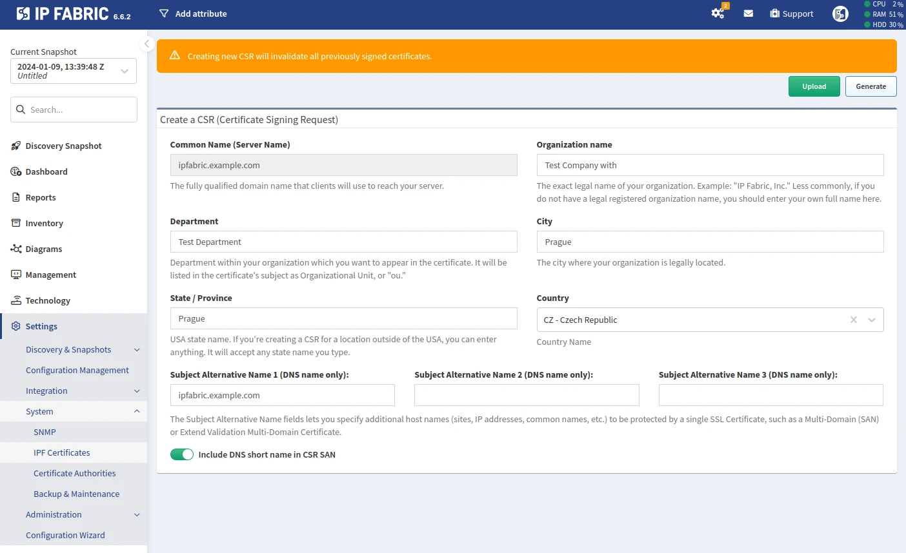
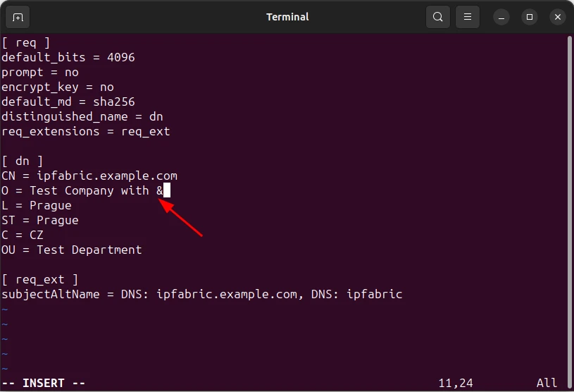

# IPF Certificates

You are accessing the IP Fabric GUI using a secure TLS connection. A self-signed
server certificate is automatically generated during the IP Fabric deployment.
However, due to the nature of SSL/TLS, the self-signed server certificate cannot be
trusted -- as indicated in an SSL/TLS error in the web browser (for example,
`NET::ERR_CERT_AUTHORITY_INVALID` in Google Chrome).

We recommend that you replace the self-signed server certificate with your own
server certificate signed by a trusted certificate authority.

!!! information "Enabling SSO while using a Private Certificate Authority (CA)"

    If your organization uses an internal CA and you plan to enable SSO, additional
    steps are required after completing the instructions on this page. Specifically,
    you must add your CA certificate to the system's trust store to ensure SSO functions
    correctly. For detailed guidance, refer to [Certificate Authorities](../system/ca.md).

Usually, the server certificate replacement can be handled via **Settings -->
System --> IPF Certificates** and consists of the following steps:

1. Generate a CSR (Certificate Signing Request).
2. Sign the generated CSR with a trusted certificate authority.
3. Upload the signed server certificate.

!!! important

    Only a certificate that is the result of signing a CSR generated with
    **Settings --> System --> IPF Certificates --> Generate** can be uploaded to
    IP Fabric with **Settings --> System --> IPF Certificates --> Upload** and
    used as IP Fabric's server certificate.

In the [Miscellaneous](#miscellaneous) section, we also describe how to handle
some special requirements regarding certificates -- when **Settings -->
System --> IPF Certificates** on its own is not sufficient.

## Generate CSR (Certificate Signing Request)

!!! note "Subject Alternative Name"

    Short Subject Alternative Names (only hostnames without a domain name) are
    not accepted by all CAs (Certificate Authorities). To remove it from the
    CSR, switch off the **Include DNS short name in CSR SAN** toggle.

!!! warning "Only Some Characters Are Allowed in Fields"

    The fields **Organization name**, **Department**, **City**, and
    **State / Province** must match the following regular expression:
    `/^[A-Za-z0-9.,\/_@%^:=+ -]*$/`

    - They must contain only these characters: `A-Z` `a-z` `0-9` `.,/_@%^:=+ -`

    This is for security reasons.

    If this is too restrictive, please follow the instructions in
    [Generate CSR with Special Characters](#generate-csr-with-special-characters).

    

1. Go to **Settings --> System --> IPF Certificates**.
2. Fill out the **Create a CSR (Certificate Signing Request)** form.
3. Click **Generate** (in the top-right corner).
4. A file called `nimpee.csr` will be downloaded.

## Sign Generated CSR

This step depends on the vendor and version of your certificate authority.
Therefore, please check the vendor's documentation.

## Upload Signed Server Certificate

!!! warning

    Only PEM (Base64-encoded) certificate format is supported.

!!! warning

    Only a certificate that was created by signing the most recent CSR can be
    uploaded to IP Fabric! If you generate another CSR before uploading the
    certificate created from the previously generated CSR, the certificate will
    not be applied.

!!! important

    If you are signing a certificate by a certificate authority that also has
    intermediate certificates, the whole certificate chain needs to be included
    in the final certificate uploaded to IP Fabric in one continuous file:

    ```
    -----BEGIN CERTIFICATE-----
    (Base64 server certificate)
    -----END CERTIFICATE-----
    -----BEGIN CERTIFICATE-----
    (Base64 intermediate certificate)
    -----END CERTIFICATE-----
    -----BEGIN CERTIFICATE-----
    (Base64 root certificate)
    -----END CERTIFICATE-----
    ```

1. Go to **Settings --> System --> IPF Certificates**.
2. Click **Upload** (in the top-right corner).
3. **Drag and drop** the new certificate or use **Select file** to upload it.
4. While the new certificate is being installed, the IP Fabric GUI may be
   unresponsive for a few seconds.
5. Refresh the IP Fabric GUI in your browser.

## Miscellaneous

### Generate CSR With Special Characters

Let's consider an example where we enter `Test Company with &` (please note that
the character `&` is not allowed) as the **Organization name**. After filling in
the remaining fields, when we click **Generate**, an `Invalid Input` error will
be displayed.



If any special characters are required in any of the mentioned fields, follow
these steps:

1. Fill out the **Create a CSR (Certificate Signing Request)** form, but avoid
   any special characters (in our example, we replaced `Test Company with &`
   with `Test Company with`):

   

2. Click **Generate**.
  - In your browser, a file called `nimpee.csr` will be downloaded. **Please do
    not use this file.**
  - The files `customer.conf`, `customer.key`, and `customer.csr` will be
    generated in the directory `/opt/nimpee/conf.d/ssl-cust` on the IP Fabric
    appliance. It's important to note that `customer.csr` will be identical to
    `nimpee.csr`.

3. Log in to the IP Fabric CLI as the `osadmin` user.

4. Change to `root`:

   ```shell
   sudo su
   ```

5. Change to the `/opt/nimpee/conf.d/ssl-cust` directory:

   ```shell
   cd /opt/nimpee/conf.d/ssl-cust
   ```

6. Remove `customer.key` and `customer.csr` (they will be re-generated in step 8):

   ```shell
   rm customer.key customer.csr
   ```

7. Modify `customer.conf` (for example with `vi customer.conf`; in our example,
   we changed `Test Company with` to `Test Company with &`):

   

8. Generate new `customer.key` and `customer.csr` files using the modified
   `customer.conf`:

   ```shell
   openssl req -new -config customer.conf -keyout customer.key -out customer.csr
   ```

9. Check the new `customer.csr`:

   ```shell
   openssl req -in customer.csr -noout -text
   ```

10. Change the owner and group of the two new files to `autoboss`:

   ```shell
   chown autoboss:autoboss customer.csr customer.key
   ```

11. Download the new `customer.csr` (for example with `scp`) for signing.

Once you have the signed certificate ready, navigate to **Settings --> System
--> IPF Certificates** and click **Upload** to begin the process of uploading
the certificate.

### Additionally Add Entire Certificate Chain

A new, unmodified certificate file might contain only the server certificate
itself without the certificate chain (intermediate and root certificates).

This might be sufficient for your browser (as it most probably already has the
corresponding intermediate and root certificates), but not for SSO.

SSO requires the certificate to have the entire certificate chain (including the
intermediate and root certificates).

After uploading such a certificate via **Settings --> System --> IPF
Certificates --> Upload**, you will encounter the following error while logging
in to IP Fabric via SSO:

```
{"code":"API_AUTHENTICATION_FAILURE","message":"Authentication Failure","errors":[{"message":"Error: unable to verify the first certificate"}]}
```

!!! tip

    Alternatively, you may append the intermediate and root certificates to the
    certificate file before uploading it via **Settings --> System --> IPF
    Certificates --> Upload** -- as described above in
    [Upload Signed Server Certificate](#upload-signed-server-certificate).

To ensure that the certificate on the IP Fabric appliance has the entire
certificate chain, do the following:

1. Log in to the IP Fabric CLI as the `osadmin` user.

2. Change to `root`:

   ```shell
   sudo su
   ```

3. Change to the `/etc/nginx/ssl` directory:

   ```shell
   cd /etc/nginx/ssl
   ```

4. Verify that the `server.crt` file indeed has only the server certificate
   itself:

   ```shell
   grep 'CERTIFICATE' server.crt
   ```

   - The command should return only one pair of `-----BEGIN CERTIFICATE-----`
     and `-----END CERTIFICATE-----`.

5. Make a backup of `server.crt`:

   ```shell
   cp server.crt server.crt.bkp
   ```

6. Append the immediate and root certificates to `server.crt`:

   ```shell
   vi server.crt
   ```

   In case you do not have the immediate and root certificates readily
   available:

   1. Open the IP Fabric GUI in your browser.

   2. Click the **Lock** icon in the browser's address bar and download the
      entire certificate chain:

      Google Chrome: **Connection is secure --> Certificate is valid --> Details
      --> Export... --> Base64-encoded ASCII, certificate chain**

      Mozilla Firefox: **Connection is secure --> More information --> View
      Certificate --> Download --> PEM (chain)**

   3. Go to the IP Fabric CLI.

   4. Clear the content of `server.crt`:

      ```shell
      echo '' > server.crt
      ```

   5. Copy the content of the entire certificate chain and paste it into
      `server.crt`:

      ```shell
      vi server.crt
      ```

7. Verify that the MD5 hashes of `server.crt` and `server.key` are identical:

  !!! example

      ```shell hl_lines="2 4"
      root@ipfabric:/etc/nginx/ssl# openssl x509 -noout -modulus -in server.crt | openssl md5
      (stdin)= 9dcfd46578b9dffe06ca0146607f6153
      root@ipfabric:/etc/nginx/ssl# openssl rsa -noout -modulus -in server.key | openssl md5
      (stdin)= 9dcfd46578b9dffe06ca0146607f6153
      ```

  !!! danger

      Do not proceed with the next step if the MD5 hashes do not match!

8. Restart the `nginx` web server:

   ```shell
   systemctl restart nginx
   ```

9. Check if the `nginx` web server is running:

   ```shell
   systemctl status nginx
   ```

10. Try to log in to IP Fabric via SSO again.

### Add Custom SSL Certificate

If you require a custom SSL certificate (prepared completely outside IP
Fabric) and cannot use **Settings --> System --> IPF Certificates**, follow this
guide to replace the self-signed certificate manually.

!!! important

    Please ensure that the FQDN (DNS name) of the IP Fabric appliance is set as
    your custom certificate's `Subject Alternative Name`. Having the FQDN as the
    certificate's `Subject` or `Common Name` is not sufficient.

1. Log in to the IP Fabric CLI as the `osadmin` user.

2. Change to `root`:

   ```shell
   sudo su
   ```

3. Change to the `/etc/nginx/ssl` directory:

   ```shell
   cd /etc/nginx/ssl
   ```

4. Backup the previous server certificate and its private key:

   ```shell
   mv server.crt server.crt.bkp
   mv server.key server.key.bkp
   ```

5. Upload the new certificate chain and private key to the `/etc/nginx/ssl/`
   directory.

   1. They must have the same names as those previous ones -- `server.crt`
      and `server.key`.
   2. `server.crt` needs to contain the new SSL certificate and full certificate
      chain in PEM format.
   3. `server.key` needs to contain the new SSL certificate's private key in
      decrypted PEM format.

6. The certificate chain in `server.crt` must have the following sequence:

  1. server certificate
  2. intermediate certificate(s)
  3. root certificate


7. Make sure that the new `server.crt` has the same owner and group
   (`root:root`) and permissions (`-rw-r--r--`) as the old one:

   ```shell
   chown root:root server.crt
   chmod 0644 server.crt
   ```

8. Make sure that the new `server.key` has the same owner and group
   (`root:autoboss`) and permissions (`-rw-r-----`) as the old one:

   ```shell
   chown root:autoboss server.key
   chmod 0640 server.key
   ```

9. Verify that the MD5 hashes for `server.crt` and `server.key` are identical:

  !!! example

      ```shell hl_lines="2 4"
      root@ipfabric:/etc/nginx/ssl# openssl x509 -noout -modulus -in server.crt | openssl md5
      (stdin)= 9dcfd46578b9dffe06ca0146607f6153
      root@ipfabric:/etc/nginx/ssl# openssl rsa -noout -modulus -in server.key | openssl md5
      (stdin)= 9dcfd46578b9dffe06ca0146607f6153
      ```

  !!! danger

      Do not proceed with the next step if the MD5 hashes do not match!

      If the MD5 hashes do not match, check if the certificate chain is in the
      correct order and if the private key corresponds to the server
      certificate.

10. Restart the `nginx` web server:

   ```shell
   systemctl restart nginx
   ```

11. Check if the `nginx` web server is running:

    ```shell
    systemctl status nginx
    ```

12. Verify that the new certificate works correctly by visiting the IP Fabric
    main GUI in your browser.
