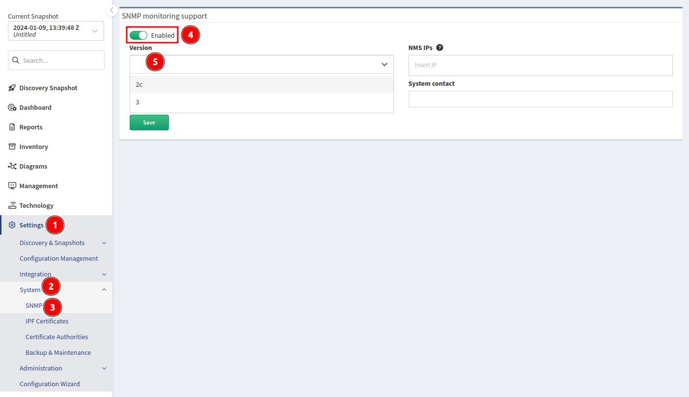
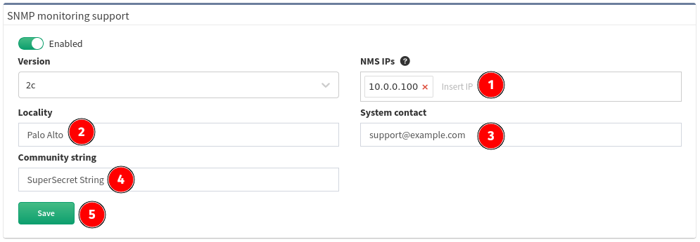
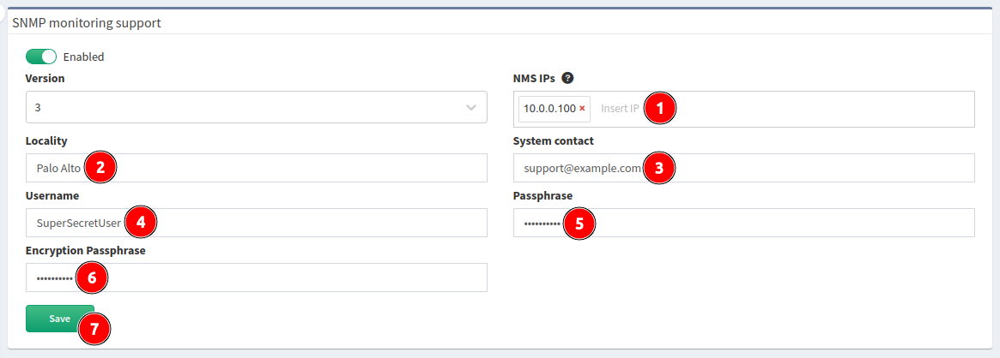

# SNMP

The IP Fabric appliance can be monitored using the SNMP protocol. CPU, memory,
hard drives, and network interfaces can be monitored. The IP Fabric appliance
uses standard Linux OS OIDs.

To enable SNMP in IP Fabric, go to **Settings --> System --> SNMP**, enable the
**on/off** toggle, and select `2c` or `3` from the **Version** list:

!!! check "Security Note"

    Only IP addresses specified in the **NMS IPs** field are enabled to have
    access to SNMP port `161/udp`.

If you selected version `2c`, please configure:

1. **NMS IPs** -- IP addresses of remote monitoring servers.
2. **Locality** -- Location of the IP Fabric appliance.
3. **System contact** -- Contact details (e.g., email) of a responsible person
   or department.
4. **Community string** -- Must match the community string configured on the
   monitoring server.
5. Click **Save**.

If you selected version `3`, please configure:

!!! info "SNMP v3"

   AES is used for data privacy.

1. **NMS IPs** -- IP addresses of remote monitoring servers.
2. **Locality** -- Location of the IP Fabric appliance.
3. **System contact** -- Contact details (e.g., email) of a responsible person
   or department.
4. **Username** -- SNMPv3 user.
5. **Passphrase** -- Authentication passphrase.
6. **Encryption Passphrase** -- Privacy passphrase.
7. **Authentication Type** -- Authentication type (`SHA 1`, `SHA 224`,
   `SHA 256`, or `SHA 512`). Prefer the stronger algorithm, `SHA 512`.
8. Click **Save**.

--8<-- "snippets/username_password_regex.md"
