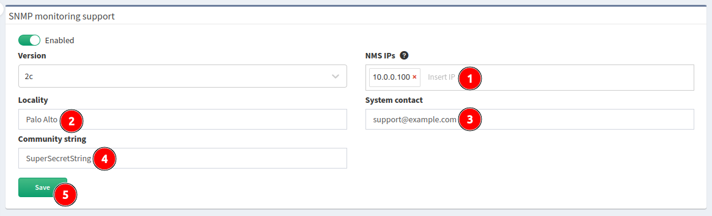

# SNMP

IP Fabric appliance can be monitored using SNMP protocol. CPU, memory,
hard drives and network interfaces can be monitored. Appliance uses
standard Linux OS OIDs.

To enable SNMP on IP Fabric, go to **Settings --> System --> SNMP**, click
the **on/off** toggle and select `2c`, or `3` from the **Version** list:

!!! check "Security note"

    Only IP address specified in the **Host IP** field is enabled to have access
    to SNMP 161/udp.

If you selected version `2c`, please configure:

1. **Host IP** - IP address of remote monitoring server
2. **Locality** - location of IP Fabric appliance
3. **System Contact** - contact to responsible person or department
4. **Community string** - must match community string configured on monitoring
   server
5. Click **Save**

If you selected version `3`, please configure:

!!! info "SNMP v3"

    For user authentication, only SHA is supported. For data privacy, AES is
    used.

1. **Host IP** - IP address of remote monitoring server
2. **Locality** - location of IP Fabric appliance
3. **System Contact** - contact to responsible person or department
4. **Username** - SNMP v3 user
5. **Passphrase** - authentication and privacy passphrase
6. Click **Save**

--8<-- "snippets/username_password_regex.md"
