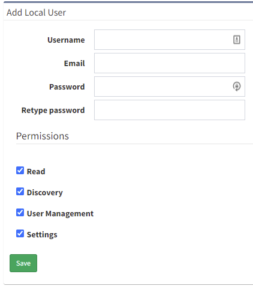
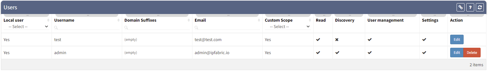
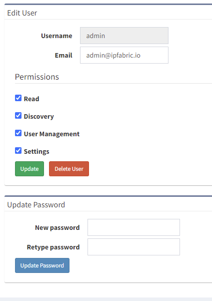

# Local Users

Main user management tab allows you to create a new local account with
various user permissions or modify already existing users including
default admin account. Only a user with User Management permission can
access the User Management menu.

## Adding New Local User

A new user is added to the system by filling out his/her user details. Valid
email domain needs to be set (for example .com, .io, .fr etc) for a user to be
successfully created

Following are the pre-defined user roles:

**READ** – a user can view the discovered data, load diagram views, but
cannot launch a discovery themselves or modify or delete existing views.
He is also unable to execute basic snapshot operations like loading and
unloading snapshots.

**DISCOVERY** – a user can launch a discovery, save new view or modify
existing diagram view and view stored configurations.

**USER MANAGEMENT** – an administrative right that specifically grants a
privilege to a user to create, delete or modify other users.

**SETTINGS** – an administrative right that enables access to the global
settings of the system.

## Working With Users

Within this table, all user accounts can be modified or deleted. It also
transparently shows user permissions and emails.

When an edit menu for a specific user account is opened, user
permissions or a password can be updated.

The password of the default admin account can also be changed here.
