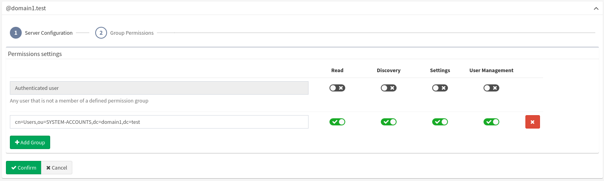

# LDAP Authentication

Only LDAP user authentication is supported. Users need to be assigned
the appropriate permissions locally or default user permissions for
authenticated users need to be set.

User synchronization or import capabilities ***are not supported at
this time***. LDAP hence work in an ***on-demand*** state - ***users are
added to the IP Fabric after they log in for the first time.***

### Supported LDAP servers are:

-   Microsoft Active Directory
-   OpenLDAP

## Enable LDAP authentication

1.  Log in to the IP Fabric as a user with admin rights.
2.  Go to ***Settings → User Management → LDAP Settings*** tab.
3.  Select ***+Add Domain***.
4.  Choose LDAP server type in the ***Type*** drop-down menu. Only
    ***Microsoft Active Directory*** or ***Open LDAP*** servers are
    supported.
5.  Enter all the aliases/suffixes for this domain in the ***Account
    suffixes*** field. Each suffix must begin with @. If the same user
    can log in with other suffixes, for example, `joe@europe.domain.com`
    and `joe@domain.com` then fill in `@europe.domain.com` and `@domain.com`.
6.  Add servers for the domain:
    1.  as an ***explicit list of addresses***
        1.  Choose ***Use pre-configured LDAP servers*** in Servers
            dropdown
        2.  Specify FQDN or IP address of the LDAP server including the
            protocol prefix (such as ldap://your.domain.com or
            ldaps://your.domain.com)
        3.  Specify the port (default LDAP port is 389 and default LDAPS
            port is 636)
        4.  For LDAP over SSL, also upload a CA certificate used for the
            LDAP certificate signature
        5.  Click on ***+Add Server*** if you want to add backup servers
    2.  using ***DNS service records***
        1.  Choose ***Use DNS to find LDAP servers*** in Servers
            dropdown
        2.  Choose/upload a certificate (recommended in the production
            environment)
        3.  Define the DNS address
        4.  Define Service location name (common names are `ldap` and
            `ldaps`). This is the network service that constructs the
            final name of the record. The construction is done as
            follows: ``\_{{service location name}}.\_tcp.{{dns address}}``
7.  Specify service account with LDAP read permissions in the ***Bind
    DN*** field. This field must be an ***escaped*** LDAP-style
    *distinguished name*. (for example
    `CN=Doe\, Joe,OU=europe,DC=your,DC=domain,DC=com` or
    `CN=User,OU=europe,DC=your,DC=domain,DC=com`)
8.  Enter the bind user's password (defined in step 7) in the ***Bind
    credentials*** field.
9.  Enter a whole domain or specific organization unit (container) in
    ***Search base*** to specify where users and groups can be found in
    the LDAP tree. (for example
    `OU=NetworkAdmins,DC=your,DC=domain,DC=com`)
10. Enter an attribute where email is stored in the LDAP user object
    into ***Search email attribute**.*
11. Only for "*Microsoft Active Directory*": Tick ***Allow nested
    groups*** for nested group permission lookup. This uses [Extensible
    Match](https://ldapwiki.com/wiki/ExtensibleMatch) Rule
    ([LDAP_MATCHING_RULE_IN_CHAIN](https://ldapwiki.com/wiki/LDAP_MATCHING_RULE_IN_CHAIN))
    which might be slow in your local setup.
12. Click ***Confirm***.

!!! note ""

    If the LDAP server is not reachable or credentials to the service
    account are not correct, LDAP authentication cannot be set.

## LDAP Group Permissions

After the LDAP server is added, default permissions for authenticated
users can be set. By default, all permissions are denied. This means
that a user even with the correct LDAP username and password won't be
able to log in since he/she won't even have read-only permission. It is
recommended to create new LDAP groups (such as IP_FABRIC_ADMINISTRATORS,
IP_FABRIC_USERS, ...) and assign to them users to which you want to
grand access.

!!! warning "Primary user groups are not supported"

    It is recommended to create new
    LDAP groups (such as IP_FABRIC_ADMINISTRATORS, IP_FABRIC_USERS, ...) and
    assign them permissions.
    


## Disable LDAP authentication

Remove all LDAP configuration domains in ***Settings → User Management →
LDAP Settings*** to disable LDAP authentication.

## Local vs LDAP authentication

By default, local authentication (or in other words information stored
in the local database) is the preferred authentication method, where
LDAP is used as a backup authentication method. If a user is not found
in the local database and LDAP authentication is defined, IP Fabric will
redirect the authentication attempt to an LDAP server. If a user is
successfully authenticated through LDAP, basic information about this
user is then passed from LDAP and stored in the local database.

## Troubleshooting

Before contacting our support, please make sure that inputs entered into
IP Fabric user interface are correct. This can be done using
`ldapsearch` command utility:

!!! note ""

    `ldapsearch` is present in IP Fabric image (access it via ssh) or it can
    be installed locally as part of `ldap-utils` Linux package. It is
    recommended to ***always test LDAP configuration from the IP Fabric image***

### CLI Example

!!! warning ""

    The following example doesn’t verify SSL certificate if LDAPS is used


``` bash
LDAPTLS_REQCERT=ALLOW ldapsearch \
  -W -H "ldaps://your-ldap-server:636" \
  -D "$LDAP_BIND_DN" \
  -b "$LDAP_SEARCH_BASE" \
  -s sub
```

Your fields are correctly set when exit-code of your command is zero.

The use of nested groups can also be tested by adding the following line
to the CLI example:

``` text
(member:1.2.840.113556.1.4.1941:=$USER.DN)
```

The CLI example can be followed by a query. Useful LDAP queries to find
a user follow:


``` bash
(uid=$LOGIN_INPUT)
(|(sAMAccountName=$LOGIN_INPUT)(userPrincipalName=$LOGIN_INPUT))
```

### Error Codes

All LDAP errors regarding server connection and user binding are
returned as "*LDAP as provided is not reachable*" due to security
concerns. Please check your *Search base* and *Search login attribute*
when "*LDAP Search Failed*" error is shown.

