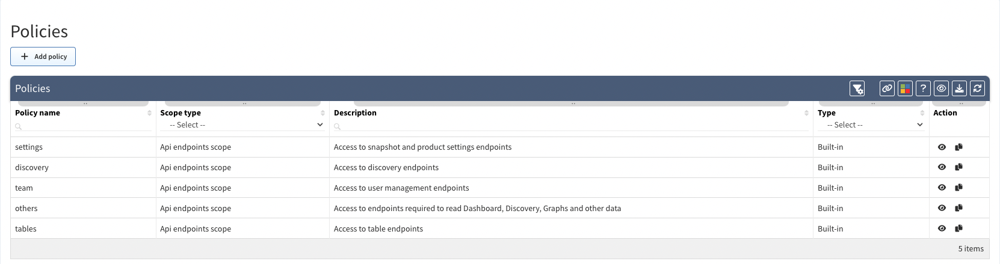
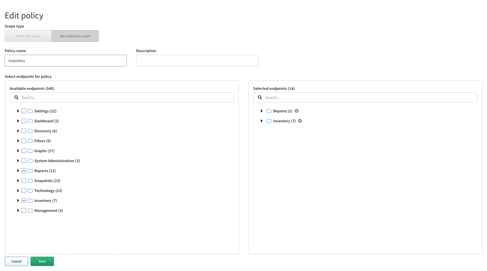
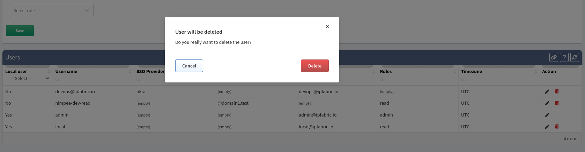

# Policies

**Policies** are sets of resources with their actions (e.g. *discovery* policy allows access to discovery api endpoints).

**Policies** page enables you to create or modify policies.

## Add Policy

1. To add new policy click on **+ Add policy**.

	

1. Then fill the **Add policy** form and click on **Save**.

	

## List of Policies

**Policies** table lists all policies including their details and enables you to **modify** or **delete** them _(with exception for built-in policies which cannot be modified or deleted)_.

## Edit Policy

1. To modify policy details, click on **edit icon** in policies table.

	

2. Then to modify policy details update data in **Edit Policy** form and click on **Save**.

	

## Copy Policy

1. To copy policy, click on **copy icon** in policies table.

	

2. Then modify policy details in **Edit Policy** form and click on **Save**.

	

## Delete Policy

1. To delete policy, click on **delete icon** in table.

	

2. Then click on **Delete** to confirm action.

	
