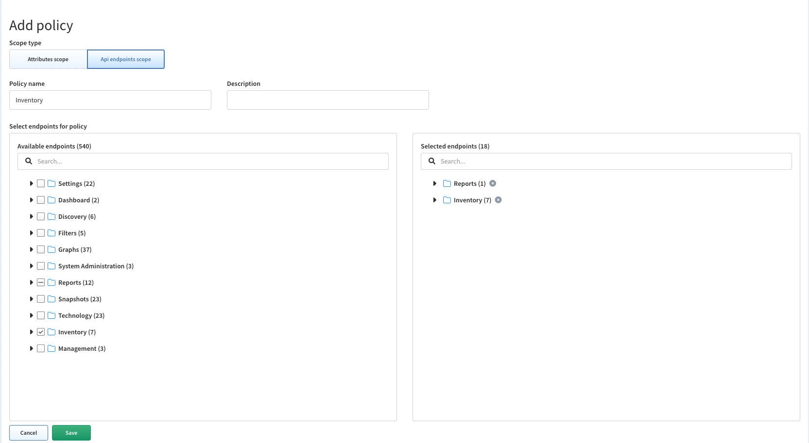
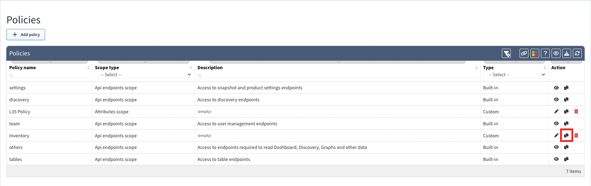
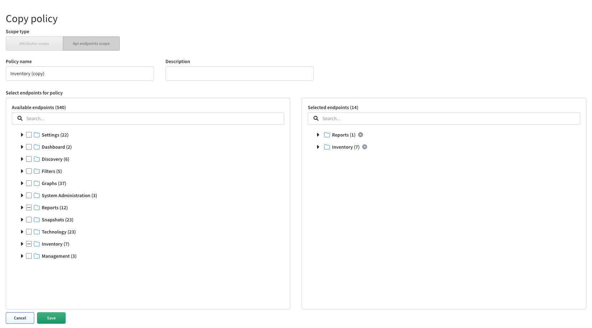

# Policies

**Policies** can contain sets of **attributes or endpoints**.

**Attributes** allow a policy to permit access to specific attributes such as **siteName**.

!!! Info
        When configuring granular policies and a user does not have any of the system policies configured, the user must have an attribute policy to be able to view diagrams. The diagram views are protected by a whitelist and will only allow users to view graphs if they have attribute scopes configured.

**Endpoints** allow a policy to only allow access to **specific API endpoints** within IP Fabric (e.g. *discovery* policy allows access to discovery api endpoints).

**Policies page** enables you to create or modify policies.

## Add Attribute Policy

1. To add a new policy click on **+ Add policy**.

	

2. By default the **Attributes scope** will be selected.

	

3. Set a policy name, add attributes (create a filters), select values and **save** your attribute policy.

	

## Add API Endpoint Policy

1. To add new policy click on **+ Add policy**.

	

2. Select **Api endpoints scope** 

	

3. Set a policy name, select API endpoints and **save** your endpoints scope.

## List of Policies

**Policies table** lists all policies including their details and enables you to **modify** or **delete** them _(with exception for built-in policies which cannot be modified or deleted)_.

## Edit Policy

1. To modify policy details, click on **edit icon** in policies table.

	

2. Then to modify policy details update data in **Edit Policy** form and click on **Save**.

	

## Copy Policy

1. To copy policy, click on **copy icon** in policies table.

	

2. Then modify policy details in **Copy Policy** form and click on **Save**.

	

## Delete Policy

1. To delete policy, click on **delete icon** in table.

	

2. Then click on **Delete** to confirm action.

	
