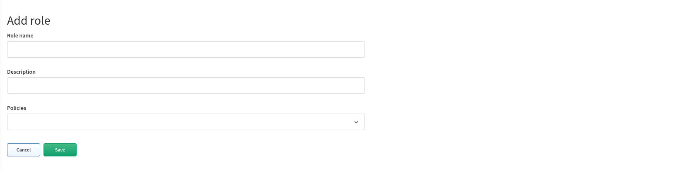
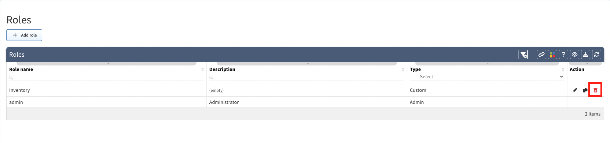

# Roles

**Roles** enable users to perform actions on system resources (e.g. *user-management* role with assigned *team* policy enables users view, add, update and delete Users, Roles, Policies, LDAP Configuration).

**Roles** page enables you to create or modify roles.

## Add Role

1. To add new role click on **+ Add role**.

	

1. Then fill the **Add role** form and click on **Save**.

	

## List of Roles

**Roles** table lists all roles including their details and enables you to **modify** or **delete** them _(with exception for built-in ***admin*** role which cannot be modified nor deleted)_.

## Edit Role

1. To modify role details, click on **edit icon** in roles table.

	

2. Then to modify role details update data in **Edit Role** form and click on **Save**.

	

## Copy Role

1. To copy role, click on **copy icon** in roles table.

	

2. Then modify role details in **Edit Role** form and click on **Save**.

	

## Delete Role

1. To delete role, click on **delete icon** in table.

	

2. Then click on **Delete** to confirm action.

	
