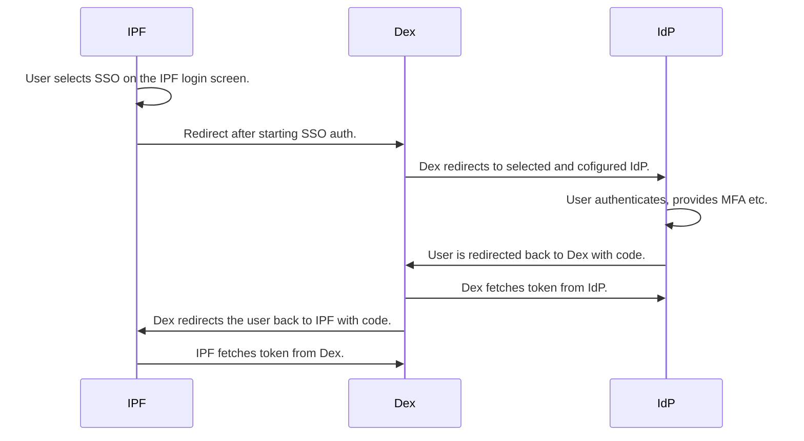

# Single Sign On (SSO)

IP Fabric includes support for single sign-on. We have opted for [Dex (A
Federated OpenID Connect Provider)](https://dexidp.io/) as a key building block
to allow a broader set of Identity providers (IdP).



Implementation of SSO configuration can be complex, and because of that, it is configured for you by our Solution Architects. If you are unsure who your Solution Architect is, contact our Support Team.

## SSO Configuration

While Dex supports various connectors, we strongly recommend using OpenID
Connect (OIDC) for SSO integration. Please, check [official Dex
documentation](https://dexidp.io/docs/connectors) for their overview.

Dex configuration is located at `/etc/ipf-dex.yaml` on the IP Fabric appliance.
It has several configuration sections. The key ones are covered below.

Dex configuration has at the very top attribute called `issuer`. This needs to
be configured to be the same as `url` in the IPF API configuration. For example

```yaml
issuer: https://ipf-device-fqdn/dex
```

### IPF API configuration

The IPF API configuration is stored at `/opt/nimpee/conf.d/api.json`. The
relevant section for SSO is called `dex`. It's general format looks like

```json
  "dex": {
    "url": "https://ipf-device-fqdn/dex",
    "providers": []
  }
```

The `providers` sections have to contain at least one SSO provider (which
corresponds to `staticClient` in the Dex configuration).

!!! example "Example of `providers` section"

    ```json
    "providers": [
      {
        "name": "okta",
        "clientId": "ipfabric",
        "clientSecret": "aiphoocah6oucieco2ae5VeiJo"
        "roleAssignments": [
          {
            "groupName": "any",
            "roleId": "ID_OF_CREATED_ROLE_WITH_READ_POLICY"
          },
          {
            "groupName": "group01",
            "roleId": "admin"
          }
        ]
      }
    ]
    ```

Multiple mappings with the same `groupName` will get merged (so the user will
receive all corresponding roles on IP Fabric side).

### Static client

Section `staticClients` contain configuration for the IP Fabric portal, which
acts as a client to `dex`.

!!! example

    ```yaml
    staticClients:
      - id: ipfabric
        redirectURIs:
          - 'https://ipf-device-fqdn/api/v5.0/auth/external/okta'
        name: 'IP Fabric'
        secret: aiphoocah6oucieco2ae5VeiJo
    ```

- `id` is a unique identification of the client within Dex configuration. Has
  to be the same as `clientId` from the IPF API config.
- `redirectURIs` is a full path to the callback endpoint of the IP Fabric client.
  It is in the format of
  `https://{{ipf-device-fqdn}}/api/{api_version}/auth/external/{{name-from-api-config}}"`.
  The end of the URI has to be the same as `name` attribute in the IPF API
  config. Please, use only letters. No special characters are allowed. Please,
  be aware of the `{api_version}` property. It is updated with every _major_
  IPF release.
- `name` is an arbitrary name of the client.
- `secret` has to be the same as `clientSecret` in the API config. It is a
  shared secret between IFP and Dex.

### OpenID Connect (OIDC)

[Dex documentation on OIDC](https://dexidp.io/docs/connectors/oidc/) covers all
configuration options.

!!! example "Example of OIDC provider"

    ```yaml
    - type: oidc
      id: sso
      name: SSO SAML
      config:
        issuer: https://auth.customer.com/auth/idp
        redirectURI: https://ipf-device-fqdn/dex/callback
        clientID: ipfabric
        clientSecret: woo5ieSa7die4fooy6Oop7gedi
        getUserInfo: true
        insecureEnableGroups: true
        scopes:
          - openid
          - profile
          - email
          - roles
        claimMapping:
          groups: roles
    ```

### SAML Connector

Please review the [official Dex SAML
documentation](https://dexidp.io/docs/connectors/saml/) for all configuration
options and potential caveats.

!!! example "Example Okta SAML configuration"

    ```yaml
    connectors:
      - type: saml
        id: okta_saml
        name: Okta SAML
        config:
          ssoURL: https://dev-xxxxx.okta.com/app/dev-xxxxxx_dexdevsaml_1/exk2jwjoow8IomIfk5d7/sso/saml
          ssoIssuer: http://www.okta.com/exk2jwjoow8IomIfk5d7
          redirectURI: https://ipf-device-fqdn/dex/callback
          caData: "LS0t ... 0tLS0tCg=="
          usernameAttr: name
          emailAttr: email
          groupsAttr: groups
          nameIDPolicyFormat: emailAddress
    ```

- `redirectURI` is `issuer` with appended `/callback`. It needs to point back to the Dex instance,
  which will handle incoming redirects from IdP. The 'redirectURI'property is configured on the IdP side.
- `caData` contain Base64 encoded certification chain which is used to verify
  IdP identity. It can be replaced with `ca` attribute alternatively, which points to a file containing a chain.
