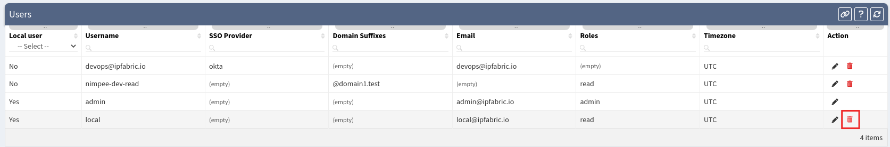

# Users

**Users** page enables you to create or modify users including default admin, LDAP and SSO accounts.

## Add Local User

To add new user, fill the **Add Local User** form on **Users** page and click on **Save**.

To allow user access to system is required to assign user one or more **Roles**.

Users with no assigned roles will get `API_INSUFFICIENT_RIGHTS` error upon login/access to API.

To **add** or **modify** roles follow instructions at [Roles page](roles.md).

## List of Users

**Users table** lists all local, LDAP and SSO users including their details and enables you to **modify** or **delete** them _(exception: a user currently logged in cannot delete her/himself)_.

## Edit Local User

1. To modify local users details or password, click on **edit icon** in users table.

	

2. Then to modify users details, update data in **Edit User** form and click on **Update**.
3. Or to modify users password, fill in passwords in **Update Password** form and click on **Update Password**.

	

## Edit LDAP/SSO User

LDAP/SSO users have **Roles** assigned via LDAP and SSO Configurations, hence it's not possible to modify their **Roles** in UI as it's possible for Local Users.

1. To edit LDAP/SSO users, click on **edit icon** in table.

	

2. Then to modify users details update data in **Edit User** form and click on **Update**.

	

## Delete User

1. To delete a user, click on **delete icon** in table.

	

2. Then click on **Delete** to confirm action.

	

 Delete User is also possible by clicking on **Delete User** when editing user.

## Disable Local User Access

To disable Local Users Access, follow the steps in [Edit Local User](#edit-local-user) and remove all **Roles** assigned to that user.

