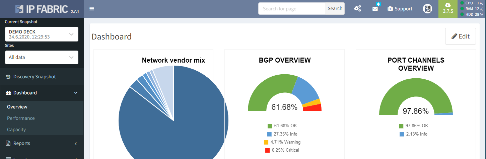
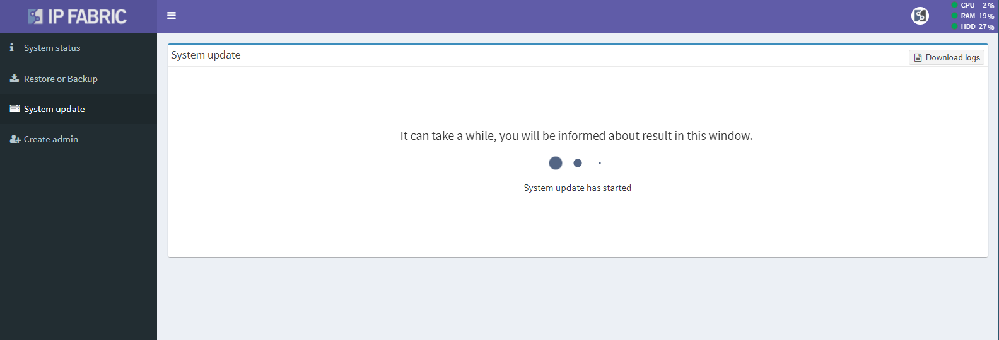

# System Update

!!! fail "Clearing Cache Memory"

    Please force refresh your browser cache after an upgrade!
    Depending on your operating system all you need to do is the following key combination:

    - Windows: Ctrl + F5
    - Mac/Apple: Command + Shift + R
    - Linux: CTRL + SHIFT + R (for Chrome/Chromium based browsers and Firefox)

## Access Administrative Interface And Backup The System

Access administrative interface by clicking **Support** button at the
top right of the main user interface and then clicking **System
Administration**. You can also access administrative interface directly
by connecting to HTTPS port `8443` of the IP Fabric VM, e.g.
(`https://ipfabric-ip-address:8443`)

Use the user **osadmin** with password configured during the first boot
wizard.

On [Restore and Backup](../backup_and_restore) page perform system backup.

!!! info "Backup Disk"

    Local backup disk is not present by default! Please add a new virtual disk to your VM to enable local backups. (See Restore and Backup page)

## Online Upgrade

At the **System update** page of the administrative interface, click the
**Update** button. (In releases earlier than 2.2.6 additional release
credentials are required).

!!! warning "Network requirements"

    An online upgrade requires access to:

    - `callhome.ipfabric.io` (194.228.111.170) remote port 443/TCP for upgrade availability check
    - `releases.ipfabric.io` (194.228.111.172) remote port 443/TCP for upgrade package download

In the following screenshot, the green 3.7.5 button in the right top
corner indicates that a new version of IP Fabric is available (if the
system has Internet connectivity).

## Offline Upgrade

Download the latest upgrade package from the updates folder on the distribution page [https://releases.ipfabric.io/ipfabric/#updates](https://releases.ipfabric.io/ipfabric/#updates)

!!! warning

    When performing offline upgrade IP FABRIC v2.2.2 or lower, load the patch for large offline updates first using [https://releases.ipfabric.io/nimpee/updates/nimpee-offline-update-fix.tar.gz.sig](https://releases.ipfabric.io/nimpee/updates/nimpee-offline-update-fix.tar.gz.sig)

Go to **Support -> System Administration** (use 'osadmin' user to access). At the **System update** page of the administrative interface, upload the package. The following screenshot depicts the actual upgrade process in the System Administration.

The upgrade will start automatically after a successful package upload,
after which the IP Fabric VM will reboot. Once the IP Fabric VM is
rebooted, please run a new discovery so all of the new calculations can
take place.

Make sure to refresh the browser cache using CTRL+F5 when accessing IP
Fabric VM user interface after an upgrade.
