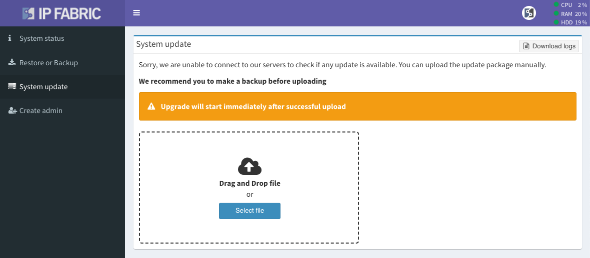

# System Update

--8<-- "snippets/clear_browser_cache.md"

## Access Administrative Interface And Backup The System

The best practice is to save the virtual machine's state using your hypervisor or, alternatively, use the IP Fabric backup. To proceed with IP Fabric system backup, do the following:

1. Navigate to **Support** (top right corner of the main user interface).
2. Navigate to **System Administration** to access the administrative interface (e.g. `https://ipfabric-ip-address:8443`).
3. Log in with the `osadmin` user and the password configured during the first boot.
4. Backup the VM by following the instructions on the [Restore or Backup](../backup_and_restore) page.

!!! info "Backup Disk"

    Local backup disk is not present by default! Please add a new virtual disk to your VM to enable local backups. (See Restore and Backup page)

## Online Update

The **Online update** is automatically available only when the IP Fabric appliance has connectivity to the servers below:

!!! warning "Network requirements"

    - `callhome.ipfabric.io` (95.217.156.217) remote port 443/TCP for update availability check
    - `releases.ipfabric.io` (95.216.185.152) remote port 443/TCP for update package download

When new IP Fabric version is publicly available, the green interactive button automatically appears in the right top corner. The image below shows an example of the new version `6.2.2` being available:

To proceed with online update:

1. Click on the new version indicator (it will navigate you to **System Administration**).
2. Log in with the `osadmin` user and the password configured during the first boot.
3. Perform the VM backup as described in the above section.
4. Navigate to **System update** and proceed (IP Fabric will automatically download the update file, perform the update and reboot itself).

## Offline Update

Offline update is available to IP Fabric VM without direct internet connectivity.

To proceed with offline update:

1. Download the latest update file from [https://releases.ipfabric.io/ipfabric/updates/](https://releases.ipfabric.io/ipfabric/updates/)
2. Navigate to **Support** (top right corner of the main user interface).
3. Navigate to **System Administration** to access the administrative interface (e.g. `https://ipfabric-ip-address:8443`).
4. Log in with the `osadmin` user and the password configured during the first boot.
5. Perform the VM backup as described in the above section.
6. Navigate to **System update** and select the update file.
7. Select or Drag and Drop your downloaded update file.

The update will start automatically after a successful package upload, after which the IP Fabric VM will reboot. Once the IP Fabric VM reboots, it's recommended to run a discovery process to create a new snapshot on the latest version.
