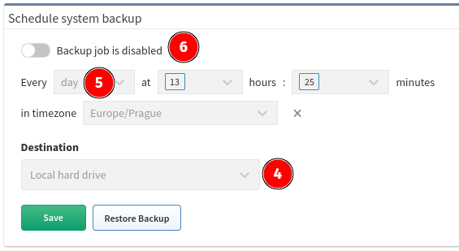

## Backup

Use IP Fabric backup to protect your important data.

There are two types of backup:

-   Local backup

-   Remote backup (FTP, sFTP)

!!! tip Security tip

    Backups are encrypted with *osadmin *user password configured during the [first boot wizard](../../Getting_Started/Platform_First_Steps/01-deployment.md#complete-first-time-boot-wizard).
    When you lose *osadmin *user password, backups are also lost!

### Local Backup

Local backup saves database, user and system files locally on a
dedicated backup volume. It's highly recommended placing backup volume
on different datastore ideally on different physical storage.

!!! info "Backup Disk"

	The backup disk is not present by default! Please add a new virtual disk to enable local backups. (See below)

To add a new backup drive and `mount` it as desired, follow instructions in [Increase Disk Space - Local Backup Disk](../../System_Administration/increase_disk_space.md#local-backup-disk).

### Automatic Local Backups

To schedule automatic local backups do the following steps:

1.  Add dedicated backup volume if not available - see steps above.

2.  Login to the user interface.

3.  Go to **Settings → Advanced → System → Schedule system backup**.

4.  Change **Destination** to **Local hard drive**.

5.  Set a backup schedule. See example for "Every day at 3:00".

6.  Enable backup

    

### Remote Backup

Remote backup saves database, user and system files remotely using FTP
or sFTP protocol.

!!! note

    This is a recommended type of backup.

!!! warning

    A directory **has to be specified** for FTP and SFTP backups

To set up remote backup do the following steps:

1.  Login to the user interface.

2.  Go to **Settings → Advanced → System → Schedule system backup**.

3.  Enable backup

4.  Change **Destination** to **FTP** or **SFTP**.

5.  Set a backup schedule. See example for "Every day at 5:15 and 17:15
    (for setting more options, please, hold SHIFT during selection)".

    

6.  Change **Destination** to **FTP** or **SFTP**.

7.  Enter remote FTP/SFTP **Server** FQDN or IP address. Make sure
    that your DNS client is configured and working properly in case of
    FQDN.

8.  Enter **Username** to access FTP/SFTP server.

9.  Enter **Password** to access FTP/SFTP server.

	!!! Info
		Password can contain only the following characters `A-Za-z0-9.,/-_@%^:=+`

10. Specify a **Directory** where FTP/SFTP backup should be uploaded.

11. Click **Save **(The IP Fabric platform will immediately test the
    connection)

12. IP Fabric tries to reach FTP/SFTP server with configured parameters.

!!! warning

    FTP/SFTP user needs read, write, list and delete permissions.

!!! info

    From version 4.1.1 onward we do not check validity of SSL certificates during FTP backups.

### Trigger a Backup Manually (On-Demand)

Both types of backup can be also triggered manually on demand. This is
useful for example before a system upgrade.

Manual backup can be triggered from IP Fabric Administrative interface:

1.  Login to admin interface (for
    example `https://ipfabric.example.com:8443`)

2.  Go to **Restore or Backup**

3.  Select **Backup** from **Do you wish to proceed with a backup or
    restore?** drop-down menu.

4.  For local backup select **Local hard drive** from the **Backup
    files destination**.

5.  For remote backup select **FTP** or **SFTP **from the **Backup
    files destination**.

    1.  Enter remote FTP/SFTP **Server** FQDN or IP address. Make sure
        that your DNS client is configured and working properly in the
        case of FQDN.

    2.  Enter **Username** to access FTP/SFTP server.

    3.  Enter **Password** to access FTP/SFTP server.
		
	!!! Info
		Password can contain only the following characters `A-Za-z0-9.,/-_@%^:=+`

    4.  Specify a **Directory** where FTP/SFTP backup should be
        uploaded.

6.  Click **Next**

## Restore

In case of database or system corruption, IP Fabric can be restored from
a backup.

!!! info

    Restore is supported only to the same version of IP Fabric as source of
    a backup. This is checked automatically during restore.

    The only exception are snapshots which can be restored to any version of
    IP Fabric appliance.

### Restore From Local Hard Drive

1.  Login to admin interface (for
    example `https://ipfabric.example.com:8443`)

2.  Go to **Restore or Backup**

3.  Select **Restore** from *Do you wish proceed a backup or
    restore?* drop down menu.

4.  Select **What restore?**. There are four options:

    1.  **Restore data & all system services** - This option restores
        database and system files. It's usable for restore from general
        system failures or upgrade failures.

    2.  **Restore database** - it means that only database data are
        restored. It can be sufficient in case of database failure or
        accidental database drop.

    3.  **Restore syslog data** - it means that only syslog data are
        restored. It can be sufficient in case of database failure or
        accidental database drop.

    4.  **Restore snapshot file** - particular snapshot can be
        restored.

5.  For restore from local backup choose **Local hard drive** from
    **Backup files source**.

6.  Click **Next**.

7.  **Select backup file** - there is year, month, day and time when a
    backup file was created in a backup filename.

8.  Click **Restore**.

!!! warning

    Backups are encrypted with **osadmin** user password configured during the [First Boot Wizard](../../Getting_Started/Platform_First_Steps/01-deployment.md#complete-first-time-boot-wizard). When you loose **osadmin** user password, all backups encrypted by this password are lost.

### Restore From Remote Server

1.  Login to admin interface (for
    example `https://ipfabric.example.com:8443`)

2.  Go to **Restore or Backup**

3.  Select **Restore** from *Do you wish proceed a backup or
    restore?* drop down menu.

4.  Select **What restore?**. There are four options:

    1.  **Restore data & all system services** - This option restores
        database and system files. It's usable for restore from general
        system failures or upgrade failures.

    2.  **Restore database** - it means that only database data are
        restored. It can be sufficient in case of database failure or
        accidental database drop.

    3.  **Restore syslog data** - it means that only syslog data are
        restored. It can be sufficient in case of database failure or
        accidental database drop.

    4.  **Restore snapshot file** - particular snapshot can be
        restored.

5.  For restore from local backup choose **FTP** or **SFTP** from
    **Backup files source**.

6.  Specify **Server** FQDN or IP address. Make sure that your DNS
    client is configured and working properly in case of FQDN.

7.  Enter **Username** to access FTP/SFTP server.

8.  Enter **Password** to access FTP/SFTP server.

9.  If you would like to use different **Directory** than
    FTP/SFTP root please specify.

10. Click **Next**.

11. **Select backup file** - there is year, month, day and time when a
    backup file was created in a backup filename.

12. Click **Restore**.

!!! warning

    Backups are encrypted with ***osadmin*** user password configured during
    the [First Boot Wizard](../../Getting_Started/Platform_First_Steps/01-deployment.md#complete-first-time-boot-wizard).
    When you loose ***osadmin*** user password, all backups encrypted by
    this password are lost.
