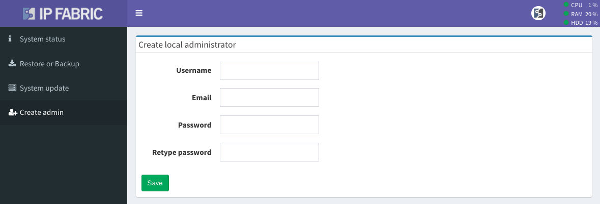

# Create Local Administrator

**System Administration --> Create admin** offers the ability to create a new
local administrator account (changing the password of an already existing
account is not possible on this page).

Creation of new non-admin users and password changes are only possible in the
IP Fabric main GUI -- in **Settings --> Administration --> Local Users**.
