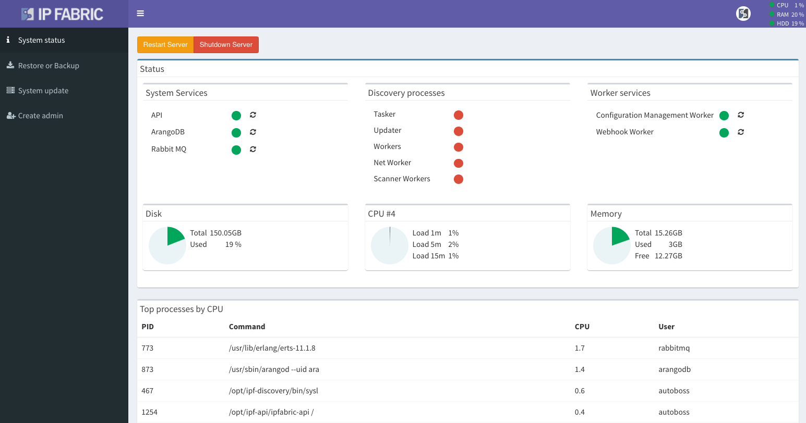

# System Status

When you log in to the System Administration with the `osadmin` user, you will find yourself in **System status** interface. It displays information such as the current CPU load, RAM usage, HDD storage space, and the running services.

Top system processes are also available.

Additionally, you can use the interface to **restart** specific system services or **reboot/shutdown** the whole virtual server.

!!! info

    The Discovery process services (Tasker, Updater, Workers, Net Worker and Scanner Workers) are not active when the there's no discovery process running.
