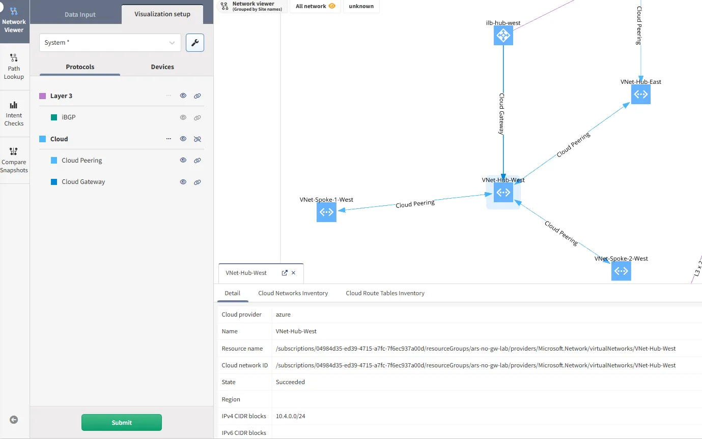
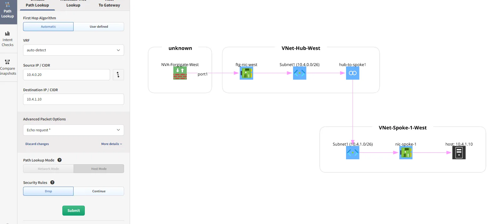
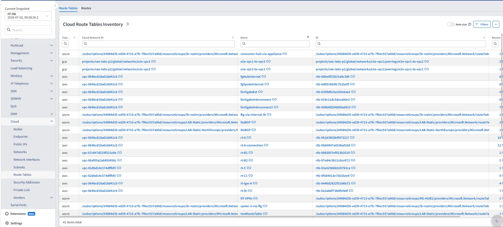
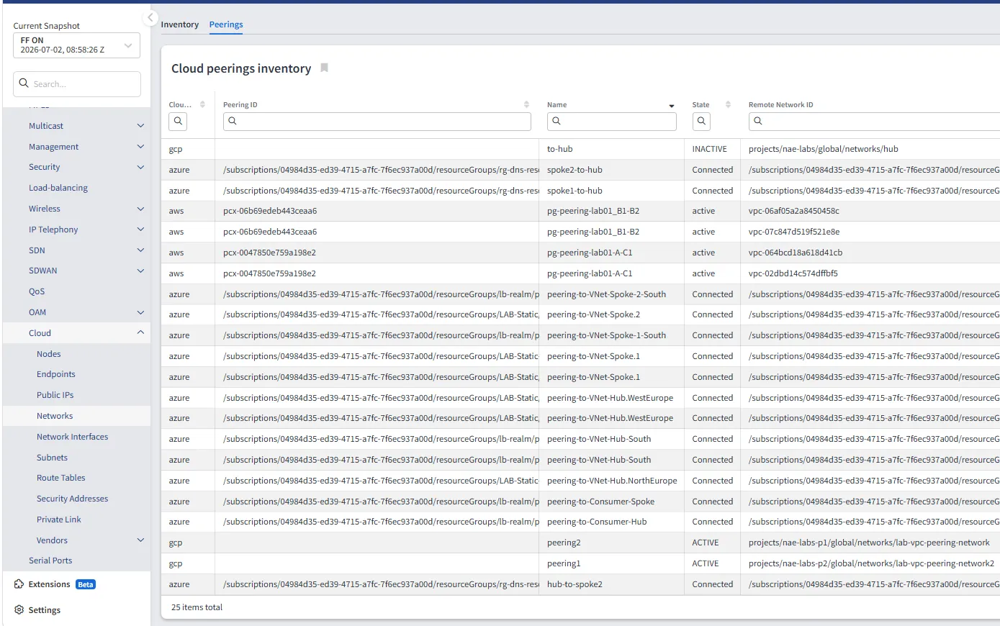

# Feature Flags

Since `6.4`, IP Fabric supports feature flags.

Feature flags, also known as feature toggles, are used in software development to enable or disable functionality without deploying new code.

Instead of deploying new features to everyone at once, feature flags allow the gradual roll out of functionality.

Features can be enabled for a small subset of users to collect feedback, and then their availability can be expanded.

Feature flags allow early access to beta features, bug fixes, and features that might cause issues or errors, enabling quick rollbacks by disabling the problematic functionality.

In IP Fabric version `6.7`, we introduced a simple way how to enable/disable feature flags using the `EnvironmentFile=` of services.

When enabling or disabling a feature flag, a global or service-related `EnvironmentFile=` needs to be created, edited, or removed.

### `EnvironmentFile=` Locations

Global environment file:

```
/etc/default/ipf-appliance-local
```

Discovery worker environment file:

```
/etc/default/ipf-discovery-worker-local
```

Discovery tasker environment file:

```
/etc/default/ipf-discovery-tasker-local
```

## Current Feature Flags

### Download of FMC ICMP Object Definitions 1 by 1

The FMC API has a bug returning malformed data for the `/objects/icmpv4objects?expanded=true` endpoint.

Since `6.5`, a new feature flag was introduced to download ICMP object definitions 1 by 1.

This can be done by adding the following line to the `tasker` environment file `/etc/default/ipf-discovery-tasker-local`:

```
ENABLE_FMC_NONEXPANDED_ICMP_CALL=true
```

### Non-Paralel Download of FMC Interface-Related Tasks

IP Fabric receives `Error 400` in customers' networks without any further details during attempts to download the list of interfaces on Firepower devices via API. This might be caused by the current approach using parallel calls while obtaining this information.

Therefore, in `6.7`, a new feature flag was introduced to change this behavior and call all interface-related requests 1 by 1.

This can be done by adding the following line to the `tasker` environment file `/etc/default/ipf-discovery-tasker-local`:

```
ENABLE_FMC_SERIAL_INTERFACE_DOWNLOAD=true
```

### Discovery of FMC Hosted by Cisco Defense Orchestrator

When FMC is hosted by Cisco Defense Orchestrator, discovery and data collection has to be handled differently. The main difference is in using an API key instead of a username/password.

Since `6.7`, it is possible to enable API key authentication for FMC by adding the following line to the `global` environment file `/etc/default/ipf-appliance-local`:

```
ENABLE_FMC_TOKEN_AUTH=true
```

After updating the environment file, you must restart IP Fabric application by running the following command:

```
sudo systemctl restart ipf-appliance
```

### VeloCloud Discovery

Since `6.9`, VeloCloud devices can be discovered by adding the following line to the `global` environment file `/etc/default/ipf-appliance-local`:

```
ENABLE_DISCOVERY_DEVICES_VELOCLOUD=true
```

After updating the environment file, you must restart IP Fabric application by running the following command:

```
sudo systemctl restart ipf-appliance
```

### Nokia SROS Discovery

Since `6.5`, Nokia SROS (Service Router Operating System) devices can be discovered by adding the following line to the `worker` environment file `/etc/default/ipf-discovery-worker-local`:

```
ENABLE_DISCOVERY_DEVICES_NOKIA=true
```
### Opengear ACM/CM/OM Support

Since `7.0`, Opengear ACM/CM/OM devices can be discovered by adding the following line to the `global` environment file `/etc/default/ipf-appliance-local`:

```
ENABLE_DISCOVERY_DEVICES_OPENGEAR_OM_CM_ACM=true
```

After updating the Environment file, restart the IP Fabric application:

```
sudo systemctl restart ipf-appliance
```

### Extensions

Since `7.0`, Extensions can be enabled by adding the following line to the `global` environment file `/etc/default/ipf-appliance-local`:

```
ENABLE_EXTENSIONS=true
```

This feature flag enables the Extensions functionality, which allows users to add and customize their IP Fabric instance with tailored functionality through containerized applications. Extensions can be managed through the IP Fabric UI under the **Extensions** menu.

!!! warning "Podman Default Subnet"

    As of version `8.0.0`, Podman replaced Docker. Podman is used for extensions and is **disabled and stopped by default** to prevent subnet conflicts. The default configuration uses `10.88.0.0/16`, which may collide with existing network infrastructure. This conflict occurs only when at least one container is running.

    **To customize the Podman subnet:**

    1. Edit the configuration in `/etc/containers/containers.conf.d/subnet.conf` — [see known issue](../../support/known_issues/IP_Fabric/unable_to_discover_devices_in_10_88_0_0_16_subnet.md), OR
    2. Contact our customer support team via the [support portal](https://support.ipfabric.io)

    **To use Podman with the default subnet** (only if `10.88.0.0/16` is unused in your environment), run:

    ```bash
    sudo systemctl enable --now podman.socket
    ```

For more information about Extensions, see the [7.0 Release Notes](../../releases/release_notes/previous_releases/IP_Fabric_v7.x.x/7.0.md#extensions-engineering-preview) for more information.

After updating the environment file, you must restart IP Fabric application by running the following command:

```bash
sudo systemctl restart ipf-appliance
```

### Configuration Management Optimizations

Starting in version `7.2`, you can enable additional configuration management performance optimizations by adding the following entries to the
syslogworker environment file at `/etc/default/ipf-discovery-syslogworker-local`.

Remember to restart the syslogworker after modifying the environment file:

```bash
sudo systemctl restart ipf-discovery-syslogworker
```

#### Git File Commit Optimization

This feature accelerates file history retrieval operations. It improves performance scaling as Git repositories grow.

```bash
ENABLE_EXPERIMENTAL_GIT_FILE_COMMIT=true
```

#### Git Repository Configuration

Applies Git configuration enhancements including:

- In-memory Git index preloading
- Commit graph files for faster history traversal
- Automatic commit graph maintenance

These settings optimize Git operation performance with minimal overhead.

```bash
ENABLE_EXPERIMENTAL_GIT_CONFIGURE_REPOSITORY=true
```

#### Git Repository Optimization

Performs repository optimization during worker initialization stage including:

- Comprehensive garbage collection
- Storage-optimized repository repacking
- Commit graph generation for accelerated traversal

This optimization significantly increases startup time but improves runtime performance.

```bash
ENABLE_EXPERIMENTAL_GIT_OPTIMIZE_REPOSITORY=true
```

#### Performance Logging

Enables detailed execution time tracking for critical operations:

- Configuration updates
- Git operations
- Database queries
- Device connections

```bash
ENABLE_EXPERIMENTAL_SYSLOGWORKER_PERFORMANCE_LOGGING=true
```

### Enable Manual Links / Transparent Firewall

This configuration flag enable manual link configuration option in both global and snapshot settings.
For more information about feature, see the [7.3 Release Notes](../../releases/release_notes/previous_releases/IP_Fabric_v7.x.x/7.3.md#transparent-firewalls).

Since `7.3`, the manual link support can be enabled by adding the following line to the `global` environment file `/etc/default/ipf-appliance-local`:

```
ENABLE_MANUAL_LINKS=true
```

After updating the Environment file, restart the IP Fabric application:

```
sudo systemctl restart ipf-appliance
```

### Palo Alto External Dynamic Lists

Starting in version `7.3`, these feature flags enable downloading content from configured External Dynamic Lists.

The associated files contain IP address or URL lists, which are then passed to the firewall rules on a device.

To enable collection of respective lists, following lines need to be added to the `worker` environment file `/etc/default/ipf-discovery-worker-local`:

```
ENABLE_PALOALTO_EDL_IPLIST=true
ENABLE_PALOALTO_EDL_URLLIST=true
```

### Cisco VTY Line Transport Methods

Since `8.0`, IP Fabric supports collecting operational data from Cisco IOS and IOS-XE VTY lines by running the `show line vty <id>` command per VTY range.

This allows IP Fabric to discover which transport methods (such as SSH and Telnet) each VTY line range permits.

To enable this feature, add the following line to the `worker` environment file `/etc/default/ipf-discovery-worker-local`:

```
ENABLE_CISCO_LINE_VTY=true
```

### Versa Interface Collection Split

Since `8.0`, IP Fabric can collect Versa VOS interface data using separate lightweight API calls instead of the single heavy `interfaces?deep` call.

When enabled, IP Fabric queries `interfaces/brief`, `interfaces/detail`, and `interfaces/dynamic-tunnels` individually and recombines the results. This improves reliability on Versa Directors that struggle to return the full payload in one response.

To enable this feature, add the following line to the `worker` environment file `/etc/default/ipf-discovery-worker-local`:

```
ENABLE_VERSA_VOS_INTERFACES_SPLIT=true
```

### JSON Schema Task Validation

Starting in version `8.0`, IP Fabric can validate selected discovery task results with JSON Schema definitions from product contracts instead of legacy Joi schemas.

This is an opt-in validation mode. When this feature flag is disabled, IP Fabric uses legacy task validation.

To enable this feature, add the following line to the `worker` environment file `/etc/default/ipf-discovery-worker-local`:

```
ENABLE_JSON_SCHEMA_TASK_VALIDATION=true
```

### New Cloud Model

Since `8.0`, IP Fabric includes the New Cloud Model (NCM), which replaces the adapted on-premises abstractions with cloud-native constructs as first-class entities: VPCs/VNets, subnets, vNICs, route tables, peering, and security policies — structured the way cloud providers actually expose them.

#### Data Collection

A single org-scoped cloud collector task is created per AWS account and region, Azure subscription, or GCP project. A larger, hierarchy-aware task set (resource hierarchy, networks, subnets, route tables, peering, security, VMs, and more) runs against that one collector instead of many per-VPC devices.

#### Network Diagrams

Cloud network constructs are displayed as nodes in the network and sites diagram instead of VPCs/VNets being represented as devices. The detail tab shows relevant data for each construct. A new **Cloud** group of protocols has been added, containing **Cloud Gateway** and **Cloud Peering**.



#### Path Lookup

Path lookup has changed significantly in the NCM. The following cloud constructs are now shown in the path:

- Virtual NIC (network interface)
- Subnet
- Peering




#### Technology Tables

New technology tables have been added and are available under this feature flag: **Networks inventory**, **Peering inventory**, **Security Addresses**, **Route Tables**, and **Network Interfaces**. Existing cloud tables have also been updated. The **Hostname** column has been marked as deprecated in all existing cloud tables.

VMware NSX-T data is no longer included in the cloud endpoints tables (`/technology/cloud/endpoints/virtual-machines` and `/technology/cloud/endpoints/virtual-machines-interfaces`) when this feature flag is enabled. VMware virtual machine data is instead available in the new `/inventory/hosts/virtual-machines` and `/inventory/hosts/virtual-machines-interfaces` tables, which do not require this feature flag.





#### Enabling the Feature Flag

To enable the new cloud model, add the following line to the `global` environment file `/etc/default/ipf-appliance-local`:

```
ENABLE_NEW_CLOUD_MODEL=true
```

After updating the environment file, you must restart IP Fabric application by running the following command:

```
sudo systemctl restart ipf-appliance
```

!!! warning

    The new cloud model uses new database tables. Snapshots taken without this feature flag enabled (using the old model) are not compatible with the new model. If you load an old snapshot after enabling this feature flag, some data may be missing or incomplete, as the old snapshot data cannot be mapped to the new table structure.

## Deprecated Feature Flags

### ACI `fvTenant` API Endpoint (Removed in `7.5`)

**This feature was permanently added to the product in the `7.5` release.**

### GCP Discovery (Removed in `7.0`)

Since `6.5.0`, GCP (Google Cloud Platform) devices can be discovered.

**This feature was permanently added to the product in the `7.0` release.**

### Stormshield Discovery (Removed in `7.0`)

Since `6.5`, Stormshield devices can be discovered.

**This feature was permanently added to the product in the `7.0` release.**

### Citrix NetScaler ADC Discovery (Removed in `6.9`)

Since `6.8`, Citrix NetScaler devices can be discovered.

**This feature was permanently added to the product in the `6.9` release.**

### Fortinet FortiSwitch Discovery (Removed in `6.8`)

Since `6.7`, Fortinet FortiSwitch devices can be discovered.

**This feature was permanently added to the product in the `6.8` release.**

### ACI Service Graphs (Removed in `7.11`)

In versions `6.4` through `7.10`, ACI service graphs could be enabled.

**This feature was permanently added to the product in the `7.11` release.**
