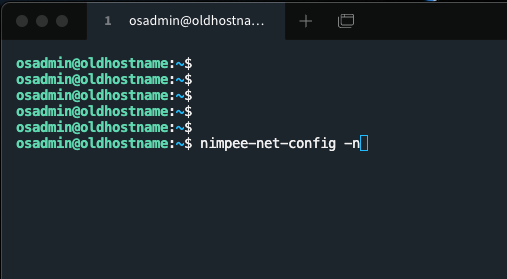
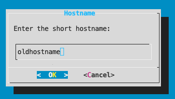
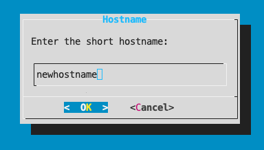
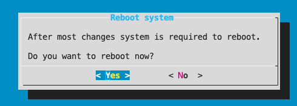
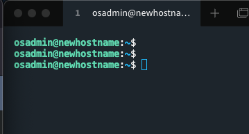

# How to change `hostname`

To change a hostname of your IP Fabric machine, you must

1. `SSH` to the IP Fabric appliance as an `osadmin` user

2. Execute command `nimpee-net-config -n` to launch network configuration wizard.

  

3. After executing `nimpee-net-config -n`, the first option is to change the hostname.

  

4. Delete the old hostname and change it to a new one and select "OK".

  !!! info

      Valid characters for hostnames are ASCII letters from **a** to **z**, the digits from **0** to **9**, and the hyphen (**−**). A hostname may not start with a hyphen.

  

5. This wizard changes other Network related configuration items like DNS name, Network Interface configuration, NTP etc. For the sake of changing just the `hostname` leave everything as is until you reach the `"Do you want to reboot now?"` screen.

6. When you reach `"Do you want to reboot now?"` screen, we recommend rebooting the machine to apply all changes.

  

  !!! warning

      This will reboot the IP Fabric machine and the appliance won't be reachable until it boots and API starts again, it can take several minutes.

7. Connect again to IP Fabric with `SSH` and verify if the hostname has been correctly changed.

  

