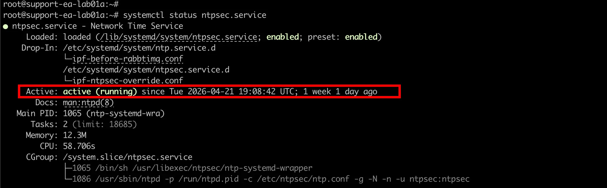

# How To Change NTP Configuration

--8<-- "snippets/cli_root_access.md"

Since version `7.x`, the IP Fabric appliance uses `ntpsec` for time synchronization. To change the NTP configuration, edit the `/etc/ntpsec/ntp.conf` file and restart the service.

## Steps

1. Edit the NTP configuration file:

    ```shell
    sudo vi /etc/ntpsec/ntp.conf
    ```

2. Restart the NTP service to apply changes:

    ```shell
    sudo systemctl restart ntpsec.service
    ```

3. Check that the service is running:

    ```shell
    sudo systemctl status ntpsec.service
    ```

    The output should show `active (running)`:

    

## Default Configuration

The default `/etc/ntpsec/ntp.conf` file uses the Debian NTP pool:

```text title="/etc/ntpsec/ntp.conf"
# /etc/ntpsec/ntp.conf, configuration for ntpd; see ntp.conf(5) for help

driftfile /var/lib/ntpsec/ntp.drift
leapfile /usr/share/zoneinfo/leap-seconds.list

# This should be maxclock 7, but the pool entries count towards maxclock.
tos maxclock 11

# pool.ntp.org maps to about 1000 low-stratum NTP servers.  Your server will
# pick a different set every time it starts up.  Please consider joining the
# pool: <https://www.pool.ntp.org/join.html>
pool 0.debian.pool.ntp.org iburst
pool 1.debian.pool.ntp.org iburst
pool 2.debian.pool.ntp.org iburst

tos minclock 4 minsane 3

# Access control configuration
restrict default kod nomodify noquery limited

# Local users may interrogate the ntp server more closely.
restrict 127.0.0.1
restrict ::1
```

## Example: Adding a Custom NTP Server

To add your own NTP server (e.g., an internal time source at `10.0.1.100`), add a `server` line to the configuration:

```text title="/etc/ntpsec/ntp.conf"
# /etc/ntpsec/ntp.conf, configuration for ntpd; see ntp.conf(5) for help

driftfile /var/lib/ntpsec/ntp.drift
leapfile /usr/share/zoneinfo/leap-seconds.list

# This should be maxclock 7, but the pool entries count towards maxclock.
tos maxclock 11

# Custom NTP server (added)
server 10.0.1.100 iburst prefer

# pool.ntp.org maps to about 1000 low-stratum NTP servers.  Your server will
# pick a different set every time it starts up.  Please consider joining the
# pool: <https://www.pool.ntp.org/join.html>
pool 0.debian.pool.ntp.org iburst
pool 1.debian.pool.ntp.org iburst
pool 2.debian.pool.ntp.org iburst

tos minclock 4 minsane 3

# Access control configuration
restrict default kod nomodify noquery limited

# Local users may interrogate the ntp server more closely.
restrict 127.0.0.1
restrict ::1
```

!!! note

    - Use `server` for a specific NTP server and `pool` for a pool of servers.
    - The `iburst` option speeds up initial synchronization.
    - The `prefer` option marks the server as the preferred time source.

After saving the file, restart the service:

```shell
sudo systemctl restart ntpsec.service
```

To check synchronization with the new server:

```shell
ntpq -pn
```

The output shows all configured NTP sources with their status. The `*` symbol marks the currently selected source:

```text
     remote           refid      st t when poll reach   delay   offset   jitter
==============================================================================
*10.0.1.100      .GPS.            1 u   64  128  377    0.523   -0.012    0.015
+0.debian.pool.n .PPS.            1 u  120  256  377   12.345    1.234    0.567
+1.debian.pool.n .PPS.            2 u   95  256  377   15.678    0.890    0.432
+2.debian.pool.n .ATOM.           2 u  200  256  377   20.123   -2.345    0.789
```

