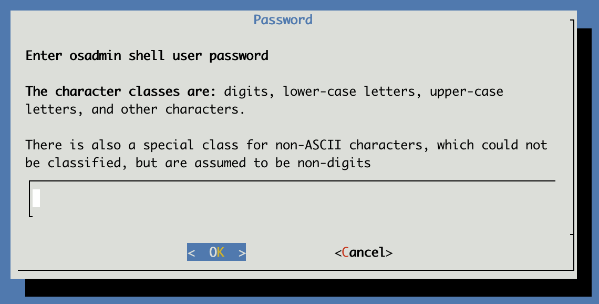

# How to change the `osadmin` password

1. Login to your IP Fabric via SSH with the `osadmin` user and type in the `nimpee-net-config -t` command, that is going to launch the configuration wizard.

  

2. Select `Yes` to proceed.

  !!! attention

      Changing the `osadmin` password will affect: CLI access, System administration access and the backup encryption! Backups created before the password change will no longer be restorable.

3. Input the new `osadmin` password twice.

  

  

  Password setup contains password complexity check, simple passwords are rejected.

  Password requirements as follows:
  - max password length is 256
  - single character class passwords are not supported
  - two character class must be at least 24 characters long
  - minimal length of passphrase is 24 characters
  - three character class must be at least 16 characters long
  - four character class must be at least 12 characters long
  - passphrase must have at least five words

  The character classes are:
  - digits
  - lower-case letters
  - upper-case letters
  - and other characters

  There is also a special class for non-ASCII characters, which could not be classified, but are assumed to be non-digits.

4. Select `Yes` to reboot the system.

  
