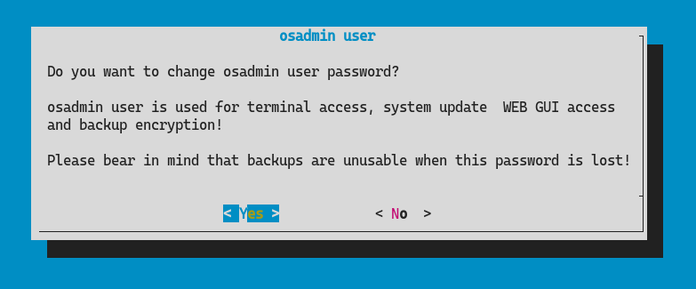

# How to change the `osadmin` password

1. Login to your IP Fabric via SSH with the `osadmin` user and type in the `nimpee-net-config -t` command, that is going to launch the configuration wizard.

  

2. Select `Yes` to proceed.

  !!! attention

      Changing the `osadmin` password will affect: CLI access, System administration access and the backup encryption! Backups created before the password change will no longer be restorable.

3. Input the new `osadmin` password twice.

  

4. Select `Yes` to reboot the system.

  
