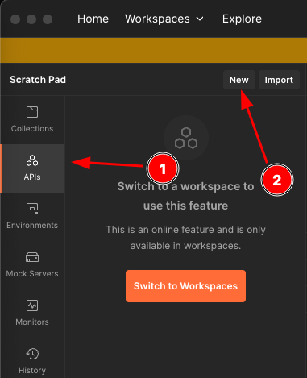
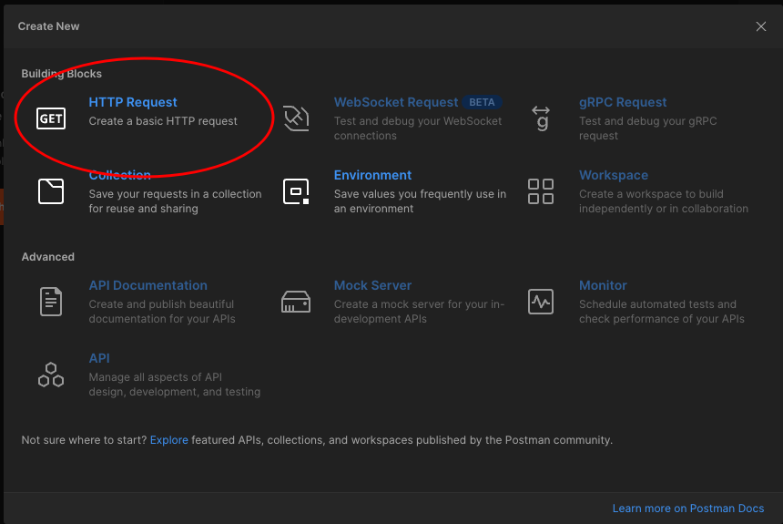
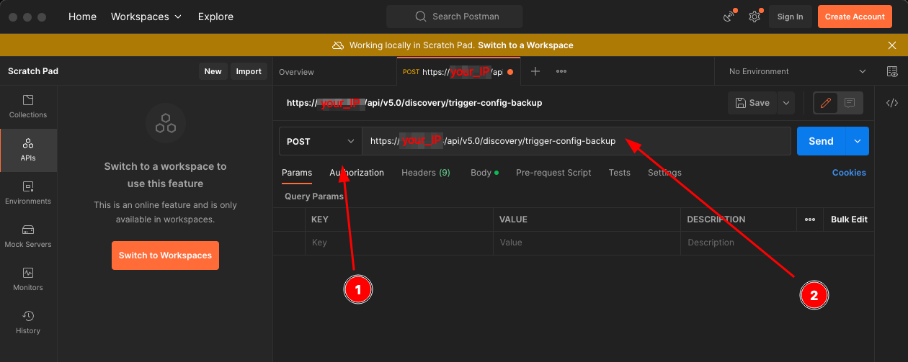
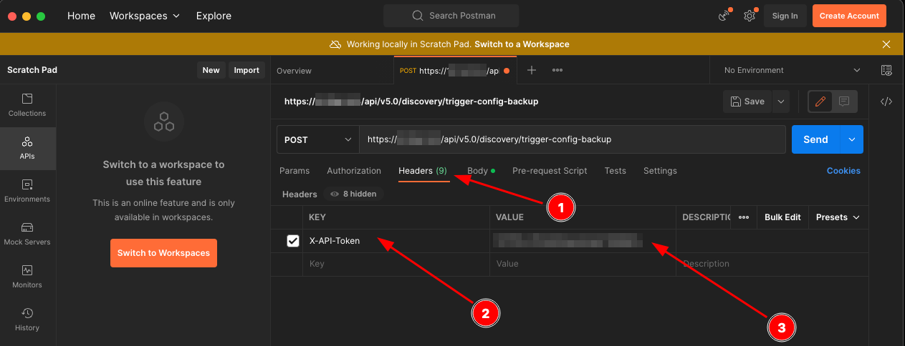
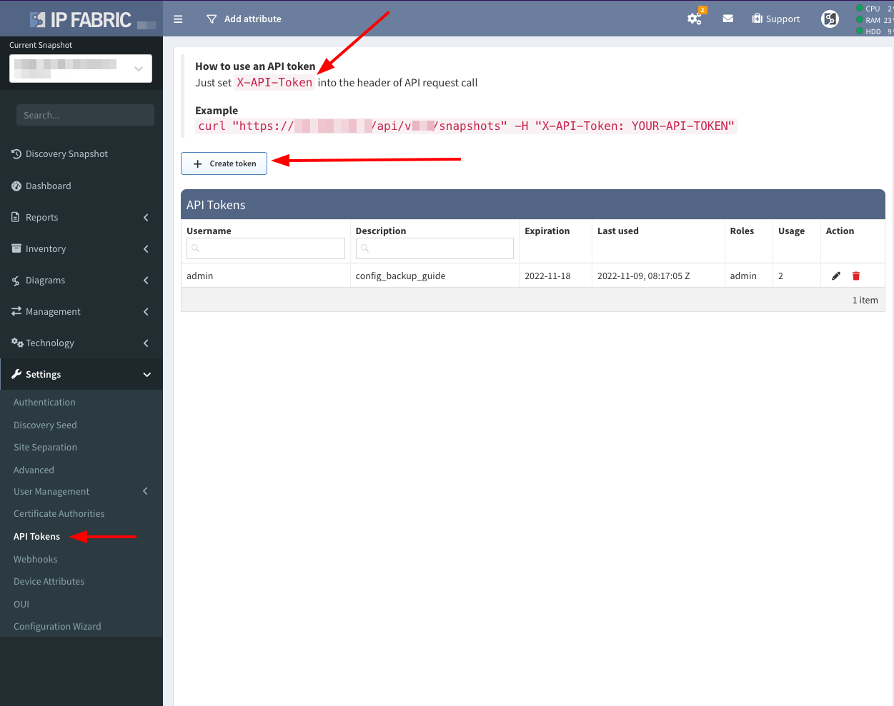
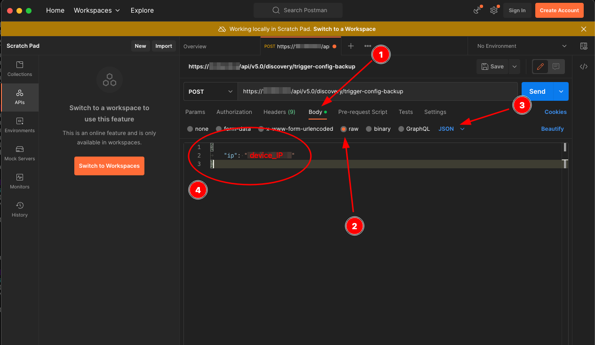
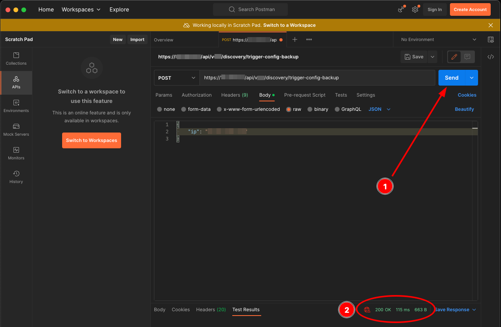
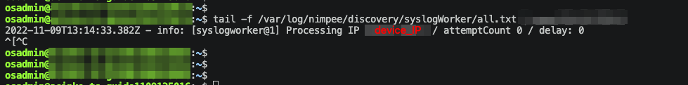
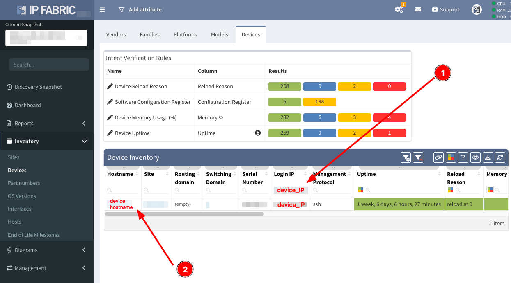
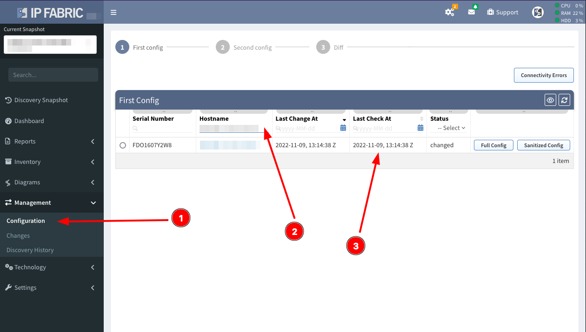

# How to trigger manual configuration backup just one device

If you added a new device into your network and the backup job didn't run yet, you can trigger config backup through API with programs like Postman or tool of your choosing.

!!! note
    
    For ease of explanation, this example will use Postman

1.  Open Postman, select **API** and click on **NEW** then select **HTTP Request**

  
  

2.   Select **POST** and put in the this URL:    
  ```shell
    https://you-ipfabric-address/api/vX.X/discovery/trigger-config-backup
  ```
  -  put in `your-ipfabirc-address` and change `vX.X` to the version you're currently have installed (e.g. `v6.0`)

  

3.  Select **Headers** and put `X-API-Token` in **Key** field and your *API Token* generated in [Settings --> API Tokens](../../../IP_Fabric_Settings/api_tokens.md) to the **Value** field.

  

  !!! tip "API Token" 

      If you don't have an *API Token* generated, you can generate one in **Settings --> API Tokens**:
      
      

4.  Select **Body** then select **raw** then in dropdown menu select **JSON** format:
  
  

  - Put the following string in the textbox: 

  ```json
  {
  	  "ip": "device_login_IP"
  }
  ```

5.  Connect to your machine via `ssh` and put in following command:
  
  ```shell
  tail -f /var/log/nimpee/discovery/syslogWorker/all.txt
  ```

6.  Hit the **Send** button, if the call was successful you should see the response `200 OK`:
  
  

  !!! failure
      
      If you can see anything else in response than `200 OK` there's something wrong (e.g. expired or wrong *API Token*).

7.  Go back to your `ssh` session, you should see a following message confirming the config management was triggered for the particular device:
  
  

8.  Go to the **IP Fabric** GUI and into **Inventory --> Devices** and search for the `device IP address` you get `device hostname`, *copy* the `device hostname` to clipboard
  
  

9.  Go to the **Management --> Configuration** and *paste* the `device hostname` to the `hostname` table and compare the time with the `syslog` message from point 7.

  
