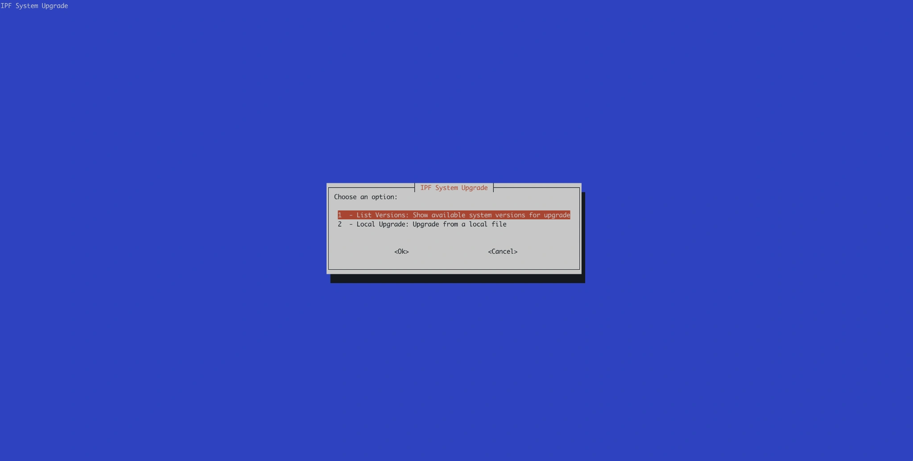
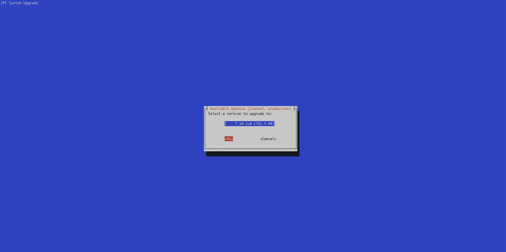
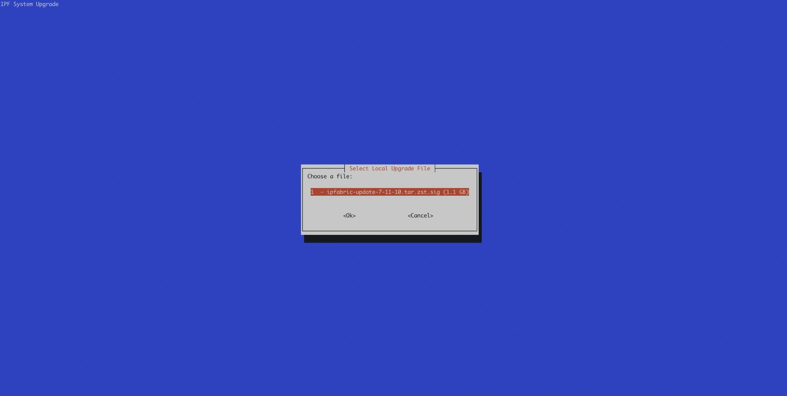
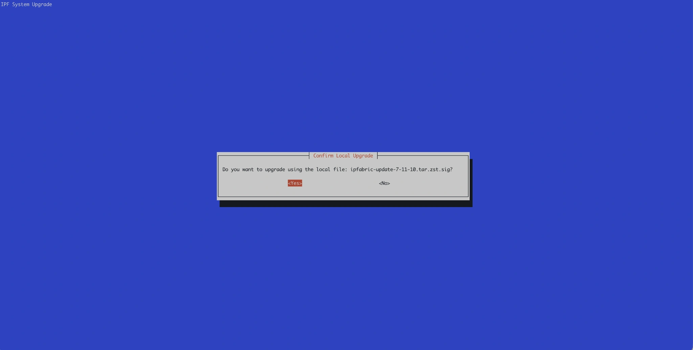
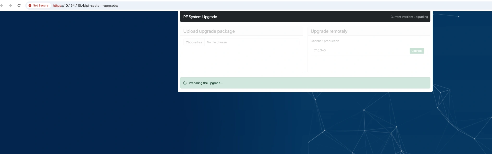

# How To Upgrade IP Fabric via CLI

IP Fabric provides a command-line upgrade tool that can be used either through an interactive text user interface (TUI) or through explicit CLI subcommands.

The upgrade tool supports both:

- **Remote upgrade checks and upgrades** from the configured update channel
- **Local upgrades** from a downloaded upgrade package file

The tool binary is located at:

```bash
/opt/ipf-system-upgrade/bin/cli
```

## Prerequisites

* Run the command as a user with sufficient privileges, typically `root`.
* For **local upgrades**, run the command from the directory where the upgrade package is stored, or provide the full path to the package file.
* Ensure the appliance can reach the update source if you want to check for or perform a **remote upgrade**.

## CLI Upgrade With TUI

By default, running the tool without a subcommand starts the interactive TUI:

```bash
/opt/ipf-system-upgrade/bin/cli
```

You can also explicitly start the TUI with:

```bash
/opt/ipf-system-upgrade/bin/cli tui
```

### Main Menu

The TUI provides two main options:

1. **List Versions** -- shows available system versions for upgrade from the configured update channel
2. **Local Upgrade** -- upgrades the system from a local package file

Example main menu:



#### Remote Upgrade

The **List Versions** option checks the configured update channel for available versions.

If updates are available, they are displayed in the TUI. After selecting a version, the upgrade package is downloaded and the upgrade process starts.

Example version selection screen:



#### Local Upgrade

The **Local Upgrade** option upgrades IP Fabric from a local upgrade package.

When selected in the TUI, the tool looks for upgrade files in the directory from which the command was started. If a valid package is found, it is offered for selection:



After selecting the file, the tool asks for confirmation:



!!! Warning "Local Upgrades Behavior"

    By default, the tool searches for local upgrade files in the **current working directory**.

    For example, if the tool is started from `/root`, it searches `/root`.

    If no package file is found in the current directory, the tool shows an error similar to:

    ```text
    No files found in the current directory (/root).

    Please place the upgrade package file in this directory or run this script from another directory.
    One can also run this script directly with upgrade file path as an argument (x upgrade-local /full/path/of/file.sig).
    ```

    This means you have two options:

    * change to the directory containing the upgrade package and run the tool there
    * provide the full path to the upgrade package file as an argument

    Example:

    ```bash
    cd /tmp
    /opt/ipf-system-upgrade/bin/cli
    ```

    Or:

    ```bash
    /opt/ipf-system-upgrade/bin/cli upgrade-local /full/path/to/ipfabric-update-<version>.tar.zst.sig
    ```

Once the upgrade package is selected and the upgrade is in progress, the web-based upgrade portal will display the same status.



## CLI Upgrade Without TUI

The tool also supports non-interactive usage through subcommands.

**Help output**

```bash
/opt/ipf-system-upgrade/bin/cli -h
```

Example output:

```text
usage: cli [-h] [--versions-json-file VERSIONS_JSON_FILE] [--action-json-file ACTION_JSON_FILE] [--status-file STATUS_FILE] {tui,list-updates,upgrade,upgrade-local} ...

IPF System Upgrade CLI tool

positional arguments:
  {tui,list-updates,upgrade,upgrade-local}
                        Command to execute
    tui                 Execute the Text User Interface (TUI). This is default if no command is given.
    list-updates        List available updates
    upgrade             Create an action file for a specific version
    upgrade-local       Create an action file for upgrading from a local file

options:
  -h, --help            show this help message and exit
  --versions-json-file VERSIONS_JSON_FILE
                        Path to the versions JSON file (default: /var/lib/ipf-system-upgrade/versions.json) [env var: IPF_SYSTEM_UPGRADE_VERSIONS_JSON_FILE]
  --action-json-file ACTION_JSON_FILE
                        Path to the upgrade action JSON file (default: /var/lib/ipf-system-upgrade/upgrade-action.json) [env var: IPF_SYSTEM_UPGRADE_ACTION_JSON_FILE]
  --status-file STATUS_FILE
                        Location of status file. (default: /var/lib/ipf-system-upgrade/upgrade-status.json) [env var: IPF_SYSTEM_UPGRADE_STATUS_FILE]

In general, command-line values override environment variables which override defaults.
```

### Commands

#### `list-updates`

Lists available online upgrade versions from the configured update channel.

```bash
/opt/ipf-system-upgrade/bin/cli list-updates
```

Example output when no updates are available:

```bash
No updates available.
```

#### `upgrade`

Creates an upgrade action for a specific remote version.

```bash
/opt/ipf-system-upgrade/bin/cli upgrade <version>
```

!!! Info

    Replace `<version>` with the exact target version shown by the `list-updates` command.

#### `upgrade-local`

Creates an upgrade action from a local upgrade package. Path is required.

```bash
/opt/ipf-system-upgrade/bin/cli upgrade-local <path-to-package.sig>
```

Example:

```bash
/opt/ipf-system-upgrade/bin/cli upgrade-local /tmp/ipfabric-update-7-11-10.tar.zst.sig
```

## After the Upgrade

Once the upgrade completes successfully, the system reboots automatically. After the reboot:

1. Verify the new version is running by logging in to the main GUI.
2. It is recommended to create a new discovery snapshot on the latest version.
3. Reload any snapshots that were unloaded before the upgrade.

For more details on post-upgrade steps, see [System Update](../../system_update.md).

!!! tip "Back Up Before Upgrading"

    Always create a VM snapshot of the IP Fabric appliance before performing an upgrade. This allows you to quickly revert to the previous state if anything goes wrong. For details, see [Best Practices Before Update](../../system_update.md#best-practices-before-update).

## Troubleshooting

### No Local Upgrade File Found

If the tool does not detect a local upgrade package, verify that:

* you are running the TUI from the directory containing the package, or
* you provided the full path to the package file

### No Remote Updates Available

If `list-updates` returns `No updates available.`, verify that:

* the system has network connectivity to the update source
* the configured update channel is correct
* a newer version is actually available for the current system
