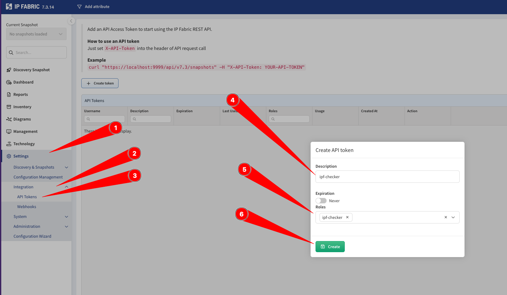

# ipf-checker

!!! info "Required Steps Before Upgrading to `v7.5`"

    The upcoming `v7.5` release introduces a new PostgreSQL-based database, which brings updated hardware requirements.
    To ensure stability and optimal performance after the upgrade, we strongly recommend using directly attached SSD or NVMe storage.
    To assess your current hardware performance use the tool by running `sudo ipf-checker -d -s`.

    **WARNING**: The test may take a long time to complete. The default timeout is 30 minutes. We recommend avoiding any use of the IP Fabric appliance while the test is running.

The `ipf-checker` is a Python script, which reports whether the hardware requirements,
environment checks and dependencies are all met by the IP Fabric appliance to ensure smooth operation.

It can display the results in a clean, readable table and also write them to a file.

## Use

Execute shell command `ipf-checker` and use options if needed.

```shell
ipf-checker [-h] [-q] [-c] [-d [TIMEOUT_MINUTES]] [-b [username] [password] | -t [x-api-token] | -a [access-token] | -s]

Resource validation tool for the IP Fabric appliance that displays a table in the terminal and shows the results of various environment checks in real time.

options:
  -h, --help            show this help message and exit
  -q, --quiet           Quiet option for ipf-checker with no output in console.
  -c, --no-color        No color or style output in console.
  -d [TIMEOUT_MINUTES], --disk-benchmark [TIMEOUT_MINUTES]
                        Perform a read and write disk benchmark on the machine. An optional argument can be passed to specify the timeout in minutes. WARNING!!! The test might take a really long time.
  -b [username] [password], --basic [username] [password]
                        Passing basic credentials for calling IP Fabric endpoints.
  -t [x-api-token], --x-api-token [x-api-token]
                        Passing X-API-TOKEN for calling IP Fabric endpoints.
  -a [access-token], --access-token [access-token]
                        Passing basic credentials for calling IP Fabric endpoints.
  -s, --skip-auth       Skipping tests that need authentication.
```

!!! example "Results table"

    The script will generate a table with the results of the checks performed.
    { align=left }

## Environment variables

In your home directory, you can create the `.ipf-checker/env` file, which can
contain any of the following environment variables:

```bash
IPF_CHECKER_LOG_LEVEL= # default is INFO
IPF_CHECKER_TOKEN=
IPF_CHECKER_DISK_BENCHMARK_TIMEOUT= # default is 45
```

If the token is set in an environment variable, it will be used automatically when executing the script. Shell authentication arguments override the token.

## Generating API Token

An API token is required when executing the script with authenticated tests enabled. You can generate the token in the IP Fabric UI.

There is an `ipf-checker` role you can choose for the token, ensuring the tool has access only to the necessary endpoints and nothing more.

!!! info "Token generation"

    The API token can be generated in the IP Fabric UI by going to **Settings** -> **Integrations** -> **API Tokens** 
    and clicking on the **Generate Token** button. Copy the token and use it with the `-t` option or 
    set it in the `.ipf-checker/env` file as `IPF_CHECKER_TOKEN`.

    
