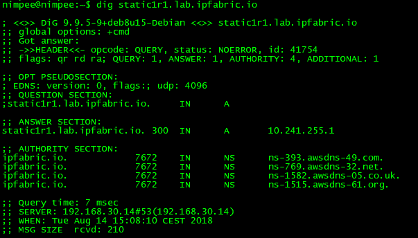
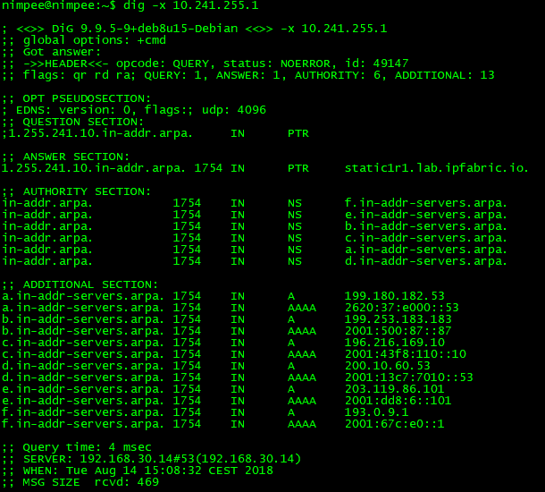
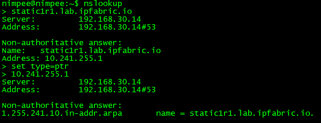

# Troubleshooting VM Using IP Fabric CLI

In the event of a VM network connection problem, DNS issues, network devices connectivity issue, IP Fabric CLI is a useful helper.

CLI can be also used to access system and application logs as well as snapshot files.

## Checking The Network Interface Settings

!!! warning
	When you log in through a VM console or SSH, network settings are displayed. This content is static, generated when VM boots! When DHCP is used, an IP address can change in some cases.


To display actual IP address use command:

```shell
ip addr show
```

Default gateway and other routes (if configured) can be check as follows:

```shell
ip r
```

## Checking DNS

DNS can be checked using the `dig` or `nslookup` command.

For example, let's check A record and PTR (reverse) record of some device using `dig`.

For A record check **ANSWER** which contains requested IP address. Also **SERVER** section below is important as it tell us what DNS server answered our DNS query.



For PTR record check **ANSWER** which contains requested domain name.



If you prefer `nslookup` you can achieve the same results.



## Testing Connectivity To a Network Device

The very basic test is `ping` or `traceroute`.

!!! warning ICMP
	Please bear in mind that ICMP packets used by `ping` and `traceroute` can be blocked by ACL or firewall. It does not mean that a device cannot be reached using SSH or telnet.

To make sure that the network device is available from IP Fabric VM, you
can use the `telnet` and `ssh` client from the command line.

For SSH use:

```bash
ssh userName@device-IP-or-Hostname
```

For telnet use:

```shell
telnet device-IP-or-Hostname
```

Since version 5.0, there is also a new tool called `ipf-connection-tester` for connecting to network devices using the same library that we use in discovery (if `ssh` or `telnet` works with the default Linux client, it does not automatically mean it will also work during the discovery as system clients are not used).

To test SSH connectivity, use:

```shell
ipf-connection-tester ssh userName@device-IP-or-Hostname
```

If you are getting timeouts, it is possible to increase the default timeout options:

```shell
Options:
  -r, --ready-timeout <timeout>  seconds to wait till connection is ready (default: 30)
  -d, --data-timeout <timeout>   seconds to wait till data is received (default: 10)
```

For example:

```shell
ipf-connection-tester ssh userName@device-IP-or-Hostname -r 60 -d 20
```

For telnet, simply change `ssh` to `telnet`:

```shell
ipf-connection-tester telnet userName@device-IP-or-Hostname
```

Timeout options are the same. However, the telnet connection tester is much less verbose than the SSH one, so for both security and verbosity, prefer SSH whenever possible.

If you wish to run `ipf-connection-tester` from your own automation script, here are possible return values:

* `0` -- Connection success
* `1` -- Missing or invalid command line arguments
* `2` -- Connection failed

## Reboot And Shutdown

IP Fabric VM can be also rebooted or shutdown using CLI.

For VM reboot just use `reboot` command without any parameters.

For VM shutdown use `shutdown` command without any parameters.
