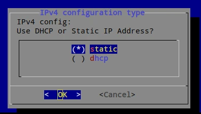
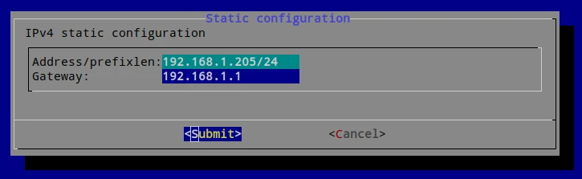

# Update Network Configuration

To change the IP address, subnet, gateway, DNS, or proxy configuration of your
IP Fabric appliance from the CLI, follow these steps:

1. Connect to the IP Fabric appliance via SSH as the `osadmin` user.

2. Run:

   ```shell
   sudo ipf-cli-config -n
   ```

  !!! note

      To keep the current configuration for any item, select `OK` and press
      `Enter`.

3. The first two options are to modify the hostname and the DNS domain name.
   See [Update Hostname or DNS Domain Name](change_hostname.md).

4. Next, select DHCP or static IP address assignment. Use the `up`/`down` and
   `Space` keys to change `()` to `(*)`.

   

5. If you selected static IP address assignment, then enter:

   - IP address
   - netmask
   - gateway
   - primary DNS
   - secondary DNS

   

6. Select `Yes` to reboot the system:

   
