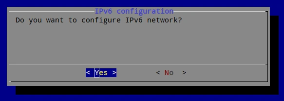
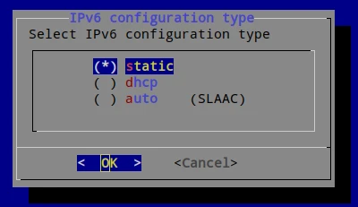
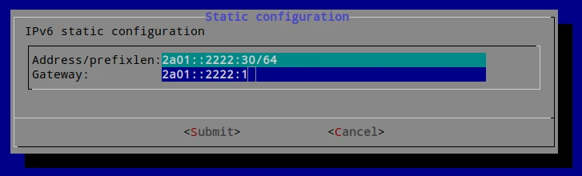
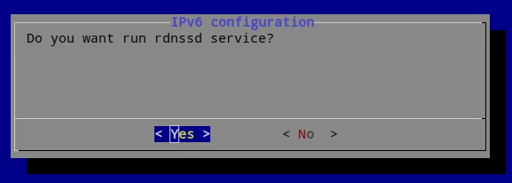
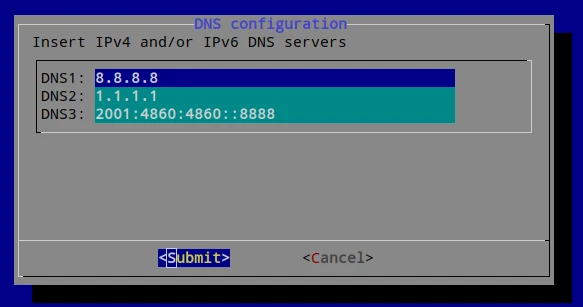

# Update Network Configuration

To change the IP address, subnet, gateway, DNS, or proxy configuration of your
IP Fabric appliance from the CLI, follow these steps:

1. Connect to the IP Fabric appliance via SSH as the `osadmin` user.

2. Run:

   ```shell
   sudo ipf-cli-config -n
   ```

  !!! note

      To keep the current configuration for any item, select `OK` and press
      `Enter`.
   
  !!! note

      If you will choose to not configure IPv6 network, current IPv6
      configuration will be removed.


3. The first two options are to modify the hostname and the DNS domain name.
   See [Update Hostname or DNS Domain Name](change_hostname.md).

4. Next, select DHCP or static IP address assignment. Use the `up`/`down` and
   `Space` keys to change `()` to `(*)`.

   

5. If you selected static IP address assignment, then enter:

   - IP address and prefixlen in format `address/prefixlen`
   - gateway

   

6. Next, answer if you want to configure IPv6 network

   

7. If you chose to configure IPv6 network, select IPv6 configuration type.
   Use the `up`/`down` and `Space` keys to change `()` to `(*)`.

   

8. If you selected `static` IPv6 configuration, then enter

   - IPv6 address and prefixlen in form `address/prefixlen`
   - IPv6 gateway

   

9. If you selected `auto` IPv6 configuration, then answer if you want to run
   Recursive DNS server daemon which reads DNS resolvers addresses from router
   advertisements and adds them to DNS configuration.

   

10. Next, insert IP addresses of DNS resolvers. If you chose to use IPv6,
   then you can use both IPv4 and IPv6 addresses, otherwise IPv4 only.
   If you selected static configuration, then at least one resolver address
   is required.

   

11. Confirm or change FQDN which will be resolved during DNS tests.

   

12. Select `Yes` to reboot the system:

   
