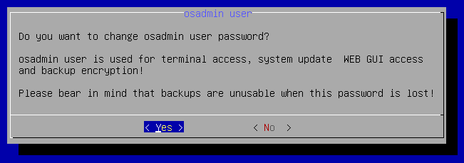
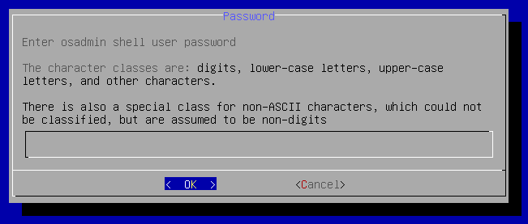
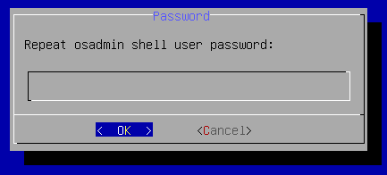

# Update `osadmin` Password

1. Connect to your IP Fabric appliance via SSH as the `osadmin` user.

2. Run:

   ```shell
   sudo ipf-cli-config -t
   ```

3. Select `Yes` to proceed:

  

  !!! attention

      Changing the `osadmin` password will affect:

      - CLI access
      - backup encryption

      Backups created before the password change will no longer be restorable!

4. Enter the new `osadmin` password twice:

   

   

   Password setup contains password complexity check; simple passwords are
   rejected.

   Password requirements are as follows:

   - The maximum password length is 256.
   - Single-character class passwords are not supported.
   - Two-character class must be at least 24 characters long.
   - The minimal length of the passphrase is 24 characters.
   - Three-character class must be at least 16 characters long.
   - Four-character class must be at least 12 characters long.
   - The passphrase must have at least five words.

   The character classes are:

   - digits
   - lower-case letters
   - upper-case letters
   - other characters

   There is also a special class for non-ASCII characters, which could not be 
   classified but are assumed to be non-digits.

5. Select `Yes` to reboot the system:

  
