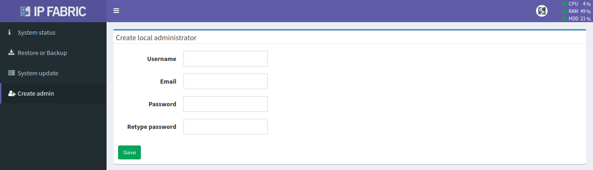

# Create Admin

**System Administration --> Create admin** allows you to create a new local
administrator account.

Changing the password of an already existing account is not possible in this
section.

Creating new non-admin accounts and changing passwords are only possible in the
IP Fabric main GUI -- in **Settings --> Administration --> Local Users**. See
[Local Users](../../IP_Fabric_Settings/administration/users.md).
