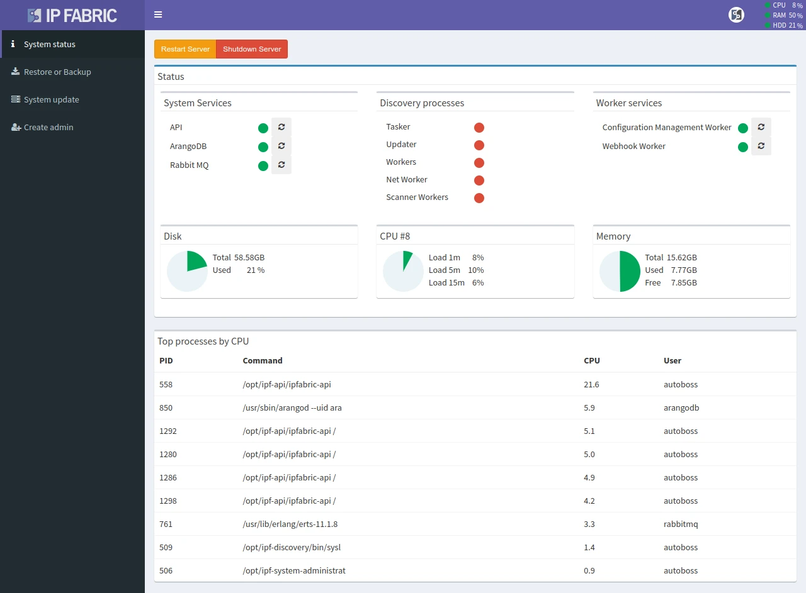

!!! danger "Deprecated Since Version 7.0"

    The System Administration UI has been deprecated since version 7.0. You can now
    access the same functionality, except for restarting the API service, in the main
    GUI under `https://ipfabric-ip-or-fqdn/support/status` or by clicking
    `Resource Usage` in the top-right corner. To restart the API service, use the
    server’s standard Debian command line interface: `sudo systemctl restart ipf-api`.

# System Status

When you log in to the **System Administration** UI with the `osadmin` user, you
will find yourself in the **System status** section. It displays information
such as the current CPU load, RAM usage, disk space usage, and the running
services.

The most CPU-intensive system processes are also displayed.

Additionally, you can **restart** specific system services or **restart / shut
down** the entire virtual machine.

!!! info

    When no discovery process is running, its services (`Tasker`, `Updater`,
    `Workers`, `Net Worker`, and `Scanner Workers`) are expected to be inactive.
