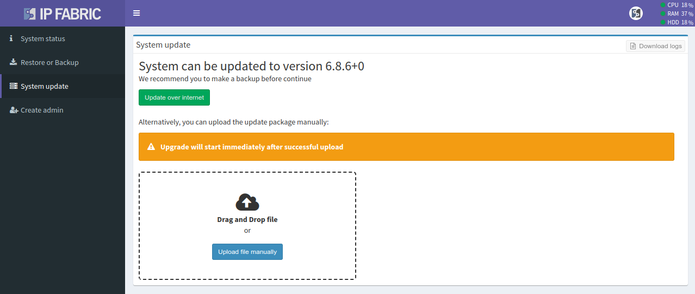

# System update

--8<-- "snippets/clear_browser_cache.md"

## Access System Administration and Backup the System

The best practice is to save the virtual machine's state (VM snapshot) using
your hypervisor. Alternatively, you may use an IP Fabric backup. To proceed with
IP Fabric backup, do the following:

1. In the main GUI, click **Support** (in the top-right corner).
2. Click **System Administration** to access the administrative interface (e.g.
   `https://ipfabric-ip-address:8443`).
3. Log in with the `osadmin` user and the password configured during the first
   boot.
4. Backup the VM by following the instructions on the
   [Restore or Backup](restore_or_backup.md) page.

!!! info "Backup Disk"

    Local backup disk is not present by default! Please add a new virtual disk
    to your VM to enable local backups. (See
    [Local Backup Disk](../increase_disk_space.md/#local-backup-disk).)

## Online Update

Online update is automatically available only when the IP Fabric appliance has connectivity to the servers below:

* `callhome.ipfabric.io` (`95.217.156.217`) remote port 443/TCP for update
  availability check
* `releases.ipfabric.io` (`95.216.185.152`) remote port 443/TCP for update
  package download

When a new IP Fabric version is available, a green indicator will appear in the
top-right corner of the main GUI. The image below shows an example of the new
version `6.2.2` being available:

To proceed with online update:

1. Click the new version indicator (it will navigate you to **System
   Administration**).
2. Log in with the `osadmin` user and the password configured during the first
   boot.
3. Perform the VM backup as described in the above section.
4. Navigate to **System update** and proceed (IP Fabric will automatically
   download the update file, perform the update and reboot itself).

## Offline Update

If your IP Fabric does not have direct internet connectivity, you may use
offline update:

1. Download the latest update file from
   [https://releases.ipfabric.io/ipfabric/updates/](https://releases.ipfabric.io/ipfabric/updates/).
2. In the main GUI, click **Support** (in the top-right corner).
3. Click **System Administration** to access the administrative interface (e.g.
   `https://ipfabric-ip-address:8443`).
4. Log in with the `osadmin` user and the password configured during the first
   boot.
5. Perform the VM backup as described in the above section.
6. Navigate to **System update**.
7. Select or drag-and-drop the downloaded update file.

After a successful package upload, the update will start automatically and the
IP Fabric VM will reboot once it is done. Afterwards, it is recommended to
create a new discovery snapshot on the latest version.
