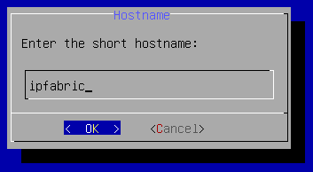

# Update Hostname or DNS Domain Name

To change the hostname or the DNS domain name of your IP Fabric machine from the
CLI, follow these steps:

1. Connect to the IP Fabric appliance via SSH as the `osadmin` user.

2. Run:

   ```shell
   sudo nimpee-net-config -n
   ```

3. Modify the hostname -- the very first option:

  

  !!! info "Valid Hostnames"

      Valid characters for hostnames are ASCII letters from `a` to `z`, digits
      from `0` to `9`, and the dash (`-`). A hostname may not start with a dash.

4. Modify the DNS domain name -- the second option:

  

  !!! note

      The First Boot Wizard can modify other configuration items, such as the
      network interface.

      To change only the hostname or the DNS domain name, leave everything as is
      until you reach the `Reboot system` dialog.

5. Select `Yes` to reboot the system:

   
