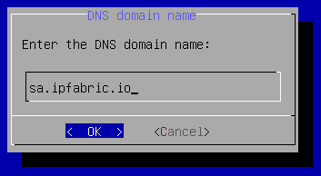

# Update hostname or domain name

To change the hostname or the DNS domain name of your IP Fabric machine from the
CLI, please do the following:

1. Connect to the IP Fabric appliance via SSH as the `osadmin` user.

2. Run the `sudo nimpee-net-config -n` command to launch the network
   configuration wizard.

3. Modify the `hostname` -- the very first option:

  

  !!! info "Valid Hostnames"

      Valid characters for hostnames are ASCII letters from `a` to `z`, the
      digits from `0` to `9`, and the hyphen (`−`). A hostname may not start
      with a hyphen.

4. Modify the `DNS domain name` -- the second option:

  

  !!! note

      The IP Fabric Boot Wizard can modify other configuration items like
      Network Interface configuration, etc.

      To change only the `hostname` or `DNS domain name`, leave everything as is
      until you reach the `Reboot system` prompt screen.

5. Select `Yes` to reboot the system:

   
