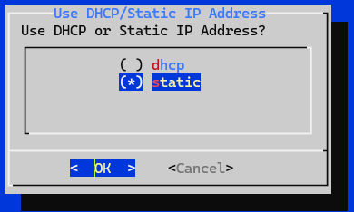
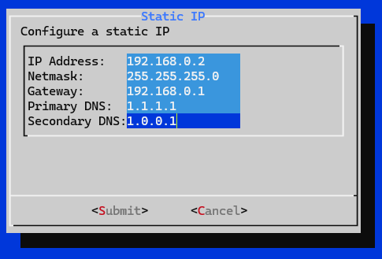

# Update Network Config

To change the IP Address, Subnet, Gateway, DNS, or Proxy configuration of
your IP Fabric VM from the CLI, please do the following:

1. Connect to the IP Fabric appliance via SSH as the `osadmin` user.

2. Run the `sudo nimpee-net-config -n` command to launch the network
   configuration wizard.

  !!! note

      To keep the current configuration for any item, select `OK` and press
      `Enter`.

3. First options are to modify the `hostname` and `DNS domain name` (detailed
   docs at [Update hostname or domain name](change_hostname.md)).

4. Next, select DHCP or Static IP Address Assignment. (Use the up/down and
   `Space` keys to change `()` to `(*)`.)

   

5. If you selected Static IP Address Assignment, then enter:

   - IP Address
   - Netmask
   - Gateway
   - Primary DNS
   - Secondary DNS

   

6. Select `Yes` to reboot the system:

   
