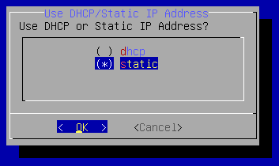
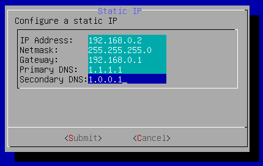

# Update Network Config

To change the IP Address, Subnet, Gateway, NTP, DNS, or Proxy configuration of 
your IP Fabric VM from the CLI, please do the following:

1. `ssh` to the IP Fabric appliance as the `osadmin` user

2. Execute command `nimpee-net-config -n` to launch network configuration
   wizard.

  !!! note

      To keep current configuration for any item highlight `OK` and press enter.

3. First options are to modify the `hostname` and `DNS domain name` (detailed 
   docs at [Update hostname or domain name](change_hostname.md)).

4. Next select DHCP or Static IP Address Assignment. (Use the up/down arrow and 
   space bar to change `()` to `(*)`)

   

5. If you selected Static IP Address Assignment then enter 

   - IP Address
   - Netmask
   - Gateway
   - Primary DNS
   - Secondary DNS

  

6. Update NTP servers using comma separated list.

  

7. Select `Yes` to reboot the system.

