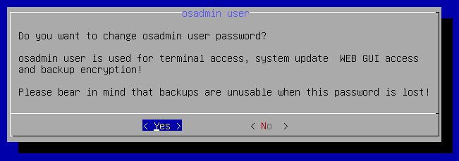
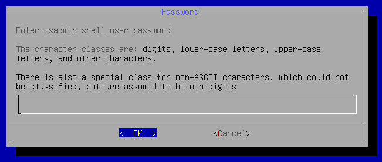

# Update `osadmin` password

1. Connect to your IP Fabric appliance via SSH as the `osadmin` user.

2. Run the `sudo nimpee-net-config -t` command to launch the configuration
   wizard and select `Yes` to proceed:

  

  !!! attention

      Changing the `osadmin` password will affect: CLI access, System
      Administration access and the backup encryption! Backups created before
      the password change will no longer be restorable.

3. Enter the new `osadmin` password twice:

   

   

   Password setup contains password complexity check, simple passwords are
   rejected.

   Password requirements are as follows:

   - max password length is 256
   - single character class passwords are not supported
   - two character class must be at least 24 characters long
   - minimal length of passphrase is 24 characters
   - three character class must be at least 16 characters long
   - four character class must be at least 12 characters long
   - passphrase must have at least five words

   The character classes are:

   - digits
   - lower-case letters
   - upper-case letters
   - and other characters

   There is also a special class for non-ASCII characters, which could not be 
   classified, but are assumed to be non-digits.

4. Select `Yes` to reboot the system:

  
