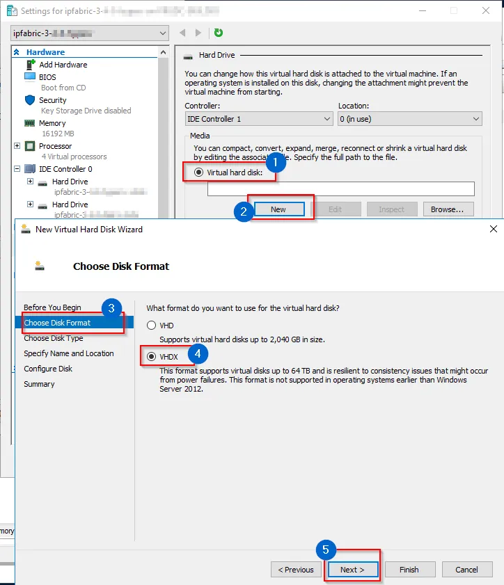

# Server Disk Space Summary

Starting with version `5.0.0`, the IP Fabric appliance deploys as a single hard
disk installation instead of two disk volumes.

Starting with versions `7.3.23` and `7.5.11`, new installations utilise the GPT
disk partitioning scheme, while older versions and all pre-existing installations
utilise the MBR partitioning scheme.

The IP Fabric appliance uses LVM for the **root** and **swap** partitions. In a
default installation, **swap** has 16 GB, and **root** has approximately 72 GB
of disk space.

In the current versions we automatically resize the **boot** disk.

On appliances with the MBR partitioning scheme it works like this:

1. Resize the primary partition to the full size of the disk.
2. Resize the extended partition to the full size of the primary partition.
3. Extend `ipfabric-vg/root` to `+100%FREE`.
4. Online resize the `ext4` partition.

On appliances with the GPT partitioning scheme the process is similar, with one less step:

1. Resize the system (LVM) partition to the full size of the disk.
2. Extend `ipfabric-vg/root` to `+100%FREE`.
3. Online resize the `ext4` partition.

## Increasing Disk Space on IP Fabric Appliance

If you need any help with disk space expansion, please contact our
[Support team](../support/index.md).

### Resizing Root/First Disk

The easiest way to resize the IP Fabric system disk is to:

1. Shutdown the VM.
2. Resize the root/first disk to the desired size.
3. Start the VM.

`cloud-init` will take care of resizing the disk.

### Expanding System Volume by Adding Additional Disk(s)

If you want to add a secondary or any additional disk as a system disk, you will
need to manually add it to the `ipfabric-vg/root` volume.

To do that, follow these LVM resources:

- [Debian Wiki -- LVM](https://wiki.debian.org/LVM)
- [ArchWiki -- LVM](https://wiki.archlinux.org/title/LVM)

## Local Backup Disk

!!! note "Backup Disk"

    The backup disk is not present by default! To enable local backups, please
    add a new virtual disk.

When enabling local backups, a
[backup](../IP_Fabric_Settings/system/Backup_and_Maintenance/system_backup.md)
tool creates backups in the `/backup` directory. The tool first checks if the
local backup directory exists, and then the backups are created.

Any additional disk (see the hypervisor-specific configurations at the bottom of
this page) can be mounted as the backup directory. For local backups, we
recommend using an additional disk located on a different datastore than the
`root` volume.

!!! warning

    The backup disk must be partitioned with LVM. Specifically, the `/backup`
    directory must be on the logical volume `backup` of the volume group
    `backup-vg`.

### Instructions To Mount a Physical Disk to the `/backup` Directory

!!! warning

    Depending on your system, the name of your backup disk may vary. To find out
    the name of your backup disk, you can use the `lsblk` command. In the
    following steps 2 and 3, we will use `vdb` as an example of a backup disk
    name. If your backup disk has a different name, please replace `vdb` with
    the correct name in steps 2 and 3.

1. Find a device which you want to use as the `/backup` directory. In this case,
   `vdb`.

   ```shell
   osadmin@ipfabric:~$ lsblk
   NAME                    MAJ:MIN RM  SIZE RO TYPE MOUNTPOINT
   vda                     254:0    0 76,3G  0 disk
   ├─vda1                  254:1    0  487M  0 part /boot
   ├─vda2                  254:2    0    1K  0 part
   └─vda5                  254:5    0 75,8G  0 part
     ├─ipfabric--vg-swap_1 253:0    0   16G  0 lvm  [SWAP]
     └─ipfabric--vg-root   253:1    0 59,8G  0 lvm  /
   vdb                     254:16   0   20G  0 disk             # <-- We want to use this device for the /backup directory.
   ```

   On systems utilising the GPT partitioning layout, the `lsblk` output may look different:

   ```shell
   osadmin@ipfabric:~$ lsblk
   NAME                    MAJ:MIN RM  SIZE RO TYPE MOUNTPOINT
   vda                     254:0    0 76,3G  0 disk
   ├─vda1                  254:1    0  256M  0 part /boot/efi
   ├─vda2                  254:2    0    1M  0 part
   ├─vda3                  254:1    0  512M  0 part /boot
   └─vda4                  254:5    0 75,5G  0 part
     ├─ipfabric--vg-swap_1 253:0    0   16G  0 lvm  [SWAP]
     └─ipfabric--vg-root   253:1    0 59,5G  0 lvm  /
   vdb                     254:16   0   20G  0 disk             # <-- We want to use this device for the /backup directory.
   ```

2. Create an LVM physical volume on the disk `vdb`:

   ```shell
   osadmin@ipfabric:~$ sudo pvcreate /dev/vdb
     Physical volume "/dev/vdb" successfully created.
   ```

3. Create the volume group `backup-vg`:

   ```shell
   osadmin@ipfabric:~$ sudo vgcreate backup-vg /dev/vdb
     Volume group "backup-vg" successfully created
   ```

4. Use the entire size of the volume group `backup-vg` to create the logical
   volume `backup`:

   ```shell
   osadmin@ipfabric:~$ sudo lvcreate -n backup -l 100%FREE backup-vg
     Logical volume "backup" created.
   ```

5. Create a filesystem (in this example, `ext4`) on the logical volume `backup`:

   ```shell
   osadmin@ipfabric:~$ sudo mkfs.ext4 /dev/mapper/backup--vg-backup
   mke2fs 1.46.2 (28-Feb-2021)
   Discarding device blocks: done
   Creating filesystem with 5241856 4k blocks and 1310720 inodes
   Filesystem UUID: 26bf3259-8421-4b67-ad27-71fa55e57af8
   Superblock backups stored on blocks:
     32768, 98304, 163840, 229376, 294912, 819200, 884736, 1605632, 2654208,
     4096000

   Allocating group tables: done
   Writing inode tables: done
   Creating journal (32768 blocks): done
   Writing superblocks and filesystem accounting information: done
   ```

6. Create a new [fstab](https://wiki.archlinux.org/title/fstab) entry (for example, using `sudo vi /etc/fstab`):

  !!! info

      We strongly recommend using only LVM partition LABELs and UUIDs in
      `fstab`. For more information, see
      [Persistent block device naming](https://wiki.archlinux.org/title/Persistent_block_device_naming).

      ```shell
      /dev/mapper/backup--vg-backup   /backup   ext4   defaults   0   0
      ```

7. Create the `/backup` directory:

   ```shell
   sudo mkdir /backup
   ```

8. The logical volume `backup` can now be mounted with:

   ```shell
   sudo mount /backup
   ```

9. Finally, check the output of `lsblk`:

   ```shell
   osadmin@ipfabric:~$ lsblk
   NAME                    MAJ:MIN RM  SIZE RO TYPE MOUNTPOINT
   vda                     254:0    0 76,3G  0 disk
   ├─vda1                  254:1    0  487M  0 part /boot
   ├─vda2                  254:2    0    1K  0 part
   └─vda5                  254:5    0 75,8G  0 part
     ├─ipfabric--vg-swap_1 253:0    0   16G  0 lvm  [SWAP]
     └─ipfabric--vg-root   253:1    0 59,8G  0 lvm  /
   vdb                     254:16   0   20G  0 disk
   └─backup--vg-backup     253:2    0   20G  0 lvm  /backup
   ```

	or, on systems with GPT partitioning:

   ```shell
   osadmin@ipfabric:~$ lsblk
   NAME                    MAJ:MIN RM  SIZE RO TYPE MOUNTPOINT
   vda                     254:0    0 76,3G  0 disk
   ├─vda1                  254:1    0  256M  0 part /boot/efi
   ├─vda2                  254:2    0    1M  0 part
   ├─vda3                  254:1    0  512M  0 part /boot
   └─vda4                  254:5    0 75,5G  0 part
     ├─ipfabric--vg-swap_1 253:0    0   16G  0 lvm  [SWAP]
     └─ipfabric--vg-root   253:1    0 59,5G  0 lvm  /
   vdb                     254:16   0   20G  0 disk
   └─backup--vg-backup     253:2    0   20G  0 lvm  /backup
   ```

### Increase Size of Backup Disk

!!! warning

    Depending on your system, the name of your backup disk may vary. To find out
    the name of your backup disk, you can use the `lsblk` command. In the
    following step 6, we will use `vdb` as an example of a backup disk name. If
    your backup disk has a different name, please replace `vdb` with the correct
    name in step 6.

Suppose you prepared a backup disk with size of 20 GB with the instructions
above, and you would like to increase its size (for example, to 40 GB).

1. Shutdown the IP Fabric appliance.

2. Increase the backup disk's size at the hypervisor level (for example, to 40
   GB).

3. Start the IP Fabric appliance.

4. Log in to the CLI as the `osadmin` user.

5. Check the status with `lsblk` -- notice that the disk `vdb` in this case has
   40 GB, but the LVM logical volume `backup` still has only 20 GB:

   ```shell
   osadmin@ipfabric:~$ lsblk
   NAME                    MAJ:MIN RM  SIZE RO TYPE MOUNTPOINT
   vda                     254:0    0 76,3G  0 disk 
   ├─vda1                  254:1    0  487M  0 part /boot
   ├─vda2                  254:2    0    1K  0 part 
   └─vda5                  254:5    0 75,8G  0 part 
     ├─ipfabric--vg-swap_1 253:1    0   16G  0 lvm  [SWAP]
     └─ipfabric--vg-root   253:2    0 59,8G  0 lvm  /
   vdb                     254:16   0   40G  0 disk 
   └─backup--vg-backup     253:0    0   20G  0 lvm  /backup
   ```

6. Resize the LVM physical volume:

   ```shell
   osadmin@ipfabric:~$ sudo pvresize /dev/vdb
     Physical volume "/dev/vdb" changed
     1 physical volume(s) resized or updated / 0 physical volume(s) not resized
   ```

7. Resize the LVM logical volume:

   ```shell
   osadmin@ipfabric:~$ sudo lvextend -l +100%FREE /dev/backup-vg/backup
     Size of logical volume backup-vg/backup changed from <20,00 GiB (5119 extents) to <40,00 GiB (10239 extents).
     Logical volume backup-vg/backup successfully resized.
   ```

8. Resize the filesystem:

   ```shell
   osadmin@ipfabric:~$ sudo resize2fs /dev/mapper/backup--vg-backup
   resize2fs 1.46.2 (28-Feb-2021)
   Filesystem at /dev/mapper/backup--vg-backup is mounted on /backup; on-line resizing required
   old_desc_blocks = 3, new_desc_blocks = 5
   The filesystem on /dev/mapper/backup--vg-backup is now 10484736 (4k) blocks long.
   ```

9. Re-check the status with `lsblk`:

   ```shell
   osadmin@ipfabric:~$ lsblk
   NAME                    MAJ:MIN RM  SIZE RO TYPE MOUNTPOINT
   vda                     254:0    0 76,3G  0 disk 
   ├─vda1                  254:1    0  487M  0 part /boot
   ├─vda2                  254:2    0    1K  0 part 
   └─vda5                  254:5    0 75,8G  0 part 
     ├─ipfabric--vg-swap_1 253:1    0   16G  0 lvm  [SWAP]
     └─ipfabric--vg-root   253:2    0 59,8G  0 lvm  /
   vdb                     254:16   0   40G  0 disk 
   └─backup--vg-backup     253:0    0   40G  0 lvm  /backup
   ```

10. Also, check the size of the filesystem:

   ```shell
   osadmin@ipfabric:~$ df -h /backup
   Filesystem                     Size  Used Avail Use% Mounted on
   /dev/mapper/backup--vg-backup   40G   19M   38G   1% /backup
   ```

### Remove Backup Disk

!!! danger

    After following the instructions, all data on the backup disk will be lost!

!!! warning

    Depending on your system, the name of your backup disk may vary. To find out
    the name of your backup disk, you can use the `lsblk` command. In the
    following step 6, we will use `vdb` as an example of a backup disk name. If
    your backup disk has a different name, please replace `vdb` with the correct
    name in step 6.

Suppose you have a backup disk prepared with the instructions above, and now you
would like to remove it.

1. Find the backup disk you want to remove. In this case, `vdb`.

   ```shell
   osadmin@ipfabric:~$ lsblk
   NAME                    MAJ:MIN RM  SIZE RO TYPE MOUNTPOINT
   vda                     254:0    0 76.3G  0 disk 
   ├─vda1                  254:1    0  487M  0 part /boot
   ├─vda2                  254:2    0    1K  0 part 
   └─vda5                  254:5    0 75.8G  0 part 
     ├─ipfabric--vg-swap_1 253:1    0   16G  0 lvm  [SWAP]
     └─ipfabric--vg-root   253:2    0 59.8G  0 lvm  /
   vdb                     254:16   0   20G  0 disk             # <-- We want to unconfigure and remove this device.
   └─backup--vg-backup     253:0    0   20G  0 lvm  /backup
   ```

2. Remove the `fstab` entry (for example, using `sudo vi /etc/fstab`):

   ```shell
   /dev/mapper/backup--vg-backup   /backup   ext4   defaults   0   0
   ```

3. Unmount the LVM logical volume `backup`:

   ```
   sudo umount /backup
   ```

4. Disable and remove the LVM logical volume `backup` (you may check the `sudo
   lvdisplay` outputs before and after running the commands):

   ```shell
   osadmin@ipfabric:~$ sudo lvchange -an /dev/backup-vg/backup

   osadmin@ipfabric:~$ sudo lvremove /dev/backup-vg/backup
     Logical volume "backup" successfully removed
   ```

5. Disable and remove the LVM volume group `backup-vg` (you may check the `sudo
   vgdisplay` outputs before and after running the commands):

   ```shell
   osadmin@ipfabric:~$ sudo vgchange -an backup-vg
     0 logical volume(s) in volume group "backup-vg" now active

   osadmin@ipfabric:~$ sudo vgremove backup-vg
     Volume group "backup-vg" successfully removed
   ```

6. Remove the LVM physical volume on the disk `vdb` (you may check the `sudo
   pvdisplay` outputs before and after running the command):

   ```shell
   osadmin@ipfabric:~$ sudo pvremove /dev/vdb
     Labels on physical volume "/dev/vdb" successfully wiped.
   ```

7. Verify with `lsblk` that the disk `vdb` has been unconfigured:

   ```shell
   osadmin@ipfabric:~# lsblk
   NAME                    MAJ:MIN RM  SIZE RO TYPE MOUNTPOINT
   vda                     254:0    0 76.3G  0 disk 
   ├─vda1                  254:1    0  487M  0 part /boot
   ├─vda2                  254:2    0    1K  0 part 
   └─vda5                  254:5    0 75.8G  0 part 
     ├─ipfabric--vg-swap_1 253:1    0   16G  0 lvm  [SWAP]
     └─ipfabric--vg-root   253:2    0 59.8G  0 lvm  /
   vdb                     254:16   0   20G  0 disk 
   ```

8. Shutdown the IP Fabric VM.

9. Remove the disk `vdb` from the VM at the hypervisor level.

10. Start the VM.

11. Verify with `lsblk` that the disk `vdb` is no longer present:

    ```shell
    osadmin@ipfabric:~$ lsblk
    NAME                    MAJ:MIN RM  SIZE RO TYPE MOUNTPOINT
    vda                     254:0    0 76.3G  0 disk 
    ├─vda1                  254:1    0  487M  0 part /boot
    ├─vda2                  254:2    0    1K  0 part 
    └─vda5                  254:5    0 75.8G  0 part 
      ├─ipfabric--vg-swap_1 253:0    0   16G  0 lvm  [SWAP]
      └─ipfabric--vg-root   253:1    0 59.8G  0 lvm  /
    ```

## Deprecated Resize Wizard

The IP Fabric appliance with a version lower than `5.0` used two LVM volumes by
default: `ipfabric-vg/root` for system and data, and `backup-vg/backup` for
`/backup`.

The system and data volume was extended over two disks (usually the first two).
For additional disks, you could choose to extend the _root_ or _backup_ volume.
This option was discontinued in favor of one system/data disk with the
possibility of adding a backup disk.

The original script is still present in the system, but we discourage its use as
it expects only the boot disk to be `sda`, `sdb` as extended `ipfabric-vg/root`,
and you could choose how `sd[c-z]` would be used. The new approach with one disk
is more versatile and is not limited to `sd[a-z]` disks.

!!! error "Deprecated Script"

    This script should not be used anymore. The script also only supports the
    MBR partitioning scheme, and doesn't work with the GPT partitioning scheme.
    You should run it only when you know what you are doing.

Script location: `/opt/nimpee/sys-lvm-resize.sh`

## Increase Disk Space for VMware

### Extend Existing Virtual Disk (for System and Data)

1. Open the VMware vSphere web console.
2. Right-click the VM name and select **Edit Settings**.
3. Select **Hard disk** and change its size.
4. Click **OK**.
5. Restart the VM (using CLI or web UI).
6. The disk space is automatically increased if you resized the first disk.

### Add New Virtual Disk (as an Additional Backup Disk)

1. Open the VMware vSphere web console.
2. Right-click the VM name and select **Edit Settings**.
3. Click **Add New Device --> New Hard disk**.
4. Specify the size.
5. Specify the **Location**:
   1. For system disk expansion, it is recommended to select `Store with the
      virtual machine`.
   2. For the backup volume, it is recommended to select a different datastore,
      ideally on different physical storage.
6. Click **OK**.
   
7. Launch the Remote (Web) Console.
8. Reboot (the **Send Ctrl+Alt+Delete** function can be also used) or power on
   the IP Fabric VM.
9. Follow
   [Adding additional disk(s)](#expanding-system-volume-by-adding-additional-disks)
   or
   [Example adding disk to backup](#instructions-to-mount-a-physical-disk-to-the-backup-directory).

## Increase Disk Space for Hyper-V

### Extend Existing Virtual Disk (for System and Data)

1. Open Hyper-V Manager.
2. Shutdown the VM. (When started, Hyper-V won't let you change any hardware
   settings.)
3. Right-click the VM name and select **Settings**.
4. Select **IDE Controller --> Hard Drive --> ipfabric-x-x-x-disk1.vhdx**.
5. Click **Edit** -- **Choose Action** -- select the option **Expand**, click
   **Next**.
6. Set up the required disk size and click **Finish**.
7. Start the VM.
8. The disk space is automatically increased if you resized the first disk.

### Add New Virtual Disk (as an Additional Backup Disk)

1. Open Hyper-V Manager.
2. Shutdown the VM. (When started, Hyper-V won't let you change any hardware
   settings.)
3. Right-click the VM name and select **Settings**.
   
4. Select **IDE Controller 1 --> Hard Drive** and click **Add**.
   
5. Select **Virtual hard disk** and click **New**. In the `Choose Disk Format`
   step, select **VHDX** and click **Next**.
   
6. In the `Choose Disk Type` step, select **Dynamically expanding** and click
   **Next**.
   
7. Specify the name and location of the disk and click **Next**.
8. In the `Configure Disk` step, select **Create a new blank virtual hard
   disk**, change the **Size** to the required value, and click
   **Finish**.
   
9. Apply the new disk in the **Settings** window and close **Settings**.
10. Start the VM.
11. Follow
    [Adding additional disk(s)](#expanding-system-volume-by-adding-additional-disks)
    or
    [Example adding disk to backup](#instructions-to-mount-a-physical-disk-to-the-backup-directory).
