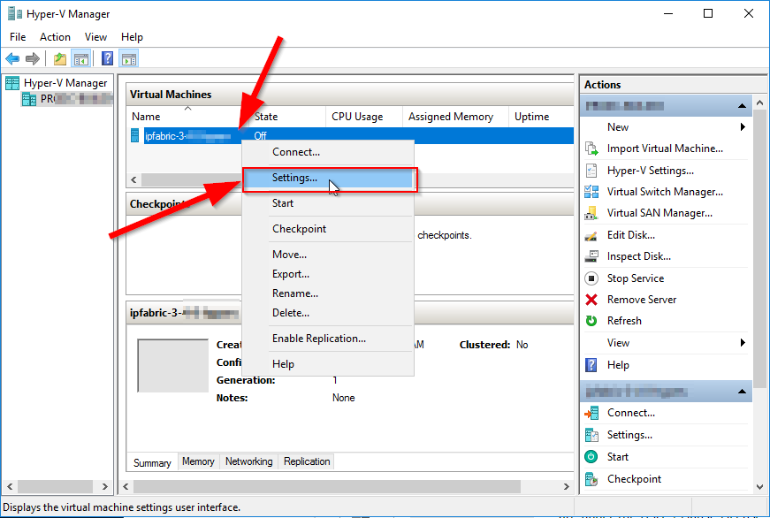
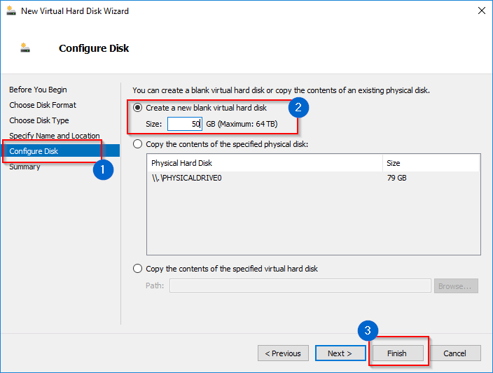

# Increase Disk Space

## System or Backup

Appliance disk space can be extended by extending existing virtual disk or by adding new empty virtual hard drive to IP Fabric VM. Same procedure can be also used to add new partition for local system backup.

!!! note "Backup Disk"

    Backup disk is not present by default! Please add new virtual disk to enable local backups. (See option 2 for VMWare or Hyper-V)

!!! warning "Supported hypervisors"

    VMware vSphere and HyperV are the only supported platform.

## Increase Disk Space For VMware

### Option 1 - Extend Existing Virtual Disk (for System And Data)

1.  Open VMware vSphere web console.
2.  Right click on VM name and select **Edit Settings**.
3.  Select **Hard disk** and change its size.
4.  Click **OK**.
5.  Restart VM (using CLI or web UI).
6.  Disk space is automatically increased.

### Option 2 - Add New Virtual Disk (as Additional Backup Disk)

1.  Open VMware vSphere web console.
2.  Right click on VM name and select **Edit Settings**.
3.  Click **Add New Device → Hard Disk**
4.  Select new size
5.  Specify **Location**:
    1.  for system disk expansion is recommended to select **Store with
        the virtual machine**
    2.  for backup volume is recommended to select different datastore
        ideally on a different physical storage
6.  Click **OK**
    
7.  Launch Remote (Web) Console.
8.  Reboot(**Send Ctrl+Alt+Delete** function can be also used) or power on IP
    Fabric VM.
9.  During system boot **Disk space expansion** wizard appears.
    
10. Select **Yes** to start disk space expansion.
11. Select which volume to extend:
    1. System volume is used for all data except local backups.
    
    2. Backup is used only for local backups.
    
12. Selected volume is extended.
    
13. Enter **OK**

## Increase Disk Space For Hyper-V

### Option 1 - Extend Existing Virtual Disk (for System And Data)

1.  Open Hyper-V Manager.
2.  Shutdown VM. (when Started, HyperV won't let you change any
    hardware settings)
3.  Right click on VM name and select **Settings**.
4.  Select **IDE Controller - Hard Drive -
    ipfabric-3-x-x-disk1.vhdx **
5.  Click **Edit** - **Choose Action** - select option **Expand**,
    click **Next**.
6.  Set up required disk size and click **Finish**.
7.  Start VM.
8.  Disk space is automatically increased.

### Option 2 - Add New Virtual Disk (as Additional Backup Disk)

1. Open HyperV Manager.
2. Shutdown VM. (when Started, HyperV won't let you change any
    hardware settings)
3. Right click on VM name an select **Settings**.
   
4. Select IDE Controller 1 - Hard Drive - click **Add**
   
5. Select **Virtual hard disk** - click **New** - select **Choose
    Disk Format** - select **VHDX** - click **Next**.
   
6. Select **Dynamically expanding** - click **Next**
   
7. Specify name and location of disk.
8. **Configure Disk** - select **Create a new blank virtual hard
    disk** - change **Size** to required value - click
    **Finish**.
   
9. Apply new disk on Settings window - close **Settings**.
10. Start VM.
11. During system boot **Disk space expansion** wizard appears.
    
12. Select **Yes** to start disk space expansion.
13. Select which volume to extend:
    1. System volume is used for all data except local backups.
    
    2. Backup is used only for local backups.
    
14. Selected volume is extended.
    
15. Enter **OK**
