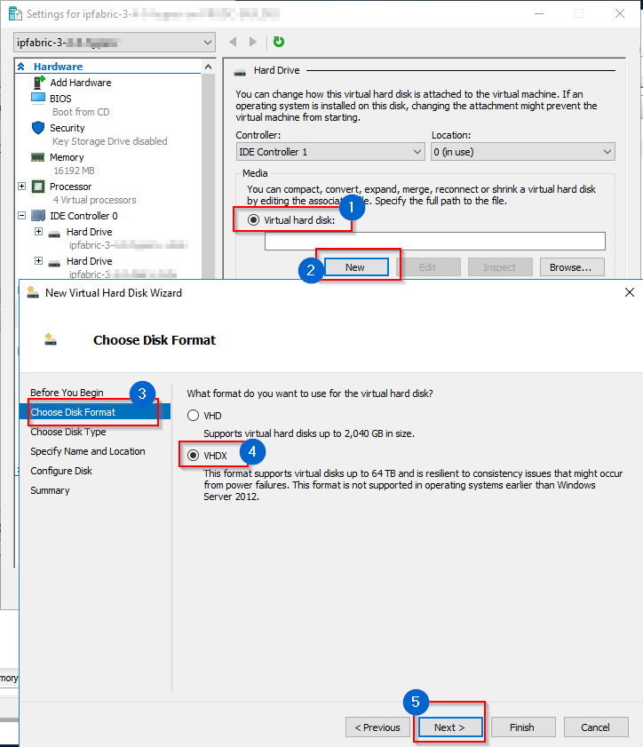

# Server Disk Space Summary

Starting with version `5.0.0`, the IP Fabric appliance deploys as a single hard disk installation instead of two disk volumes.

The IP Fabric appliance is using LVM type for the **root** and **swap** partitions. On a default installation, **swap** has 16 GB, and **root** has ~72 GB of disk space.

We automatically resize the **boot** disk as follows:

- resize primary partition to full size of the disk
- resize extended partition to full size of primary partition
- extend `ipfabric-vg/root` to `+100%FREE`
- online resize `ext4` partition

## Increasing Disk Space on IP Fabric Appliance

If you need any help with disk space expansion, please contact our [Support team](../support/index.md).

### Resizing Root/First Disk

The easiest way how to resize the IP Fabric system disk is to:

1. Shutdown the VM.

2. Resize the root/first disk to a desired size.

3. Start the VM.

`cloud-init` will take care of resizing the disk.

### Expanding System Volume by Adding Additional Disk(s)

If you want to add a secondary or any additional disk as a system disk, you will need to manually add it to the `ipfabric-vg/root` volume.

To do that, follow LVM resources:

- [Debian LVM wiki](https://wiki.debian.org/LVM)
- [Arch LVM wiki](https://wiki.archlinux.org/title/LVM)

## Local Backup Disk

!!! note "Backup Disk"

    Backup disk is not present by default! Please add a new virtual disk to enable local backups.

When enabling local backups, a [backup](../IP_Fabric_Settings/system/Backup_and_Maintenance/system_backup.md) tool creates backups to the `/backup` directory.
The tool first checks if the local backup directory exists and then the backups are created.

Any additional disk (see hypervisor-specific configuration at the bottom of this page) can be mounted as the backup directory. We recommend using an additional disk located on a different datastore than the `root` volume for the local backups.

!!! warning

    The backup disk must be partitioned with LVM. Specifically, the `/backup` directory must be on the logical volume `backup` of the volume group `backup-vg`.

### Instructions To Mount a Physical Disk To `/backup` Directory

!!! warning

    The name of your backup disk may vary depending on your system. To find out the name of your backup disk, you can use the `lsblk` command. In the following steps 2 and 3, we will use `vdb` as an example of a backup disk name. If your backup disk has a different name, please replace `vdb` with the correct name in steps 2 and 3.

1. Find a device which you want to use as the `/backup` directory. In this case, `vdb`.

   ```shell
   osadmin@ipfabric:~$ lsblk
   NAME                    MAJ:MIN RM  SIZE RO TYPE MOUNTPOINT
   vda                     254:0    0 76,3G  0 disk
   ├─vda1                  254:1    0  487M  0 part /boot
   ├─vda2                  254:2    0    1K  0 part
   └─vda5                  254:5    0 75,8G  0 part
     ├─ipfabric--vg-swap_1 253:0    0   16G  0 lvm  [SWAP]
     └─ipfabric--vg-root   253:1    0 59,8G  0 lvm  /
   vdb                     254:16   0   20G  0 disk             # <-- We want to use this device for the /backup directory.
   ```

2. Create LVM physical volume on the disk `vdb`:

   ```shell
   osadmin@ipfabric:~$ sudo pvcreate /dev/vdb
     Physical volume "/dev/vdb" successfully created.
   ```

3. Create the volume group `backup-vg`:

   ```shell
   osadmin@ipfabric:~$ sudo vgcreate backup-vg /dev/vdb
     Volume group "backup-vg" successfully created
   ```

4. Use the entire size of the volume group `backup-vg` for creating the logical volume `backup`:

   ```shell
   osadmin@ipfabric:~$ sudo lvcreate -n backup -l 100%FREE backup-vg
     Logical volume "backup" created.
   ```

5. Create a filesystem (in this example `ext4`) on the logical volume `backup`:

   ```shell
   osadmin@ipfabric:~$ sudo mkfs.ext4 /dev/mapper/backup--vg-backup
   mke2fs 1.46.2 (28-Feb-2021)
   Discarding device blocks: done
   Creating filesystem with 5241856 4k blocks and 1310720 inodes
   Filesystem UUID: 26bf3259-8421-4b67-ad27-71fa55e57af8
   Superblock backups stored on blocks:
     32768, 98304, 163840, 229376, 294912, 819200, 884736, 1605632, 2654208,
     4096000

   Allocating group tables: done
   Writing inode tables: done
   Creating journal (32768 blocks): done
   Writing superblocks and filesystem accounting information: done
   ```

6. Create a new [fstab](https://wiki.archlinux.org/title/fstab) entry (for example with `sudo vi /etc/fstab`):

  !!! info

      We strongly recommend only LVM partition, LABEL and UUID in `fstab`, for more info see
      [Persistent block device naming](https://wiki.archlinux.org/title/Persistent_block_device_naming).

      ```shell
      /dev/mapper/backup--vg-backup   /backup   ext4   defaults   0   0
      ```

7. Create the `/backup` directory:

   ```shell
   sudo mkdir /backup
   ```

8. The logical volume `backup` can be now mounted with:

   ```shell
   sudo mount /backup
   ```

9. Finally, check the output of `lsblk`:

   ```shell
   osadmin@ipfabric:~$ lsblk
   NAME                    MAJ:MIN RM  SIZE RO TYPE MOUNTPOINT
   vda                     254:0    0 76,3G  0 disk
   ├─vda1                  254:1    0  487M  0 part /boot
   ├─vda2                  254:2    0    1K  0 part
   └─vda5                  254:5    0 75,8G  0 part
     ├─ipfabric--vg-swap_1 253:0    0   16G  0 lvm  [SWAP]
     └─ipfabric--vg-root   253:1    0 59,8G  0 lvm  /
   vdb                     254:16   0   20G  0 disk
   └─backup--vg-backup     253:2    0   20G  0 lvm  /backup
   ```

### Increase Size of Backup Disk

!!! warning

    The name of your backup disk may vary depending on your system. To find out the name of your backup disk, you can use the `lsblk` command. In the following step 5, we will use `vdb` as an example of a backup disk name. If your backup disk has a different name, please replace `vdb` with the correct name in step 5.

Suppose you prepared a backup disk with size of 20 GB with the instructions above and you would like to increase its size (for example to 40 GB).

1. Shutdown the IP Fabric appliance.

2. Increase the backup disk's size at the VM-level (for example to 40 GB).

3. Start the IP Fabric appliance.

4. Log in to the CLI as the `osadmin` user.

5. Check the status with `lsblk` -- notice that the disk `vdb` in this case has 40 GB, but the LVM logical volume `backup` still has only 20 GB:

   ```shell
   osadmin@ipfabric:~$ lsblk
   NAME                    MAJ:MIN RM  SIZE RO TYPE MOUNTPOINT
   vda                     254:0    0 76,3G  0 disk 
   ├─vda1                  254:1    0  487M  0 part /boot
   ├─vda2                  254:2    0    1K  0 part 
   └─vda5                  254:5    0 75,8G  0 part 
     ├─ipfabric--vg-swap_1 253:1    0   16G  0 lvm  [SWAP]
     └─ipfabric--vg-root   253:2    0 59,8G  0 lvm  /
   vdb                     254:16   0   40G  0 disk 
   └─backup--vg-backup     253:0    0   20G  0 lvm  /backup
   ```

6. Resize the LVM physical volume:

   ```shell
   osadmin@ipfabric:~$ sudo pvresize /dev/vdb
     Physical volume "/dev/vdb" changed
     1 physical volume(s) resized or updated / 0 physical volume(s) not resized
   ```

7. Resize the LVM logical volume:

   ```shell
   osadmin@ipfabric:~$ sudo lvextend -l +100%FREE /dev/backup-vg/backup
     Size of logical volume backup-vg/backup changed from <20,00 GiB (5119 extents) to <40,00 GiB (10239 extents).
     Logical volume backup-vg/backup successfully resized.
   ```

8. Resize the filesystem:

   ```shell
   osadmin@ipfabric:~$ sudo resize2fs /dev/mapper/backup--vg-backup
   resize2fs 1.46.2 (28-Feb-2021)
   Filesystem at /dev/mapper/backup--vg-backup is mounted on /backup; on-line resizing required
   old_desc_blocks = 3, new_desc_blocks = 5
   The filesystem on /dev/mapper/backup--vg-backup is now 10484736 (4k) blocks long.
   ```

9. Re-check the status with `lsblk`:

   ```shell
   osadmin@ipfabric:~$ lsblk
   NAME                    MAJ:MIN RM  SIZE RO TYPE MOUNTPOINT
   vda                     254:0    0 76,3G  0 disk 
   ├─vda1                  254:1    0  487M  0 part /boot
   ├─vda2                  254:2    0    1K  0 part 
   └─vda5                  254:5    0 75,8G  0 part 
     ├─ipfabric--vg-swap_1 253:1    0   16G  0 lvm  [SWAP]
     └─ipfabric--vg-root   253:2    0 59,8G  0 lvm  /
   vdb                     254:16   0   40G  0 disk 
   └─backup--vg-backup     253:0    0   40G  0 lvm  /backup
   ```

10. Also check the size of the filesystem:

   ```shell
   osadmin@ipfabric:~$ df -h /backup
   Filesystem                     Size  Used Avail Use% Mounted on
   /dev/mapper/backup--vg-backup   40G   19M   38G   1% /backup
   ```

## Deprecated Resize Wizard

IP Fabric appliance with version lower than `5.0` was using two LVM volumes by default. `ipfabric-vg/root` for system and data, `backup-vg/backup` for `/backup`.
The system and data volume was extended over two disks (usually first two). For additional drives, you could choose to extend the _root_ or _backup_ volume. This option was discontinued in favor of one system/data disk with the possibility of adding a backup disk.
The original script is still present in the system, but we discourage to use it as it expects only the boot disk to be `sda`, `sdb` as extended `ipfabic-vg/root`, and you could choose how `sd[c-z]` would be used. The new approach with one disk is more versatile and is not limited to `sd[a-z]` disks.

!!! error "Deprecated script"

    This script should not be used anymore. You should run it only when you know what you are doing.

Script location: `/opt/nimpee/sys-lvm-resize.sh`

## Increase Disk Space for VMware

### Extend Existing Virtual Disk (for System and Data)

1.  Open the VMware vSphere web console.
2.  Right click the VM name and select **Edit Settings**.
3.  Select **Hard disk** and change its size.
4.  Click **OK**.
5.  Restart the VM (using CLI or web UI).
6.  The disk space is automatically increased if you resized the first disk.

### Add New Virtual Disk (as an Additional Backup Disk)

1. Open the VMware vSphere web console.
2. Right click the VM name and select **Edit Settings**.
3. Click **Add New Device --> Hard Disk**.
4. Select new size.
5. Specify **Location**:
   1. for system disk expansion, it is recommended to select **Store with
      the virtual machine**
   2. for backup volume, it is recommended to select a different datastore
      ideally on a different physical storage
6. Click **OK**.
   
7. Launch the Remote (Web) Console.
8. Reboot (the **Send Ctrl+Alt+Delete** function can be also used) or power on the IP
   Fabric VM.
9. Follow [Adding additional disk(s)](#expanding-system-volume-by-adding-additional-disks)
   or [Example adding disk to backup](#instructions-to-mount-a-physical-disk-to-backup-directory).

## Increase Disk Space for Hyper-V

### Extend Existing Virtual Disk (for System and Data)

1.  Open Hyper-V Manager.
2.  Shutdown the VM. (When Started, Hyper-V won't let you change any
    hardware settings.)
3.  Right click the VM name and select **Settings**.
4.  Select **IDE Controller - Hard Drive -
    ipfabric-x-x-x-disk1.vhdx**.
5.  Click **Edit** - **Choose Action** - select option **Expand**,
    click **Next**.
6.  Set up the required disk size and click **Finish**.
7.  Start the VM.
8.  The disk space is automatically increased, if you resized the first disk.

### Add New Virtual Disk (as an Additional Backup Disk)

1. Open Hyper-V Manager.
2. Shutdown the VM. (When Started, HyperV won't let you change any
   hardware settings.)
3. Right click the VM name and select **Settings**.
   
4. Select IDE Controller 1 - Hard Drive - click **Add**.
   
5. Select **Virtual hard disk** - click **New** - select **Choose
   Disk Format** - select **VHDX** - click **Next**.
   
6. Select **Dynamically expanding** - click **Next**
   
7. Specify name and location of disk.
8. **Configure Disk** - select **Create a new blank virtual hard
   disk** - change **Size** to required value - click
   **Finish**.
   
9. Apply the new disk the on Settings window - close **Settings**.
10. Start the VM.
11. Follow [Adding additional disk(s)](#expanding-system-volume-by-adding-additional-disks)
    or [Example adding disk to backup](#instructions-to-mount-a-physical-disk-to-backup-directory).
