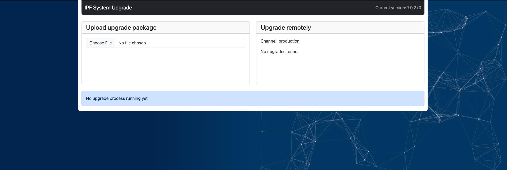

# System Update

--8<-- "snippets/clear_browser_cache.md"

## Best Practices Before Update

### Unloading Loaded Snapshots

Unload all loaded snapshots on the `/snapshot-management` page.
This will drastically reduce maintenance time during the update process. In extreme cases, it can save several hours.

The entire background process consists of unloading all snapshots, deleting indexes, reloading snapshots one by one, and
creating new indexes. This can take anywhere from a few minutes to multiple hours.

During maintenance, the application is unusable. However, if you manually unload all snapshots before the update and then
reload them afterward, you can continue using the appliance or perform discoveries while the snapshots are being reloaded.

### Back Up System

Save the virtual machine's state (VM snapshot) using
your hypervisor. Alternatively, you may use an IP Fabric backup. To proceed with
IP Fabric backup, follow the instructions on the
[Restore or Backup](Command_Line_Interface/How_to/backup_restore_CLI.md) page.

## Update

The system update functionality is accessible at
`https://ipfabric-ip-or-fqdn/ipf-system-upgrade/`.



### Online Update

Online updates are automatically available only when the IP Fabric appliance has
connectivity to the following servers:

- `version.ipfabric.io` remote port `443/tcp` for update availability checks.
- `releases.ipfabric.io` remote port `443/tcp` for update package downloads.

--8<-- "snippets/allowlist_fqdn.md"

The upgrade service uses the following User-Agent headers:

- `IPF System Upgrade Run Upgrade Service (appliance version: .*)`
- `IPF System Upgrade Version Fetcher (appliance version: .*)`


When a new IP Fabric version is available, a green indicator will appear in the
top-right corner of the main GUI.

To proceed with an online update, follow these steps:

1. Go to `https://ipfabric-ip-address/ipf-system-upgrade/` and log in with the
   `osadmin` user and the password configured during the first
   boot.
2. In the **Upgrade remotely** section, select the IP Fabric version to which you
   want to upgrade your instance.
3. IP Fabric will automatically download the update file, perform the update,
   and reboot itself.
4. It is recommended to create a new discovery snapshot on the latest version
   afterwards.

--8<-- "snippets/no_proxy_localhost.md"

#### Release Channels

Release channels provide controlled access to updates based on stability.

The default release channel is `production`.

To switch IP Fabric to a different channel:  

1. Create or edit `/etc/default/ipf-system-upgrade-local` (this file doesn't exist by default)

2. Set your release channel:

   ```
   IPF_SYSTEM_UPGRADE_VERSIONS_QUERY_CHANNEL='<assigned_channel>'  # e.g., 'early-access'
   ```

Apply changes by either:

- Running: `sudo systemctl restart system-upgrade-version-fetcher-ipf.service`

- Waiting ≤15 minutes for automatic refresh

To verify the active channel, run:

```
cat /var/lib/ipf-system-upgrade/versions.json
```

??? Example

    ``` json
    {
       "channel": "production",
       "possibleUpdates": []
    }
    ```

To return instance to the stable production channel, there are two options:

1. **Option 1**: Remove the configuration file
   ```
   sudo rm /etc/default/ipf-system-upgrade-local
   ```

2. **Option 2**: Explicitly set the release channel to `production`

   ```
   IPF_SYSTEM_UPGRADE_VERSIONS_QUERY_CHANNEL='production'
   ```

Apply changes using either method above (restart service or wait ≤15 minutes).

### Offline Update

If your IP Fabric instance does not have direct internet connectivity, you may
use offline update:

1. Download the latest update file from
   <https://releases.ipfabric.io/updates/>.
2. Go to `https://ipfabric-ip-address/ipf-system-upgrade/` (you can go there
   using the **Support --> Manual Upgrade** link in top right corner of main GUI)
   and log in with the `osadmin` user and the password configured during the first
   boot.
3. In the **Upload upgrade package** section, choose the update file from your
   computer.
4. After a successful upload, the update process will start automatically, and the
   IP Fabric VM will reboot once completed.
5. It is recommended to create a new discovery snapshot on the latest version

--8<-- "snippets/no_proxy_localhost.md"
