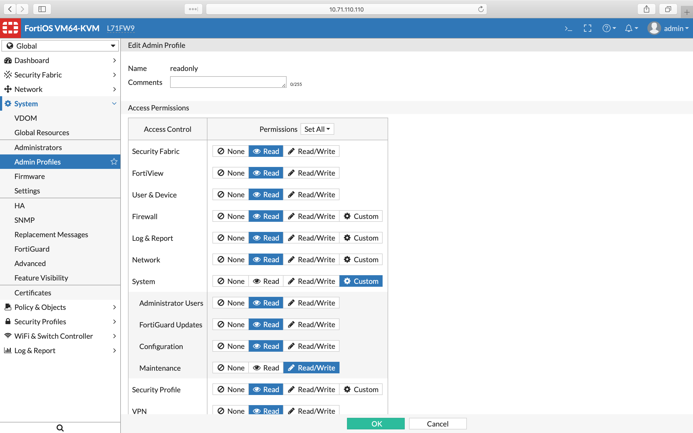

# Fortinet FortiGate

Currently, we support FortiOS version 5.2 and higher. In this article, you will find **our recommendations regarding setup of administrator profiles and accounts**. It's very important especially if you use **Virtual Domains** since part of a required configuration can be done only from CLI.  If you plan to use a user with full read/write permissions or even with super_admin profile assigned (which is not recommended, except a LAB testing), you can skip the rest of this article.

## Create an Admin Profile

First you need to create an admin profile with read-only permissions.
Follow these steps:

1.  Login to your FortiGate. In case you have VDOMs enabled, ensure you have switched to the global scope (relevant drop-down menu is at the top left corner)
2.  Navigate to System > Admin Profiles and click on "+ Create New"
3.  Fill in a name and set all permissions to Read (you can do it by clicking on "Set All" dropdown menu). The only exception is **System > Management** permission, which has to be set to "**Read/Write**" (especially if VDOMs are enabled). See the picture below from FortiOS version 6.0.  
    

## Make the created admin profile global (VDOMs only)

If you have Virtual Domains (VDOMs) enabled, you have to follow this procedure to make the created admin profile global. It means that administrators having this profile will be able to work with all VDOMs. By default, only the default *prof_admin* profile is set as global.

1.  Connect to the FortiGate via SSH or Telnet or use the console at the top right corner (version 5.6 and above) or at the dashboard (version 5.4 and below)

2.  Run the following commands to change the profile: 

    

    

        config global
        config system accprofile
        edit read_only
        set scope global
        end
        end

    

    

    Change the name of the previously created profile in the 3rd line accordingly.

## Create an Administrator account

1.  Navigate to System > Administrators and click on "+ Create New" and select "Administrator"
2.  Fill in its name, select a type of authentication and finally select the previously created Administrator profile. If you have VDOMs enabled, the Virtual Domains section bellow should disappear (if not, the selected profile is not global)
3.  Apply other restrictions if needed and click OK.

!!! Warning Ensure, that there is at least one interface with SSH or Telnet allowed and this interface is accessible from IP Fabric VM. To do so, navigate to Network \> Interfaces and check the "Access" column.
###

Now it's time to create a new snapshot or add your FortiGate to an existing one. All VDOMs should be discovered as separate devices named as \<hostname>\_\<VDOM_name>.  If not, check the connectivity report in IP Fabric web interface and search for an IP address of your FortiGate.