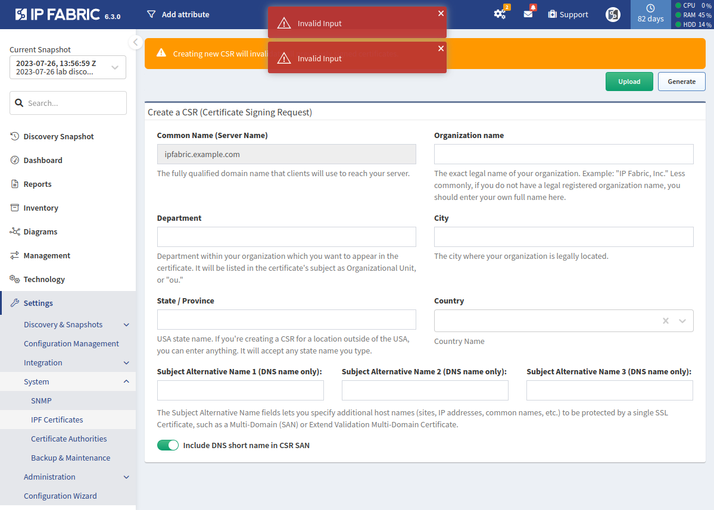
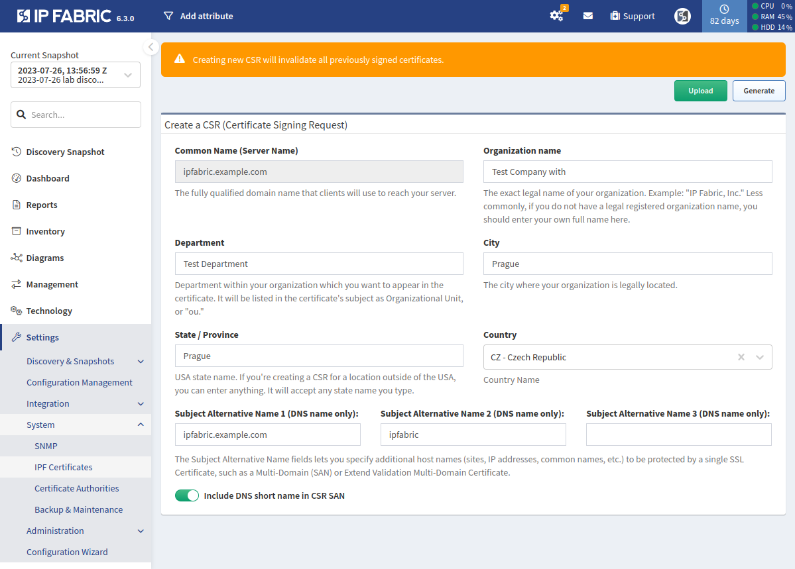
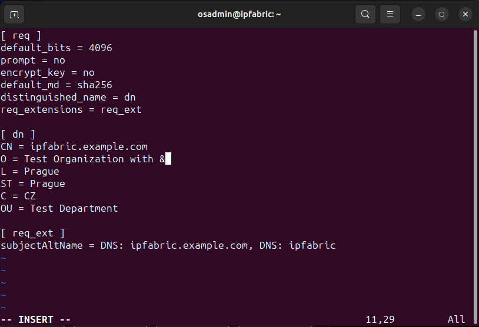

# How to Generate CSR with Special Characters

When filling out the **Create a CSR (Certificate Signing Request)** form (in **Settings -->
System --> IPF Certificates**), you can only use characters `A-Za-z0-9.,/-_@%^:=+` in the following fields:

- **Organization name**
- **Department**
- **City**
- **State / Province**

This restriction is for security reasons.

Let's consider an example where we enter `Test Company with &` (please note that the character `&` is not allowed) as the Organization name. After filling in the remaining fields, when we click **Generate**, an `Invalid Input` error will be displayed.



If any special characters are required in any of the mentioned fields, you may
use the following steps:

1. Fill out the **Create a CSR (Certificate Signing Request)** form, but avoid
   any special characters (in our example, we replaced `Test Company with &`
   with `Test Company with`):

   

2. Click **Generate**.
  - In the browser, a file called `nimpee.csr` will be downloaded - please do
    not use this file.
  - The files `customer.conf`, `customer.key`, and `customer.csr` will be generated in the directory `/opt/nimpee/conf.d/ssl-cust` on the IP Fabric appliance. It's important to note that `customer.csr` will be identical to `nimpee.csr`.

3. Log in to the IP Fabric CLI as the `osadmin` user.

4. Change to `root`:

   ```shell
   sudo su
   ```

5. Change to the `/opt/nimpee/conf.d/ssl-cust` directory:

   ```shell
   cd /opt/nimpee/conf.d/ssl-cust
   ``` 

6. Remove `customer.key` and `customer.csr` (will be re-generated in step 8):

   ```shell
   rm customer.key customer.csr
   ```

7. Modify `customer.conf` (for example with `vi customer.conf`; in our example,
   we changed `Test Company with` to `Test Company with &`):

   

8. Generate new `customer.key` and `customer.csr` files using the modified
   `customer.conf`:
   
   ```shell
   openssl req -new -config customer.conf -keyout customer.key -out customer.csr
   ```

9. Check the new `customer.csr`:

   ```shell
   openssl req -in customer.csr -noout -text
   ```

10. Download the new `customer.csr` (for example with `scp`) for signing.

Once you have the signed SSL certificate ready, navigate to **Settings --> System --> IPF Certificates** and click **Upload** to begin the process of uploading the certificate.
