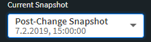
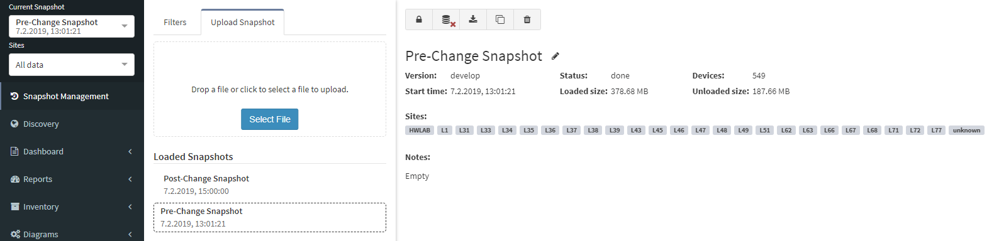
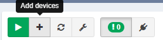
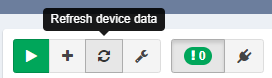

# How Snapshots Work

Network snapshots record the state of the network in time, enabling to retrieve historical information, follow network state changes, analyze connectivity, and more. A network snapshot is a fully functional software copy of the network, including all configuration and state data. Active network view displays information from a network snapshot which can be selected using Snapshot selector drop-down menu in the top left corner of the Main User Interface.

## Snapshot Management

Up to five (5) snapshots can be loaded simultaneously into active memory. When the snapshot is active it is considered "loaded". Other snapshots can be stored on HDD, with only free HDD space being the limiting factor.

Locking active snapshot will always keep snapshot in memory.

Unloading snapshot will move network state information from RAM to HDD. It usually takes several minutes to load and unload the snapshot, depending on the network size.

Snapshots can be downloaded for external storage, which can be later uploaded back to the system.

Snapshots can be cloned to accommodate change management practices, for example when change comparison is desired but only a small part of the network is affected by the change. A snapshot can be restricted to a specific portion of the network through IP Scope in Advanced Settings menu. This will enable visual comparison of a portion of the network, and provide historical data for the collected portion of the network. However when comparing partial snapshot with full network snapshot, a number of false positives will appear, because large portion of the network will be missing.

Snapshots can be also permanently deleted from the system.

## Snapshot Manipulation

New network state snapshots can be created from the Discovery page using the start button.

To add devices to existing snapshot, use the  button. When adding devices, no data is overwritten.

To refresh network state data for specific devices in existing snapshot, use  button.
