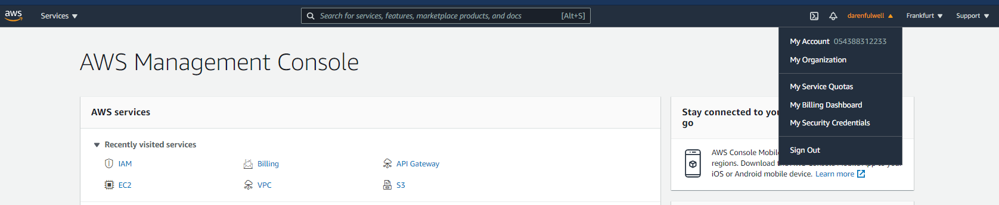
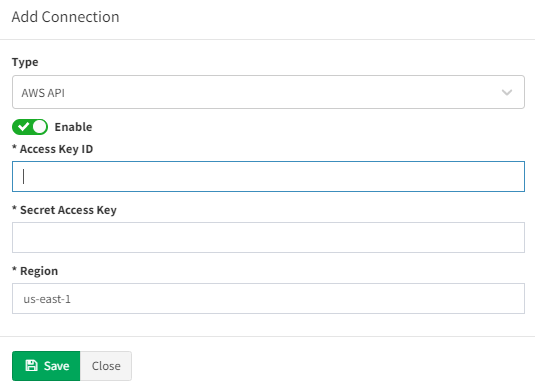

# 07 - Vendors API


## Meraki API

Starting the version 3.5.0, IP Fabric supports API based discovery for Cisco Meraki.

Meraki requires the following settings to be applied:

- API key - Generated in [Meraki dashboard](https://documentation.meraki.com/zGeneral_Administration/Other_Topics/The_Cisco_Meraki_Dashboard_API)

- Organizations ID - You can specify which organization will be included in the discovery process. If you do not specify, all available IDs will be used

- Version - Meraki currently provides only a v0 version of their API. This version has a lot of limitations ([Meraki known issues](https://ipfabric.atlassian.net/wiki/spaces/ND/pages/968032257/Meraki)).

- Base URL - URL is supported in the following format `https://nXYZ.meraki.com/api`. Be aware that the dashboard can redirect communication to a different URL.

## CheckPoint API

Checkpoint requires the following settings to be applied:

- API Key - Available in version R80.40 and above (API v1.6). To generate the key, use CheckPoint SmartConsole, and select "API Key" as administrator's Authentication method **or**

- Username / Password - Username and Password to access API data

- Base URL - Base URL for API calls `https://management.server.domain.tld`. If the API isn't available on the default port 443, add a port part to the URL (ie: `https://server:4443/`).

- Collect following domains - Mandatory only if the "Base URL" points to a Multi-Domain Server. Please verify, that all selected domains can be accessed by the provided credentials.

Don't forget to add IPF appliance to the list of allowed clients. In SmartConsole, go to **Manage & Settings > Blades** and click on **Advanced Settings...** in the **Management API** section to verify, from where are API calls allowed. In case that you use setting **All IP addresses that can be used for GUI clients**, don't forget to add IPF appliance address to **Manage & Settings > Permissions & Administrators > Trusted Clients**. In case you use Multi-Domain server, all necessary settings are in Multi Domain menu (e.g. **Multi Domain > Blades**).

## VERSA API

Starting version 3.8.0 IP Fabric supports Versa SD-WAN API. API is based on HTTPS authentication. Versa requires the following settings to be applied:

- Username - Username to Versa Director to access API data

- Password - Password to Versa Director access API data

- Base URL - Base URL of Versa Director. If the API isn't available on the default port 9182, add a port part to the URL (ie: `<https://server:4443/`).

!!! warning

    OAuth authentication credentials to Versa Director are not supported at the moment to access API.

## AWS (Amazon Web Services) API

Starting version 3.8.0 IP Fabric supports AWS API.

To add AWS to the discovery you will need an access key & secret access key from your AWS account. Those keys can be found/generated under your account in the AWS dashboard.



Click on **My Security Credentials** and open **Access keys** tab.


To generate keys click on “Create New Access Key” and your keys will be
generated. These access keys are available globally for all of yours AWS
regions.


Copy those keys to the AWS API settings in your IP Fabric and don't forget to **fill the region where the devices which you want to discover are**.



To ensure that IP Fabric can retrieve all the required data to model the AWS networks, a series of specific policies are required to be applied to the user account or role used for the API key. Example configuration with all required IAM policies:

```json
{
  "Version": "2012-10-17",
  "Statement": [
    {
      "Sid": "IPFabricEC2",
      "Effect": "Allow",
      "Action": [
        "ec2:DescribeAccountAttributes",
        "ec2:DescribeAddresses",
        "ec2:DescribeAddressesAttribute",
        "ec2:DescribeAvailabilityZones",
        "ec2:DescribeByoipCidrs",
        "ec2:DescribeCarrierGateways",
        "ec2:DescribeCoipPools",
        "ec2:DescribeCustomerGateways",
        "ec2:DescribeDhcpOptions",
        "ec2:DescribeEgressOnlyInternetGateways",
        "ec2:DescribeInternetGateways",
        "ec2:DescribeIpv6Pools",
        "ec2:DescribeManagedPrefixLists",
        "ec2:DescribeMovingAddresses",
        "ec2:DescribeNatGateways",
        "ec2:DescribeNetworkAcls",
        "ec2:DescribeNetworkInsightsAnalyses",
        "ec2:DescribeNetworkInsightsPaths",
        "ec2:DescribeNetworkInterfaceAttribute",
        "ec2:DescribeNetworkInterfacePermissions",
        "ec2:DescribeNetworkInterfaces",
        "ec2:DescribePlacementGroups",
        "ec2:DescribePrefixLists",
        "ec2:DescribePublicIpv4Pools",
        "ec2:DescribeRegions",
        "ec2:DescribeRouteTables",
        "ec2:DescribeSecurityGroupReferences",
        "ec2:DescribeSecurityGroupRules",
        "ec2:DescribeSecurityGroups",
        "ec2:DescribeStaleSecurityGroups",
        "ec2:DescribeSubnets",
        "ec2:DescribeTags",
        "ec2:DescribeTrafficMirrorFilters",
        "ec2:DescribeTrafficMirrorSessions",
        "ec2:DescribeTrafficMirrorTargets"
      ],
      "Resource": "*"
    },
    {
      "Sid": "IPFabricEC2VPC",
      "Effect": "Allow",
      "Action": [
        "ec2:DescribeVpcAttribute",
        "ec2:DescribeVpcClassicLink",
        "ec2:DescribeVpcClassicLinkDnsSupport",
        "ec2:DescribeVpcEndpointConnectionNotifications",
        "ec2:DescribeVpcEndpointConnections",
        "ec2:DescribeVpcEndpoints",
        "ec2:DescribeVpcEndpointServiceConfigurations",
        "ec2:DescribeVpcEndpointServicePermissions",
        "ec2:DescribeVpcEndpointServices",
        "ec2:DescribeVpcPeeringConnections",
        "ec2:DescribeVpcs"
      ],
      "Resource": "*"
    },
    {
      "Sid": "IPFabricEC2Instances",
      "Effect": "Allow",
      "Action": [
        "ec2:DescribeClassicLinkInstances",
        "ec2:DescribeFleetHistory",
        "ec2:DescribeFleetInstances",
        "ec2:DescribeFleets",
        "ec2:DescribeHostReservationOfferings",
        "ec2:DescribeHostReservations",
        "ec2:DescribeHosts",
        "ec2:DescribeInstanceAttribute",
        "ec2:DescribeInstanceCreditSpecifications",
        "ec2:DescribeInstanceEventNotificationAttributes",
        "ec2:DescribeInstances",
        "ec2:DescribeInstanceStatus",
        "ec2:DescribeInstanceTypeOfferings",
        "ec2:DescribeInstanceTypes",
        "ec2:DescribeReservedInstances",
        "ec2:DescribeReservedInstancesListings",
        "ec2:DescribeReservedInstancesModifications",
        "ec2:DescribeReservedInstancesOfferings",
        "ec2:DescribeScheduledInstanceAvailability",
        "ec2:DescribeScheduledInstances",
        "ec2:DescribeSpotFleetInstances",
        "ec2:DescribeSpotInstanceRequests"
      ],
      "Resource": "*"
    },
    {
      "Sid": "IPFabricEC2ClientVPN",
      "Effect": "Allow",
      "Action": [
        "ec2:DescribeClientVpnAuthorizationRules",
        "ec2:DescribeClientVpnConnections",
        "ec2:DescribeClientVpnEndpoints",
        "ec2:DescribeClientVpnRoutes",
        "ec2:DescribeClientVpnTargetNetworks"
      ],
      "Resource": "*"
    },
    {
      "Sid": "IPFabricEC2VPNGW",
      "Effect": "Allow",
      "Action": ["ec2:DescribeVpnConnections", "ec2:DescribeVpnGateways"],
      "Resource": "*"
    },
    {
      "Sid": "IPFabricEC2LocalGW",
      "Effect": "Allow",
      "Action": [
        "ec2:DescribeLocalGatewayRouteTables",
        "ec2:DescribeLocalGatewayRouteTableVirtualInterfaceGroupAssociations",
        "ec2:DescribeLocalGatewayRouteTableVpcAssociations",
        "ec2:DescribeLocalGateways",
        "ec2:DescribeLocalGatewayVirtualInterfaceGroups",
        "ec2:DescribeLocalGatewayVirtualInterfaces"
      ],
      "Resource": "*"
    },
    {
      "Sid": "IPFabricEC2TransitGW",
      "Effect": "Allow",
      "Action": [
        "ec2:DescribeTransitGatewayAttachments",
        "ec2:DescribeTransitGatewayConnectPeers",
        "ec2:DescribeTransitGatewayConnects",
        "ec2:DescribeTransitGatewayMulticastDomains",
        "ec2:DescribeTransitGatewayPeeringAttachments",
        "ec2:DescribeTransitGatewayRouteTables",
        "ec2:DescribeTransitGateways",
        "ec2:DescribeTransitGatewayVpcAttachments",
        "ec2:GetTransitGatewayAttachmentPropagations",
        "ec2:GetTransitGatewayMulticastDomainAssociations",
        "ec2:GetTransitGatewayPrefixListReferences",
        "ec2:GetTransitGatewayRouteTableAssociations",
        "ec2:GetTransitGatewayRouteTablePropagations",
        "ec2:SearchTransitGatewayMulticastGroups",
        "ec2:SearchTransitGatewayRoutes"
      ],
      "Resource": "*"
    },
    {
      "Sid": "IPFabricELB",
      "Effect": "Allow",
      "Action": [
        "elasticloadbalancing:DescribeLoadBalancerAttributes",
        "elasticloadbalancing:DescribeLoadBalancerPolicies",
        "elasticloadbalancing:DescribeLoadBalancerPolicyTypes",
        "elasticloadbalancing:DescribeLoadBalancers"
      ],
      "Resource": "*"
    }
  ]
}
```
